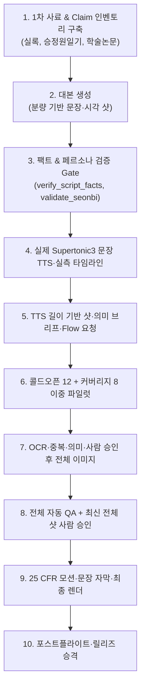

# [쉽선비 / Human Archive] 전주기 다큐멘터리 제작 및 Google Flow AI 비주얼 운영 매뉴얼

본 문서는 **'쉽선비' (Human Archive)** 채널의 정규 역사 다큐멘터리 제작 파이프라인과 `doodle_seonbi_v1` 역할 분리, Google Flow 브라우저 자동화, 렌더링 및 릴리즈 거버넌스를 정리한 공식 문서다.

`docs/solutions/`에는 과거 장애와 해결책이 분야별 YAML frontmatter(`module`, `tags`, `problem_type`)로 정리되어 있다. EP02 v6를 재개할 때의 첫 정본은 `docs/solutions/integration-issues/ep02-v6-reuse-first-tts-codex-visual-brief-recovery-2026-08-28.md`다. v5 자산·Flow 생명주기 이력은 `docs/solutions/integration-issues/ep02-v5-flow-visual-pipeline-contract-and-lifecycle-defects-2026-08-28.md`를 참고한다.

---

## 0. Windows 산출물 경로 전달 규칙

사용자에게 영상·이미지·오디오·문서 산출물을 전달하기 전에 `Test-Path -LiteralPath`와 `Get-Item -LiteralPath`로 **실제 파일 존재, 크기, 최종 파일명**을 확인한다. 생성 예정 경로나 work/part 파일을 완성 파일처럼 안내하지 않는다.

같은 파일을 아래 두 형식으로 구분해 제공한다.

1. **복사·탐색기용 Windows 경로**는 코드 블록 또는 인라인 코드에 드라이브 문자와 백슬래시를 그대로 쓴다.

   ```text
   D:\module\bible\human_archive\runs\ep02_jang_huibin\sample-3m-v3-001\candidate\HA002-sample-3m-v3-001.mp4
   ```

2. **Codex 클릭용 Markdown 링크**의 target에는 드라이브 문자 뒤부터 정방향 슬래시만 사용한다. 선행 `/`를 붙이지 않고, 밑줄을 이스케이프하지 않는다.

   ```markdown
   [HA002-sample-3m-v3-001.mp4](D:/module/bible/human_archive/runs/ep02_jang_huibin/sample-3m-v3-001/candidate/HA002-sample-3m-v3-001.mp4)
   ```

경로에 공백이 있으면 target만 angle bracket으로 감싼다: `[결과 파일](<D:/module/My Project/final.mp4>)`.

다음 표기는 금지한다.

- `/D:/module/...`: Windows 탐색기·PowerShell에서 사용할 수 없는 선행 슬래시 경로
- `D:\module\...`를 Markdown link target에 직접 사용: Markdown의 백슬래시 escape로 손상될 수 있음
- `human\_archive`, `ep02\_jang\_huibin`: 밑줄 앞에 불필요한 백슬래시 삽입
- 존재 확인 없이 상대경로만 전달하거나, 링크 하나만 주고 복사용 원시 경로를 생략

가능하면 확인된 산출물은 Codex 파일 패널에도 열어 주되, 사용자 응답에는 항상 **복사용 Windows 경로 + 클릭용 링크**를 함께 남긴다.

---

## 1. 파이프라인 아키텍처 개요



---

## 2. 쉽선비 두들 시각 역할·텍스트 정책 (Canonical Visual Policy)

### 스타일·역할 규칙

* 기본 프로필은 `doodle_seonbi_v1`이다. `human_archive_cinematic_v1`은 별도 프로필이며 자동 폴백하지 않는다.
* 역할은 `host_explainer`, `historical_reconstruction`, `evidence_object`, `diagram_metaphor`, `atmosphere` 다섯 가지다.
* 쉽선비는 `host_explainer`에만 등장하며 현재 빌드 전체의 8~12%, 최소 7샷 간격으로 제한한다. 역사 재현·근거 장면에는 쉽선비 또는 검은 갓 마스코트를 넣지 않는다.
* Flow가 쉽선비를 장면마다 새로 그리게 하지 않는다. 호스트 장면은 발표자 없는 왼쪽 배경을 생성한 뒤 `human_archive/assets/doodle_seonbi_v1.png`를 동일 해시·동일 비율로 합성한다. 갓만 있거나 맨몸 스틱팔다리, 상체 누락, 도포·소매·깃·허리끈 누락은 즉시 FAIL이다.
* 호스트 기본 배경에는 사람·손·신체 일부를 생성하지 않는다. 왼쪽에는 하나의 사물 중심 역사 비네트만 두고 오른쪽은 고정 쉽선비 합성 공간으로 비운다. `presenter points` 같은 동작 지시는 기본 이미지 프롬프트에 넣지 않는다.
* `evidence_object`는 한 공간의 단일 중심 사물 장면으로만 만든다. 의복·건축 카탈로그, 콜라주, 분할 패널, 손만 나온 구도, `royal court clothing and architecture`, `filled editorial` 표현을 금지한다.
* AI 기본 이미지 프롬프트에는 연도·숫자·글자·캡션·간판·인장·말풍선·오버레이 문구를 넣지 않는다. 날짜와 라벨은 `overlay_event_manifest.json`을 통해 렌더러가 합성한다.
* 기본 이미지는 검은 잉크 두들 선, 제한된 파스텔 포인트, 흰 종이 배경, 충분히 채운 와이드 구도를 사용한다.

---

## 3. Google Flow (ImageFX) CDP 브라우저 연동 원칙

### 🖥️ Chrome 디버그 모드 기동 (1회 실행)
```powershell
& "C:\Program Files\Google\Chrome\Application\chrome.exe" --remote-debugging-port=9222 --remote-allow-origins=* --user-data-dir="C:\Users\shs\.chrome_debug" https://labs.google/fx/tools/image-fx
```

CDP가 열리지 않으면 사용자가 모든 Chrome 작업을 저장하고 창을 직접 닫은 뒤 다음 순서를 사용한다. `Stop-Process`는 관련 없는 Chrome 세션까지 종료하므로 현재 턴의 명시적 사용자 승인 없이 에이전트가 실행하지 않는다. `Start-Process` 인자에는 마크다운 링크나 백슬래시 이스케이프를 넣지 않는다.
```powershell
# 사용자 명시 승인 뒤에만 전체 Chrome 강제 종료
Stop-Process -Name chrome -Force -ErrorAction SilentlyContinue
Start-Process "C:\Program Files\Google\Chrome\Application\chrome.exe" -ArgumentList '--remote-debugging-port=9222','--remote-allow-origins=*','--user-data-dir="C:\Users\shs\.chrome_debug_ep02"','https://labs.google/fx/tools/image-fx'
curl.exe http://127.0.0.1:9222/json/version
```

### ⚙️ Playwright 자동 제어 프로토콜
* **CDP 연결 URL**: `http://127.0.0.1:9222`
* **Google Flow 에디터 셀렉터**:
  * 텍스트박스: `div[role="textbox"], [contenteditable="true"]`
  * 제출: 의미 기반 버튼을 우선 사용하고 `Enter`를 폴백으로 사용한다.
  * 결과 대기: 고정 초 대기가 아니라 제출 전에는 없던 새 media URL이 두 번 연속 안정적으로 관측될 때까지 폴링한다.
* **다운로드 & 정규화**:
  * `trpc/media.getMediaUrlRedirect` 또는 `googleusercontent.com` 원본 스트림 캡처
  * PIL LANCZOS 필터로 `1920x1080 Full HD JPEG (Quality 95)` 저장

---

## 4. 정규 에피소드 제작 표준 실행 순서 (v5/v6 내레이션 정렬형)

### 음성 기본값 고정

- 일반 내레이션 기본 보이스는 **SuperTonic3 M2 warm**이다. `voice=M2`, `speed=0.95`, `total_step=10`을 사용한다.
- M2 warm 기준 샘플의 실제 절대경로는 `D:\module\bible\human_archive\audits\supertonic3_male_voice_samples_2026-08-31\M2_warm.wav`이다.
- 성경 본문 낭독은 별도 화자 M4를 유지한다. M2와 M4를 문장 단위로 임의 혼용하지 않는다.
- TTS 실행 전 `http://127.0.0.1:3093/api/voices`에서 M2가 노출되는지 확인하고, 음성 provenance에 `voice=M2`를 기록한다.

정본 순서는 `승인 대본 → 실제 문장 TTS → 실측 샷 타이밍 → 의미 브리프 → Flow 요청 → 이중 파일럿 → 전체 이미지 → 전체 QA·사람 승인 → 모션 → 문장 자막 → 렌더 → postflight`다. 테스트용 `tone_fixture`로 이미지 계약이나 최종 영상을 만들지 않는다.

### Step 1: 대본·근거·페르소나 승인

`script_candidate.json`과 Claim·source snapshot은 빌드 안에 복사해 해시로 고정한다. 사실·페르소나 검증과 사람 승인이 끝나지 않으면 TTS를 시작하지 않는다.

### Step 2: 실제 Supertonic3 문장 TTS와 실측 샷 타이밍

```powershell
$build = 'human_archive/runs/ep02_jang_huibin/full-v6-001'
$script = "$build/source/script_candidate.json"
$claims = "$build/source/claim_inventory_v2.json"
$sources = "$build/source/source_snapshot_manifest_v2.json"
$factReport = "$build/source/fact_check_report_v2.json"
$personaReport = "$build/source/persona_report_v2.json"
$factApproval = "$build/source/approvals/fact_review_approval_v1.json"

curl.exe http://127.0.0.1:3093/health
python human_archive/scripts/build_sentence_audio_master.py --script $script --build $build --audio-mode supertonic3 --tts-url http://127.0.0.1:3093
python human_archive/scripts/plan_narration_shots.py --script $script --audio "$build/sentence_audio_manifest.json" --claims $claims --profile narration_aligned_hybrid_v1 --output "$build/shot_timing_manifest.json"
```

`sentence_audio_manifest.json`의 모든 문장 provenance가 `supertonic3_http`인지 확인한다. 이후 음성 또는 타이밍을 바꾸면 기존 브리프·요청·이미지·승인은 stale이다.

### Step 3: 의미 브리프·Flow 요청 사전검사

```powershell
# fact report가 REVIEW_REQUIRED이고 모든 항목이 승인 가능한 문구 차이뿐인 경우,
# 사람이 현재 문구를 명시 승인한 뒤에만 한 번 기록한다. 재실행은 검증만 하며 stale 파일은 덮어쓰지 않는다.
python human_archive/scripts/record_fact_review_approval.py --script $script --fact-report $factReport --persona-report $personaReport --claims $claims --sources $sources --output $factApproval --reviewer-id <human-reviewer-id> --approval-source explicit_user_confirmation_in_antigravity_thread

python human_archive/scripts/generate_visual_briefs.py --script $script --timing "$build/shot_timing_manifest.json" --claims $claims --sources $sources --fact-report $factReport --persona-report $personaReport --fact-approval $factApproval --provider antigravity-cli --response-output "$build/visual_brief_response_v1.json" --output "$build/visual_brief_manifest.json" --prompts "$build/flow_image_prompts.json"
python human_archive/scripts/build_image_request_manifest_v5.py --build $build
python human_archive/scripts/validate_image_requests.py --build $build
$sourceBuild = 'human_archive/runs/ep02_jang_huibin/full-v5-001'
$reusePlan = "$build/image_reuse_plan.json"
$reuseApproval = "$build/image_reuse_review_approval.json"
python human_archive/scripts/build_semantic_image_reuse_plan.py --source-build $sourceBuild --target-build $build --output $reusePlan
# 모든 review_candidate를 사람이 검토해 현재 plan/request SHA 결속 승인 파일을 만든 뒤에만:
python human_archive/scripts/materialize_semantic_image_reuse.py --source-build $sourceBuild --target-build $build --plan $reusePlan --review-approval $reuseApproval --dry-run
python human_archive/scripts/materialize_semantic_image_reuse.py --source-build $sourceBuild --target-build $build --plan $reusePlan --review-approval $reuseApproval
```

`fact_check_report_v2.json` 원본은 승인 뒤에도 `REVIEW_REQUIRED` 그대로 보존한다. `generate_visual_briefs.py`가 현재 다섯 artifact SHA, 정확한 review-set, 사람 승인 메타데이터를 검증해 effective gate를 PASS로 만든다. persona `overall_status`는 반드시 `PASS`여야 한다. `sentence_id`는 비어 있지 않은 문자열, `segment_index`와 `review_required_count`는 bool·문자열·실수가 아닌 정수여야 하며 강제 형변환으로 보정하지 않는다. 보고서를 PASS로 편집하거나 합성 승인 JSON을 만들지 않는다. 대본·보고서·페르소나·claim·source 중 하나가 바뀌면 승인은 stale이며 새 사람 검토가 필요하다.

`antigravity-cli` 경로는 Antigravity Agent 런타임과 표준 인터페이스로 동작한다. 승인 전에는 검토된 응답 파일을 `--provider json-file --response <reviewed-response.json>`로 사용하되 동일한 fact gate 인자를 모두 전달한다. `--provider`를 생략해 fallback을 선택하지 않는다. 새 visual brief manifest는 schema v2이며 `fact_approval_sha256`와 `fact_review_set_sha256`가 필수다.

한글 semantic anchor, `narration-specific subject`, `depict directly`, 범용 조선 궁궐 행동, 생성 숫자·연도가 한 건이라도 있으면 Flow를 실행하지 않는다. 새 내레이션에 승인된 구체 장면 규칙이 없으면 범용 장면으로 폴백하지 않고 실패한다. `image_reuse_plan.json`은 결정 계획일 뿐이다. 재사용에는 전용 materializer와 실제 사람 승인 파일을 사용하며, 임시 PowerShell 복사·수동 `asset_manifest.json` 작성·합성 승인 JSON은 금지한다. dry-run과 실제 실행이 모두 통과하기 전에는 Flow 파일럿을 시작하지 않는다.

### Step 4: 이중 파일럿 생성·검토·승인

```powershell
python human_archive/scripts/generate_flow_batch.py --build $build --pilot --model "Nano Banana 2" --cdp http://127.0.0.1:9222
python human_archive/scripts/build_contact_sheet.py --build $build --pilot-set cold_open --output "$build/pilot_cold_open_contact_sheet.jpg"
python human_archive/scripts/build_contact_sheet.py --build $build --pilot-set coverage --output "$build/pilot_coverage_contact_sheet.jpg"
python human_archive/scripts/verify_visual_assets.py --build $build
```

파일럿은 콜드오픈 12장과 전 구간 커버리지 8장이다. 두 연락시트를 사람이 명시적으로 승인한 뒤에만 `record_visual_pilot_approval.py`를 실행한다. 승인 스크립트는 자동화가 대신 판단해 실행하지 않는다.

### Step 5: 전체 생성·전체 승인

```powershell
python human_archive/scripts/generate_flow_batch.py --build $build --all --model "Nano Banana 2" --cdp http://127.0.0.1:9222
python human_archive/scripts/build_contact_sheet.py --build $build --output "$build/contact_sheet.jpg"
python human_archive/scripts/verify_visual_assets.py --build $build
# 최신 전체 연락시트에 대한 명시적 사용자 승인 뒤, 실제 승인자 ID로만 실행
python human_archive/scripts/record_visual_approval.py --build $build --reviewer-id <approved-reviewer-id>
python human_archive/scripts/verify_visual_assets.py --build $build
```

`flow_batch_report` PASS는 다운로드 무결성만 뜻한다. 현재 빌드의 전체 샷 자동 QA와 최신 연락시트 사람 승인 파일 `approvals/visual_approval.json`이 모두 현재 계약·자산 해시와 일치해야 모션 단계로 이동한다.

### Step 6: 정책 거절과 OCR 실패의 분리 복구

정책 거절은 동일 프롬프트 반복이나 계정 변경으로 우회하지 않는다. 첫 자동 재시도는 의미를 유지한 `safe_rephrase`, 두 번째는 시각 모드별 `safe_abstraction`이다. 세 번째 요청은 자동 프롬프트를 만들지 않고 `REVIEW_REQUIRED`로 전환한다.

```powershell
python human_archive/scripts/rewrite_policy_rejected_prompt.py --build $build --scene-id <shot_id> --reason provider_policy_rejected
python human_archive/scripts/generate_flow_batch.py --build $build --only <shot_id> --model "Nano Banana 2" --cdp http://127.0.0.1:9222
```

OCR 실패는 정책 재시도와 섞지 않는다. 일반 OCR-safe 1회, ultra-minimal 1회 뒤 직접 크롭을 검토한다.

```powershell
python human_archive/scripts/rewrite_v5_ocr_failed_prompts.py --build $build --scene-id <shot_id>
python human_archive/scripts/generate_flow_batch.py --build $build --only <shot_id> --model "Nano Banana 2" --cdp http://127.0.0.1:9222
python human_archive/scripts/verify_visual_assets.py --build $build
```

실제 글자·워터마크·서비스 마크는 반드시 재생성한다. 사물 형상을 글자로 오인한 경우에만 이미지 SHA와 OCR findings SHA에 결속한 예외를 기록한다. stale 자산은 새 생성 전에 `asset_history`와 거절 보관소에 저장한다.

### Step 7: 모션·문장 자막·렌더·postflight

```powershell
python human_archive/scripts/verify_visual_assets.py --build $build
python human_archive/scripts/build_motion_clips_v2.py --build $build
python human_archive/scripts/build_subtitles_v2.py --build $build
python human_archive/scripts/render_episode_v2.py --build $build --output "$build/candidate/HA002-full-v6-001.mp4"
python human_archive/scripts/postflight_release.py --input "$build/candidate/HA002-full-v6-001.mp4" --report "$build/release_report.json" --duration-mode full
```

모션은 정확한 25 CFR 프레임 수를 사용하고, 자막은 같은 빌드의 실제 문장 시작·종료 시각에서 생성한다. 최종 렌더는 fixture 음성, stale 승인, 누락된 전체 평가, 타이밍 해시 불일치 중 하나라도 있으면 중단한다.

### v5/v6 상태·계보 판정

- 정식 자산 필드는 `file_path`와 `card_id`다. 파일명, SHA-256, 20KB 이상 바이트, 양수 해상도, 카드 ID가 모두 있어야 `COMPLETED`다.
- 실행 중 `SUBMITTED`는 중간 상태다. 종료 후 `flow_batch_report.json`의 기대 수·다운로드 수·누락 목록으로 판정한다.
- `image_request_manifest.contract_sha256`는 정확한 `flow_image_prompts.json` 파일 SHA다.
- 요청 해시가 바뀐 과거 행은 생성 전에 `asset_history`로 이동하고 활성 `assets`에는 현재 행만 둔다.
- 자동 콘텐츠 PASS, 파일럿 승인, 전체 승인은 서로 대체할 수 없다.
- v6 재개·정지 게이트·실행기 복구는 `docs/solutions/integration-issues/ep02-v6-reuse-first-tts-codex-visual-brief-recovery-2026-08-28.md`를 따른다. v5 자산 이력은 `docs/operations/2026-08-27-flow-v5-pilot-state-recovery.md`와 v5 해결 기록을 참고한다.

기존 `full-v4-*`, 대표 8장, 글자 수 기반 15~25% 호스트 절차는 레거시 빌드 재현용이며 신규 에피소드 기본값으로 사용하지 않는다.

### EP02 v6 시각 브리프 복구 체크포인트 (2026-08-28)

- Windows에서 `codex exec`에 한글 prompt를 stdin으로 보낼 때 `subprocess.run(..., text=True, encoding="utf-8")`를 반드시 지정한다. 로캘 기본값(CP949)을 사용하면 Codex CLI가 `input is not valid UTF-8`로 종료한다.
- 시퀀스 QA는 직접 묘사 모드 60% 이상, 동일 모드 최대 2연속, 10샷 창에서 동일 실제 소품 모티프 최대 2회를 강제한다.
- 모티프 창 검사는 설명문의 `boundary`, `edge` 같은 추상어가 아니라 `prop_motifs`만 대상으로 한다. 설명 전체를 검색하면 서로 다른 장면을 같은 `gate_boundary`로 오판한다.
- 모델 원본 응답은 덮어쓰지 않는다. 실패 응답은 `history/` 또는 attempt 파일로 보존하고, 의미를 유지한 최소 교정본을 별도 파일로 만든 뒤 `--provider json-file` 전체 게이트를 다시 통과시킨다.
- 재사용 계획기는 source/target의 현재 `image_request_manifest.json`을 함께 읽어 visual mode와 role이 다르면 `auto_reuse` 또는 `review_candidate`를 `generate_new`로 내린다.
- 현재 `full-v6-001` 정본은 112샷, 호스트 11, 직접 묘사 68(60.71%), 재사용 계획 8/22/82(auto/review/new)다. 사람의 22개 review candidate 판단 전에는 materialize 또는 Flow를 실행하지 않는다.

#### Flow 프로젝트 UI 모달 및 OCR 복구 (2026-08-28)

- Flow 프로젝트에 `최신 Flow 업데이트` dialog가 뜨면 backdrop이 프롬프트 textbox 클릭을 가로챈다. `generate_flow_batch.py`는 dialog 내부의 `시작하기`/`Get started`/`Start` 버튼을 role 기반으로 눌러 hidden 상태를 확인한 뒤 진행한다. 임의 force click이나 backdrop 삭제로 우회하지 않는다.
- 파일럿 중 OCR FAIL은 현재 자산을 `rejected_visual_variants/ocr-detected-001/`과 `asset_history`에 보존한 뒤 `rewrite_v5_ocr_failed_prompts.py`로 1차 OCR-safe, 재실패 시 2차 ultra-minimal을 적용한다.
- OCR 재시도 뒤 `--only` 보고서는 선택 범위만 기록하므로 마지막에 `generate_flow_batch.py --pilot`을 다시 실행해 정식 20/20 파일럿 보고서를 복원한다.
- 현재 `full-v6-001`은 재사용 30개 물질화 완료, 파일럿 20/20 다운로드 PASS, OCR 콘텐츠 PASS다. 정지 게이트는 최신 두 파일럿 연락시트의 사람 승인이다. 승인 전 전체 82개 생성을 시작하지 않는다.
- 전체 생성 중 Flow가 `비정상적인 활동이 감지되었습니다`를 표시하면 `provider_activity_blocked`로 분류하고 즉시 중단한다. 계정 변경, CAPTCHA 우회, 같은 요청 반복, 모델 변경으로 제한을 우회하지 않는다. 현재 v6은 77개 완료, 1개 SUBMITTED, 34개 미착수 상태이며 provider 제한 해소와 명시적 재개 판단 전에는 재실행하지 않는다.
