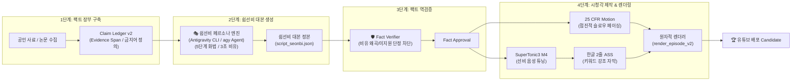

# [마스터 실행 계획서] '쉽선비' 채널 운영 및 대본 생성 파이프라인 구축 로드맵

- **프로젝트명**: 쉽선비 (ShipSeonbi) 역사 스토리텔링 파이프라인
- **작성 일자**: 2026-08-21
- **문서 버전**: v1.1.0
- **상태**: 파이프라인 강화 완료 (Hardened Production Pipeline)
- **기본 러닝타임 기준**: **1200초 (20분) ± 30% (840초 ~ 1560초 / 14분 ~ 26분)**
- **시각 페이싱 전략**: **초반 빠른 이미지 회전(2.5~4.0s) ➡️ 로드맵(4~6s) ➡️ 사료 중계(6~9s) ➡️ 롱테이크 여운(8~12s)**

---

## 1. 개요 및 파이프라인 목표

본 계획서는 **'쉽게 역사 알려주는 선비 = 쉽선비'** 채널의 성공적인 런칭 및 지속 가능한 고품질 영상 제작을 위해, **모든 사실 segment가 검토된 근거에 연결되는 사실 검증 엔진**과 **유쾌한 선비 페르소나 대본 생성기**를 유기적으로 결합하는 종합 실행 계획입니다.

---

## 2. 에피소드 제작 표준 워크플로우 (6단계)

### Phase 1: 주제 선정 및 사료 수집 (Fact Ledger 구축)
- [ ] **Step 1-1**: 대중적 고정관념/오해가 있는 역사적 미스터리 주제 선정.
- [ ] **Step 1-2**: 최소 4~6개의 1차 사료 및 최신 동료평가 논문 수집.
- [ ] **Step 1-3**: `source_ledger.json` 및 `claim_inventory.json` 생성 (허용 표현 및 금지 통념 명시).

### Phase 2: '쉽선비' 페르소나 대본 생성 (Antigravity CLI 기반)
- [ ] **Step 2-1**: `seonbi_narration_policy.yaml` 화법 규칙 로드.
- [ ] **Step 2-2**: 5단계 스토리텔링 공식 적용:
  - 0~15초: "다들 ~로 알고 계시지요? 허허, 천만의 말씀!" (상식 파괴 훅, 에피소드당 정확히 1회)
  - 15~45초: "오늘 선비와 함께 파헤쳐 보시지요!" (로드맵)
  - 본론: 전문 용어를 일상 언어로 1:1 치환하는 3초 직관 비유 (발화 3.5초 이내)
  - 절정: 1차 사료 현장 중계
  - 결론: 촌철살인 인문학 통찰 및 여운
- [ ] **Step 2-3**: Antigravity CLI / Agent를 통해 `generate_verified_script.py --provider antigravity-cli --persona seonbi`로 문장별 JSON 대본 생성.

### Phase 3: 사실 무결성 역검증 (Fact Verification Gate)
- [ ] **Step 3-1**: `verify_script_facts.py` 실행.
- [ ] **Step 3-2**: 비유적 표현이 원본 학술 Claim을 왜곡하지 않는지 전수 검증 (`unsupported_count=0`).
- [ ] **Step 3-3**: `fact_check_report_seonbi.json` 생성 및 사람 검토 승인.

### Phase 4: 오디오 & 한글 자막 제작
- [ ] **Step 4-1**: SuperTonic3 M4 음성 튜닝 (`speed: 0.96`, `pitch: -0.5 st`, 문장 간 쉼표 0.3s).
- [ ] **Step 4-2**: EBU R128 (-16±1 LUFS, True Peak ≤ -1.0 dBTP) 2-pass 라우드니스 정규화.
- [ ] **Step 4-3**: 한글 의미 단위 2줄 분할 (`Malgun Gothic`, 90px, Outline 7, 줄당 14~18자 목표, hard max 20자, 최대 2줄).

### Phase 5: 시각 자산 및 모션 클립 빌드 (점진적 슬로우 페이싱)
- [ ] **Step 5-1**: Flow Provider로 1920x1080 고화질 역사적 재현 자산 생성 (카드 ID 결속).
- [ ] **Step 5-2**: 픽셀 무결성 검증, pHash 중복 검사, 6축 의미 검증.
- [ ] **Step 5-3**: 초반 빠른 컷 전환(2.5~4.0s)부터 결론 롱테이크(8~12s)까지 점진적 슬로우 모션 클립 렌더링 (25 CFR BT.709 tv-range).

### Phase 6: 원자적 렌더링 & 포스트플라이트 검증
- [ ] **Step 6-1**: `render_episode_v2.py`로 `.part` 생성 후 candidate 생성.
- [ ] **Step 6-2**: `postflight_release.py`로 ffprobe 실측치(1200초 ± 30% 러닝타임, 25fps CFR, BT.709, LUFS, 자막 영역) 검증.
- [ ] **Step 6-3**: `release_episode.py`로 최종 릴리스 승격.

---

## 3. 에피소드 파이프라인 확장 라인업 (시즌 1 연구 상태)

| 에피소드 ID | 에피소드 제목 | 핵심 고정관념 (가설) | 쉽선비의 사료 기반 탐구 질문 | 연구 상태 |
|---|---|---|---|---|
| **EP01** | **폼페이 최후의 밤** | 폼페이 시민들은 금화 챙기다 다 죽었다? | 대다수는 초기 탈출 성공, 지붕 붕괴와 새벽 화쇄류의 복합 재난 | `technical_pilot_not_release_ready` |
| **EP02** | **타이타닉의 마지막 2시간** | 선장은 빙산 경고를 완전히 무시하고 과속했다? | 당시 항해 관행과 통신 지연의 딜레마, 3등실 차별의 오해와 진실 | `research_hypothesis` |
| **EP03** | **로마 네로 황제 방화설** | 네로는 로마가 불탈 때 하프를 켜며 노래했다? | 네로는 화재 당시 안치오에 있었으며 사재를 털어 구호 활동 전개 | `research_hypothesis` |
| **EP04** | **조선 붕당정치의 오해** | 조선 선비들은 밥그릇 싸움만 하다 나라를 망쳤다? | 견제와 균형을 통한 고도의 학술 토론 시스템과 제도적 순기능 | `research_hypothesis` |
| **EP05** | **투탕카멘의 저주** | 파라오의 무덤을 연 발굴단은 모두 저주로 의문사했다? | 발굴자 대부분은 평균 수명 이상 장수, 언론이 만든 최초의 바이럴 가짜뉴스 | `research_hypothesis` |

---

## 4. 품질 보증 (QA) 및 릴리스 체크리스트

모든 '쉽선비' 에피소드는 다음 체크리스트를 100% 만족해야만 출판됩니다:

- [ ] **1. 대본 톤앤보이스**: 첫 15초에 상식 파괴 훅(`"허허, 천만의 말씀!"`)과 3초 현대 직관 비유가 포함되었는가?
- [ ] **2. 팩트 무결성**: 모든 역사적 진술이 `Claim Ledger`에 등록되어 있으며 `unsupported_count=0`인가?
- [ ] **3. 오디오 규격**: 48kHz mono, EBU R128 -16±1 LUFS, TP ≤ -1.0 dBTP를 만족하는가?
- [ ] **4. 자막 가독성**: 줄당 14~18자 목표 (hard max 20자), 최대 2줄, 문장 성분/고아 어절 절단 없이 핵심 키워드가 강조되었는가?
- [ ] **5. 영상 규격 & 페이싱**: 1920x1080, 25fps CFR, BT.709 tv-range, 러닝타임 1200초 ± 30%(840~1560초), 초반 빠른 이미지 전환 ➡️ 점진적 슬로우 페이싱 곡선을 준수했는가?
- [ ] **6. 자동화 테스트**: `python -m pytest` 전체 테스트 스위트 100% 통과.
