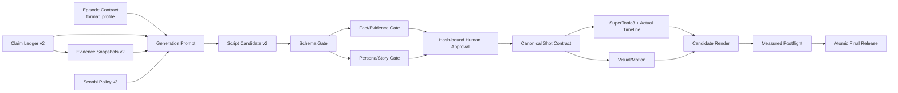

# 쉽선비 대본 생성·검증 파이프라인 신뢰성 강화 Implementation Plan

> **For agentic workers:** REQUIRED SUB-SKILL: Use superpowers:subagent-driven-development (recommended) or superpowers:executing-plans to implement this plan task-by-task. Steps use checkbox (`- [ ]`) syntax for tracking.

**Goal:** 앞으로 생성되는 모든 역사 대본이 `쉽선비` 페르소나, 5단계 서사, 문장·근거 단위의 출처 추적성, 실측 미디어 규격을 만족한 경우에만 배포 후보가 되도록 현재 EP01 고정 시제품을 범용·차단형 파이프라인으로 전환한다.

**Architecture:** 에피소드 계약·근거 스냅샷·Claim Ledger를 유일한 입력으로 삼아 공급자 중립적인 대본 후보를 만든 뒤, JSON Schema → 팩트 근거 → 쉽선비 페르소나/서사 → 사람 승인 순으로 통과시킨다. 승인된 정확한 `ship_seonbi` 대본 해시만 샷·TTS·자막·렌더에 전달하고, 포스트플라이트가 계약 시간·A/V 동기·25 CFR·BT.709·EBU R128·자막·프리즈·아티팩트 해시를 실측한 뒤에만 candidate를 final로 원자 승격한다.

**Tech Stack:** Python 3.13, pytest, PyYAML, JSON Schema 2020-12, Jinja2 StrictUndefined, FFmpeg/ffprobe, SuperTonic3 HTTP M4, ASS subtitles, SHA-256 provenance

**Spec:** `docs/superpowers/specs/2026-08-21-ship-seonbi-channel-spec.md`

## Global Constraints

- 페르소나는 `ship_seonbi`이며 친근한 경어체와 `~지요`, `~했답니다`, `~이지 뭡니까!`, `~라는 말씀!` 계열을 사용한다.
- 첫 훅은 실제 오디오 기준 15초 안에 끝나고, 로드맵은 45초 안에 끝난다.
- 현대 비유는 로드맵 뒤 본론에서 사용하며 한 비유의 실제 발화 길이는 3.5초 이하다. 첫 15초 비유 의무 규칙은 폐기한다.
- `허허, 천만의 말씀!`은 오해를 뒤집는 훅에서 에피소드당 정확히 1회 사용한다. 반복 남용은 실패다.
- 사료에 없는 대화, 인물의 생각·동기 단정, 피해자 비하, 근거 없는 인과관계는 금지한다.
- 쉽선비 진행자 비주얼은 갓·도포·태블릿/붓의 브랜드 레이어로 고정하고, 역사 재현 장면과 구분한다. 의도적인 현대 소품은 재현 사실로 오인되게 배치하지 않는다.
- 모든 사실·수치·인용·역사 재현 segment는 유효한 Claim ID와 Evidence Span ID를 가져야 한다.
- 직접 인용은 원문 위치, 판본, 원문 언어, 번역자 또는 자체 번역 표시를 가져야 한다.
- 고위험 Claim은 독립된 근거 2개 이상을 원칙으로 하며, 예외는 사유가 적힌 사람 승인 없이는 통과하지 않는다.
- 자동화가 보증하는 표현은 `모든 사실 segment 근거 연결, 미해결 0건`이다. `100% 역사적 진실`이라는 절대 표현은 사용하지 않는다.
- `quick_3m`은 180초 목표·170~190초 허용이며 이 형식만 `딱 3분` 문구를 사용할 수 있다.
- `standard_docu`는 930초 목표·900~990초 허용이며 시간 비한정 슬로건을 사용한다.
- `pilot`은 비배포 형식이며 어떤 QA 결과로도 final 승격할 수 없다.
- 배포 오디오는 48 kHz mono, `-16±1 LUFS`, True Peak `≤ -1.0 dBTP`를 만족한다.
- 배포 영상은 1920×1080, SAR 1:1, 25 fps CFR, `yuv420p`, BT.709 primaries/transfer/colorspace, tv range를 모두 만족한다.
- 자막은 줄당 14~18자를 목표로 하고 hard max 20자·최대 2줄이며 마지막 cue는 영상 종료를 넘지 않고 실제 발화와 100 ms 이내로 맞아야 한다.
- 승인 파일의 모든 아티팩트 해시는 대문자 SHA-256 64자리여야 하며 `ANY`, `PENDING`, 상태 문구, 해시 접두사는 거부한다.
- 완료 표시는 프로젝트 전역 체크박스가 아니라 `episode_id + build_id + artifact SHA-256`에 귀속한다.

---

## 1. 감사 결론과 현재 기준선

### 판정

현재 상태는 **부분 구현된 EP01 기술 파일럿**이다. 채널 컨셉 문서와 쉽선비 예시 대본은 존재하지만, 향후 에피소드에 재사용할 수 있는 생성기·의미 기반 팩트 게이트·실제 쉽선비 렌더 결속은 아직 없다. 따라서 기존 마스터 계획서의 `Ready for Episode Pipeline Scaling`, `EP01 구현 & 검증 완료`, 전 항목 `[x]` 표시는 구현 완료 근거로 사용할 수 없다.

### 확인된 근거

| 영역 | 확인 결과 | 판정 |
|---|---|---|
| 쉽선비 프롬프트/정책 | `seonbi_script_prompt.j2`, `seonbi_narration_policy.yaml`은 있으나 런타임 소비자가 없다. | 문서 자산만 존재 |
| 전역 페르소나 문구 | `누가 살고 누가 남았는지`, `2천 년 전 재난` 같은 EP01 문구가 전역 예시라 EP02~EP05에 누출될 수 있다. | 에피소드 중립화 필요 |
| 대본 생성 | `generate_verified_script.py`가 claims와 source 입력을 사용하지 않고 폼페이 12문장을 하드코딩한다. | 범용 생성기 아님 |
| 팩트 검증 | 기존 Claim ID인지와 금지 문자열 일부만 검사하고 `source_snapshots`는 사용하지 않는다. | 잘못된 문장도 PASS 가능 |
| 실제 렌더 대본 | `shot_contract.json`은 `script_draft.json` 해시에 결속되어 있고 `script_seonbi.json`은 렌더 입력이 아니다. | 쉽선비 컨셉 미적용 |
| EP01 결과물 | 실제 영상은 72초 pilot이고 930초 full 결과물은 없다. | 정식 에피소드 미완료 |
| A/V 동기 | manifest 88.09초, master audio 84.24초, video 72초이며 마지막 자막이 잘린다. | 릴리스 차단 |
| 포스트플라이트 | 계약 시간을 검사하지 않고 자막은 상수 PASS이며 BT.709 일부 태그만 검사한다. | 거짓 양성 가능 |
| 음성 | 파일럿 오디오는 SuperTonic3 음성이 아니라 220 Hz sine fixture다. | 음성 품질 검증 불가 |
| 테스트 | 핵심 대본 테스트 7개는 통과하지만 전체 `human_archive/tests`는 `imagehash` 누락으로 수집 오류 3건이다. | 전체 통과 주장 불가 |

### 즉시 운영 원칙

1. Task 1~9가 끝날 때까지 EP01 상태를 `technical_pilot_not_release_ready`로 취급한다.
2. EP02~EP05 표의 반전 문구는 `research_hypothesis`로 취급하며 승인된 Ledger 전에는 대본의 사실로 사용하지 않는다.
3. 기존 `generate_full_docu_script.py`와 `generate_18min_deep_script.py` 산출물은 검증 경로 밖의 legacy 자료로 분류하고 배포 입력을 금지한다.

---

## 2. 목표 데이터 흐름



핵심 원칙은 생성 모델을 신뢰 경계 밖에 두는 것이다. 어떤 모델이나 사람이 대본 후보를 만들더라도 동일한 구조·근거·페르소나·승인·릴리스 게이트를 통과해야 한다.

---

## 3. 파일 책임 맵

### 새로 만들 파일

- `human_archive/config/delivery_profiles.yaml`: `quick_3m`, `standard_docu`, `pilot` 시간·배포 규칙의 단일 출처.
- `human_archive/schemas/episode_contract_v2.schema.json`: 형식 프로필과 연구 상태를 포함한 범용 에피소드 계약.
- `human_archive/schemas/source_ledger_v2.schema.json`: source, evidence span, claim 관계를 엄격하게 정의.
- `human_archive/schemas/verified_script_v2.schema.json`: beat와 segment 단위 근거를 갖는 canonical 쉽선비 대본.
- `human_archive/schemas/persona_report.schema.json`: 5단계 서사·말투·금지어·실측 타이밍 검사 결과.
- `human_archive/schemas/fact_check_report_v2.schema.json`: PASS/REVIEW_REQUIRED/FAIL과 근거 결속 결과.
- `human_archive/schemas/artifact_approval_v2.schema.json`: 정확한 SHA-256을 요구하는 승인 계약.
- `human_archive/scripts/lib/schema_validation.py`: 모든 CLI 경계의 JSON Schema 검증.
- `human_archive/scripts/lib/editorial_policy.py`: delivery profile·페르소나 정책 로더.
- `human_archive/scripts/lib/script_generation.py`: 프롬프트 구성과 공급자 중립 후보 수집.
- `human_archive/scripts/lib/persona_validation.py`: 쉽선비 말투·5단계·타이밍 린터.
- `human_archive/scripts/lib/approval.py`: 승인 파일 생성·검증과 해시 freshness 검사.
- `human_archive/scripts/lib/tts_provider.py`: SuperTonic3 HTTP와 test fixture를 명시적으로 분리.
- `human_archive/scripts/release_episode.py`: 검증된 candidate만 final로 원자 승격.
- `human_archive/config/channel_kpis.yaml`: 출처 없는 시장 수치 대신 실제 채널 성과를 보정하는 측정 계약.
- `human_archive/config/seonbi_visual_policy.yaml`: 진행자 외형·역사 재현 분리·AI 재현 고지·피해자 존중의 시각 규칙.
- `human_archive/analytics/episode_metrics.csv`: episode/build/profile별 유지율·시청률·정정 건수 기록.
- `human_archive/tests/helpers_v2.py`: v2 contract·evidence·script·approval·media fixture 생성 헬퍼.
- `human_archive/tests/conftest.py`: 아래 계획 전반에서 공유하는 pytest fixture 등록.
- `human_archive/tests/fixtures/episode_generic_v2.yaml`: 폼페이에 종속되지 않은 범용성 테스트 계약.
- `human_archive/tests/fixtures/script_candidate_v2.json`: 결정론적 생성·검증 테스트 후보.
- `human_archive/README.md`: 설치, 생성, 검증, 승인, 렌더, 릴리스 명령의 단일 실행 안내서.

### 수정할 파일

- `docs/superpowers/specs/2026-08-21-ship-seonbi-channel-spec.md`: 형식 이원화, 검증 가능한 표현, 출처·인용·피해자 존중 기준.
- `docs/superpowers/plans/2026-08-21-ship-seonbi-channel-script-architecture.md`: 완료 상태와 시즌 반전 문구를 아티팩트 기반 상태로 교정.
- `human_archive/templates/documentary_contract.yaml`: EP01 데이터와 범용 템플릿 책임 분리.
- `human_archive/templates/seonbi_script_prompt.j2`: v2 schema, evidence span, beat, 금지 규칙을 출력 계약으로 명시.
- `human_archive/config/seonbi_narration_policy.yaml`: 기계 검증 가능한 수치 규칙과 사람 검토 규칙 분리.
- `human_archive/scripts/build_source_snapshots.py`: ledger notes 복제를 금지하고 실제 evidence packet만 수집.
- `human_archive/scripts/build_claim_inventory.py`: `sources_path`를 실제 사용하고 claim-span 무결성을 검증.
- `human_archive/scripts/validate_fact_contract.py`: 폼페이 문자열 목록 대신 v2 schema·evidence 관계를 검증.
- `human_archive/scripts/generate_verified_script.py`: 하드코딩 제거, 범용 prompt/provider 경계와 v2 출력 적용.
- `human_archive/scripts/lib/fact_verification.py`: sentence ID 검사가 아닌 segment-to-claim-to-span 검증.
- `human_archive/scripts/verify_script_facts.py`: 입력·출력 schema 검증과 REVIEW_REQUIRED 차단.
- `human_archive/scripts/compile_shot_contract.py`: 승인된 `ship_seonbi` 대본 및 두 QA report 해시를 결속.
- `human_archive/scripts/build_audio_master_v2.py`: 실제 TTS, 실제 silence, 음성 provenance, 실측 timeline 생성.
- `human_archive/scripts/build_subtitles_v2.py`: 실제 audio manifest 기반 cue와 종료 범위 검사.
- `human_archive/scripts/render_episode_v2.py`: final이 아닌 candidate 생성으로 책임 축소.
- `human_archive/scripts/postflight_release.py`: 계약·A/V·색·음량·자막·프리즈·해시를 모두 실측.
- `human_archive/scripts/lib/media_probe.py`: avg fps, frame count, primaries, transfer, range, sample rate, channel 수 노출.
- `human_archive/scripts/lib/build_manifest.py`: 대본·팩트·페르소나·음성·자막·영상 해시 포함.
- `human_archive/schemas/build_manifest.schema.json`: 전체 upstream hash chain과 audio provenance 요구.
- `human_archive/schemas/release_report.schema.json`: 모든 측정값과 gate 결과 요구.
- `human_archive/schemas/visual_approval.schema.json`: 64자리 해시와 실제 파일별 결속 강제.
- `human_archive/tests/test_*.py`: 정상·실패·거짓 양성 회귀 테스트 보강.
- `human_archive/requirements.lock.txt`: Jinja2와 실제 테스트 의존성을 포함하고 실행 환경과 일치.
- `pytest.ini`: 기본 테스트 검색에 `human_archive/tests` 포함.

### 격리할 legacy 파일

- `human_archive/scripts/generate_full_docu_script.py`
- `human_archive/scripts/generate_18min_deep_script.py`

두 파일은 삭제하지 않고 `--allow-unverified-legacy` 같은 우회 옵션도 만들지 않는다. 실행하면 새 검증 CLI 경로를 안내하며 종료하고, 기존 고정 데이터는 테스트용 legacy fixture로만 보존한다.

### 공통 테스트 fixture 계약

Task 2에서 `human_archive/tests/helpers_v2.py`와 `conftest.py`를 함께 만든다. 이후 코드 블록에서 사용하는 fixture 이름은 다음 반환형으로 고정한다.

```python
@dataclass
class ApprovedBundlePaths:
    script: Path
    claim_inventory: Path
    source_snapshots: Path
    fact_report: Path
    persona_report: Path
    approval: Path
    shot_plan: Path
    shot_plan_approval: Path
    output: Path

    @property
    def artifacts(self) -> dict[str, Path]:
        return {
            "script_sha256": self.script,
            "claim_inventory_sha256": self.claim_inventory,
            "source_snapshot_sha256": self.source_snapshots,
            "fact_report_sha256": self.fact_report,
            "persona_report_sha256": self.persona_report,
        }

    def as_kwargs(self) -> dict[str, Path]:
        return {
            "shot_plan_path": self.shot_plan,
            "script_path": self.script,
            "claim_inventory_path": self.claim_inventory,
            "fact_report_path": self.fact_report,
            "persona_report_path": self.persona_report,
            "approval_path": self.approval,
            "shot_plan_approval_path": self.shot_plan_approval,
            "output_path": self.output,
        }
```

`profile_config`, `valid_evidence`, `claims`, `snapshots`, `valid_script`, `policy`, `valid_fact_inputs`, `generic_inputs`, `audio_manifest`, `valid_paths`, `valid_approval`, `ep01_package`, `generic_package`는 이 helper의 최소 유효 v2 객체를 반환한다. `current_pilot`은 저장소의 기존 72초 MP4, `standard_contract`는 930초 profile 계약을 가리킨다. `fixture_provider`, `media_fixture`, `release_fixture`는 각 Task의 test module에서 `tmp_path` 아래 tone/FFmpeg 초단기 fixture와 승인 파일을 만들며 저장소 run을 수정하지 않는다.

---

### Task 1: 사실에 맞는 상태 모델과 러닝타임 프로필 고정

**Files:**
- Create: `human_archive/config/delivery_profiles.yaml`
- Create: `human_archive/schemas/episode_contract_v2.schema.json`
- Create: `human_archive/scripts/lib/editorial_policy.py`
- Create: `human_archive/tests/test_delivery_profiles.py`
- Modify: `human_archive/templates/documentary_contract.yaml`
- Modify: `docs/superpowers/specs/2026-08-21-ship-seonbi-channel-spec.md`
- Modify: `docs/superpowers/plans/2026-08-21-ship-seonbi-channel-script-architecture.md`

**Interfaces:**
- Consumes: `profile_id: str`, 이미 YAML에서 읽은 profile mapping, episode contract mapping.
- Produces: `load_delivery_profile(profile_id: str, profiles: dict) -> dict`, `validate_episode_contract(contract: dict, profiles: dict) -> list[str]`.

- [ ] **Step 1: 상충하는 3분/15분 규칙을 드러내는 실패 테스트 작성**

```python
def test_three_minute_slogan_is_rejected_for_standard_docu(profile_config):
    contract = {
        "schema_version": 2,
        "episode_id": "EP01",
        "format_profile": "standard_docu",
        "target_duration_sec": 930,
        "slogan": "딱 3분 만에 귀에 쏙 넣어 드리지요",
        "research_status": "approved",
    }
    errors = validate_episode_contract(contract, profile_config)
    assert "three-minute slogan requires quick_3m" in errors


def test_pilot_is_never_publishable(profile_config):
    assert load_delivery_profile("pilot", profile_config)["publishable"] is False
```

- [ ] **Step 2: 실패 확인**

Run: `python -m pytest human_archive/tests/test_delivery_profiles.py -q`

Expected: FAIL because `editorial_policy.py` and profile configuration do not exist.

- [ ] **Step 3: 프로필 단일 출처 구현**

```yaml
schema_version: 1
profiles:
  quick_3m:
    publishable: true
    target_duration_sec: 180
    min_duration_sec: 170
    max_duration_sec: 190
    allow_three_minute_slogan: true
  standard_docu:
    publishable: true
    target_duration_sec: 930
    min_duration_sec: 900
    max_duration_sec: 990
    allow_three_minute_slogan: false
  pilot:
    publishable: false
    target_duration_sec: 72
    min_duration_sec: 30
    max_duration_sec: 180
    allow_three_minute_slogan: false
```

`documentary_contract.yaml`의 EP01은 `format_profile: standard_docu`, `research_status: approved`를 명시한다. 채널 공통 슬로건은 시간 비한정 문구로 바꾸고, `딱 3분` 문구는 `quick_3m` 오프닝에서만 허용한다.

- [ ] **Step 4: 문서의 완료 상태를 아티팩트 상태로 교정**

기존 전역 `[x]`를 템플릿 `[ ]`로 바꾸고 EP01은 `technical_pilot_not_release_ready`, EP02~EP05는 `research_hypothesis`로 기록한다. `100% 팩트`는 `모든 사실 segment가 검토된 근거에 연결되고 미해결 이슈가 0건`으로 바꾼다. 출처 없는 `30초 내 이탈률 50% 이상` 시장 문구는 삭제하거나 조사 출처·표본·측정일을 붙인 가설로 낮춘다. 벤치마크 채널의 장단점도 관찰 의견과 측정 사실을 구분한다.

마스터 계획의 자막 `줄당 25자`는 저장소 공통 규칙의 hard max 20자와 충돌하므로 `목표 14~18자, hard max 20자, 최대 2줄`로 통일한다.

- [ ] **Step 5: 테스트 및 문서 검색 검증**

Run: `python -m pytest human_archive/tests/test_delivery_profiles.py -q`

Expected: PASS.

Run: `rg -n "Ready for Episode Pipeline Scaling|구현 & 검증 완료|100% 공인 사료" docs/superpowers human_archive`

Expected: 현재 완료를 단정하는 활성 문구 0건. 감사 이력의 인용문은 `historical_status` 문맥에서만 허용한다.

- [ ] **Step 6: Commit**

```bash
git add human_archive/config/delivery_profiles.yaml human_archive/schemas/episode_contract_v2.schema.json human_archive/scripts/lib/editorial_policy.py human_archive/tests/test_delivery_profiles.py human_archive/templates/documentary_contract.yaml docs/superpowers/specs/2026-08-21-ship-seonbi-channel-spec.md docs/superpowers/plans/2026-08-21-ship-seonbi-channel-script-architecture.md
git commit -m "docs: correct ShipSeonbi release status and duration profiles"
```

---

### Task 2: 실제 Evidence Span과 Claim Ledger v2 구축

**Files:**
- Create: `human_archive/schemas/source_ledger_v2.schema.json`
- Create: `human_archive/scripts/lib/schema_validation.py`
- Create: `human_archive/tests/helpers_v2.py`
- Create: `human_archive/tests/conftest.py`
- Create: `human_archive/tests/test_evidence_contract_v2.py`
- Modify: `human_archive/scripts/build_source_snapshots.py`
- Modify: `human_archive/scripts/build_claim_inventory.py`
- Modify: `human_archive/scripts/validate_fact_contract.py`
- Modify: `human_archive/sources/pompeii_ep01_source_ledger.json`

**Interfaces:**
- Consumes: `ledger_path: Path`, `evidence_dir: Path`, JSON Schema path.
- Produces: `validate_json(instance: dict, schema: dict) -> None`, `build_snapshots(ledger_path: Path, evidence_dir: Path, output_path: Path) -> dict`, `validate_evidence_package(ledger: dict, snapshots: dict) -> list[str]`.

- [ ] **Step 1: notes를 실제 인용문처럼 복제하는 행위를 거부하는 테스트 작성**

```python
def test_rejects_ledger_notes_as_evidence_excerpt(valid_evidence):
    ledger, snapshots = copy.deepcopy(valid_evidence)
    snapshots["sources"][0]["evidence_spans"][0]["capture_method"] = "ledger_notes_copy"
    errors = validate_evidence_package(ledger, snapshots)
    assert "ledger notes are not evidence" in errors


def test_high_risk_claim_requires_two_independent_sources(valid_evidence):
    ledger, snapshots = copy.deepcopy(valid_evidence)
    ledger["claims"][0]["risk"] = "high"
    ledger["claims"][0]["evidence_refs"] = ["SRC-A:SPAN-01"]
    errors = validate_evidence_package(ledger, snapshots)
    assert "high-risk claim requires two independent sources" in errors
```

- [ ] **Step 2: 실패 확인**

Run: `python -m pytest human_archive/tests/test_evidence_contract_v2.py -q`

Expected: FAIL because v2 schema and validator do not exist.

- [ ] **Step 3: source와 evidence span 계약 구현**

각 span은 다음 필드를 필수로 한다.

```json
{
  "span_id": "SRC-PLINY-EP:6.16.4",
  "locator": "Epistles 6.16.4",
  "excerpt": "검토에 필요한 짧은 원문 또는 허용된 발췌",
  "excerpt_language": "la",
  "translation": "검토된 한국어 번역",
  "translation_credit": "판본·번역자 또는 자체 번역",
  "capture_method": "manual_verified_excerpt",
  "captured_at_utc": "2026-08-21T00:00:00Z",
  "snapshot_sha256": "64자리 대문자 SHA-256"
}
```

Claim은 `source_ids`와 별도로 `evidence_refs`를 필수로 갖고, 참조한 span이 실제 source 아래 존재해야 한다. 공식 기관 자료는 `peer_reviewed: false`로 기록하고 `source_type: official_agency` 자체로 평가한다.

- [ ] **Step 4: snapshot builder가 실제 evidence packet만 읽도록 변경**

`build_source_snapshots.py`는 `--evidence-dir`를 필수로 받고 source별 evidence JSON이 없으면 실패한다. `notes`를 `locator`, `summary`, `text_excerpt`에 복제하는 기존 코드는 제거한다. `build_claim_inventory.py`는 `sources_path`를 읽어 모든 `evidence_refs`를 확인한다.

- [ ] **Step 5: EP01 근거 패킷을 실제 locator 중심으로 마이그레이션**

`Discussion`, `Demographics report`, 사이트 루트 URL 같은 포괄 locator를 페이지·절·표·그림·문단 단위로 좁힌다. 원문을 확보하지 못한 Claim은 `review_status: blocked_missing_evidence`로 두며 승인 상태로 만들지 않는다.

- [ ] **Step 6: 테스트**

Run: `python -m pytest human_archive/tests/test_evidence_contract_v2.py human_archive/tests/test_fact_contract.py -q`

Expected: PASS, with negative tests rejecting missing spans, copied notes, invalid hash, source-type/peer-review mismatch, and high-risk single-source claims.

- [ ] **Step 7: Commit**

```bash
git add human_archive/schemas/source_ledger_v2.schema.json human_archive/scripts/lib/schema_validation.py human_archive/scripts/build_source_snapshots.py human_archive/scripts/build_claim_inventory.py human_archive/scripts/validate_fact_contract.py human_archive/sources/pompeii_ep01_source_ledger.json human_archive/tests/helpers_v2.py human_archive/tests/conftest.py human_archive/tests/test_evidence_contract_v2.py human_archive/tests/test_fact_contract.py
git commit -m "feat: require evidence spans for every historical claim"
```

---

### Task 3: EP01 하드코딩을 범용 Script Candidate v2 생성 경계로 교체

**Files:**
- Create: `human_archive/schemas/verified_script_v2.schema.json`
- Create: `human_archive/scripts/lib/script_generation.py`
- Create: `human_archive/tests/fixtures/episode_generic_v2.yaml`
- Create: `human_archive/tests/fixtures/script_candidate_v2.json`
- Create: `human_archive/tests/test_generic_script_generation.py`
- Modify: `human_archive/templates/seonbi_script_prompt.j2`
- Modify: `human_archive/scripts/generate_verified_script.py`
- Modify: `human_archive/requirements.lock.txt`

**Interfaces:**
- Consumes: episode contract v2, claim inventory v2, source snapshots v2, narration policy, a `ScriptProvider`.
- Produces: `build_prompt_context(contract: dict, inventory: dict, snapshots: dict, policy: dict) -> str`, `generate_script_candidate(contract: dict, inventory: dict, snapshots: dict, policy: dict, provider: ScriptProvider) -> dict`.

```python
class ScriptProvider(Protocol):
    def generate(self, *, prompt: str, output_schema: dict) -> dict:
        raise NotImplementedError


class JsonFileProvider:
    def __init__(self, response_path: Path):
        self.response_path = Path(response_path)

    def generate(self, *, prompt: str, output_schema: dict) -> dict:
        candidate = json.loads(self.response_path.read_text(encoding="utf-8"))
        validate_json(candidate, output_schema)
        return candidate
```

- [ ] **Step 1: 폼페이 문자열이 새 에피소드에 새어 나오는 회귀 테스트 작성**

```python
def test_generic_generation_uses_contract_and_not_pompeii_constants(generic_inputs, tmp_path):
    provider = JsonFileProvider(Path("human_archive/tests/fixtures/script_candidate_v2.json"))
    script = generate_script_candidate(*generic_inputs, provider=provider)
    assert script["episode_id"] == "GENERIC-002"
    assert script["persona"] == "ship_seonbi"
    assert "폼페이" not in json.dumps(script, ensure_ascii=False)
```

- [ ] **Step 2: 실패 확인**

Run: `python -m pytest human_archive/tests/test_generic_script_generation.py -q`

Expected: FAIL because the current function is named and hard-coded for Pompeii.

- [ ] **Step 3: canonical segment 모델 구현**

각 문장은 `beat`와 `segments`를 가진다. `display_text`는 segment 텍스트를 순서대로 결합해 계산하며 임의의 별도 사실 문장을 둘 수 없다.

```json
{
  "sentence_id": "s-004",
  "order": 4,
  "chapter": 1,
  "beat": "source_commentary",
  "segments": [
    {"kind": "transition", "text": "사료를 가만히 보면 이렇습니다."},
    {
      "kind": "fact",
      "text": "검토된 Claim의 승인 문구",
      "claim_id": "CLM-004",
      "evidence_span_ids": ["SRC-01:SPAN-03"]
    }
  ]
}
```

허용 `beat`는 `hook`, `roadmap`, `body`, `analogy`, `source_commentary`, `insight`, `outro`다. 허용 segment kind는 `transition`, `fact`, `analogy`, `direct_quote`, `insight`다.

- [ ] **Step 4: 프롬프트를 StrictUndefined로 렌더하고 공급자 출력 즉시 schema 검증**

`seonbi_script_prompt.j2`는 policy version, delivery profile, 승인 Claim, evidence span, 출력 JSON 예시를 포함한다. `누가 살고 누가 남았는지` 같은 재난 전용 로드맵은 contract의 `core_question`에서 생성하고 전역 프롬프트에서 제거한다. Jinja2는 `StrictUndefined`를 사용해 누락 변수를 조용히 빈 문자열로 만들지 않는다. CLI는 `--contract`, `--claims`, `--sources`, `--policy`, `--provider file`, `--response-file`, `--output`을 요구한다.

- [ ] **Step 5: 기존 하드코딩을 fixture로 이동하고 production 함수에서 제거**

`generate_seonbi_pompeii_script`와 `generate_pompeii_script`를 production API에서 제거한다. 기존 12문장 예시는 `tests/fixtures`의 migration 입력으로만 남긴다.

- [ ] **Step 6: 테스트**

Run: `python -m pytest human_archive/tests/test_generic_script_generation.py -q`

Expected: PASS for two different episode IDs and FAIL for malformed provider output, missing claim context, unknown beat, and empty sentence list.

- [ ] **Step 7: Commit**

```bash
git add human_archive/schemas/verified_script_v2.schema.json human_archive/scripts/lib/script_generation.py human_archive/templates/seonbi_script_prompt.j2 human_archive/scripts/generate_verified_script.py human_archive/requirements.lock.txt human_archive/tests/fixtures/episode_generic_v2.yaml human_archive/tests/fixtures/script_candidate_v2.json human_archive/tests/test_generic_script_generation.py
git commit -m "feat: make ShipSeonbi script generation episode-neutral"
```

---

### Task 4: 쉽선비 페르소나·5단계 서사를 독립 게이트로 구현

**Files:**
- Create: `human_archive/schemas/persona_report.schema.json`
- Create: `human_archive/scripts/lib/persona_validation.py`
- Create: `human_archive/scripts/validate_seonbi_persona.py`
- Create: `human_archive/tests/test_persona_validation.py`
- Modify: `human_archive/config/seonbi_narration_policy.yaml`

**Interfaces:**
- Consumes: `script: dict`, `policy: dict`, 선택적 `audio_manifest: dict`.
- Produces: `validate_persona(script: dict, policy: dict, audio_manifest: dict | None = None) -> dict`.

- [ ] **Step 1: 현재 얕은 마커 테스트가 놓치는 실패 사례 작성**

```python
def test_rejects_signature_without_five_stage_structure(valid_script, policy):
    valid_script["sentences"] = [valid_script["sentences"][0]]
    report = validate_persona(valid_script, policy)
    assert report["overall_status"] == "FAIL"
    assert "missing beat: roadmap" in report["errors"]


def test_timing_requires_audio_measurement(valid_script, policy):
    report = validate_persona(valid_script, policy, audio_manifest=None)
    assert report["timing_status"] == "REVIEW_REQUIRED"
```

- [ ] **Step 2: 실패 확인**

Run: `python -m pytest human_archive/tests/test_persona_validation.py -q`

Expected: FAIL because a persona validator does not exist.

- [ ] **Step 3: 정책을 기계 규칙과 사람 판단 규칙으로 분리**

```yaml
story:
  required_beats: [hook, roadmap, analogy, source_commentary, insight, outro]
  hook_end_sec_max: 15.0
  roadmap_end_sec_max: 45.0
  analogy_spoken_sec_max: 3.5
voice:
  signature_hook: "허허, 천만의 말씀!"
  signature_hook_min: 1
  signature_hook_max: 1
  prohibited_patterns:
    - "안녕하세요 구독자 여러분"
    - "좋아요와 구독 부탁드립니다"
  sentence_max_chars: 45
  neutral_outro: "다음에도 귀에 쏙 박히는 역사로 찾아오지요!"
human_review:
  victim_dignity_required: true
  analogy_fidelity_required: true
  insight_not_presented_as_fact: true
```

- [ ] **Step 4: 정적 린트와 실제 오디오 타이밍 린트를 구현**

정적 단계는 beat 순서, 금지 패턴, CTA, signature 횟수, 문장 길이, source commentary와 insight 존재를 검사한다. `2천 년 전`, `재난 앞`처럼 특정 에피소드에만 맞는 문구는 전역 policy에서 제거하고 해당 contract의 승인 표현으로만 허용한다. 오디오 이후 단계는 각 sentence ID의 실제 start/end를 결합해 hook ≤15초, roadmap ≤45초, 각 analogy ≤3.5초를 검사한다. 사람 판단 항목이 승인되지 않으면 PASS가 아니라 REVIEW_REQUIRED다.

- [ ] **Step 5: 테스트**

Run: `python -m pytest human_archive/tests/test_persona_validation.py -q`

Expected: PASS with negative cases for generic intro, duplicate signature, missing beat, wrong beat order, 45자 초과, analogy over 3.5초, and absent sensitivity approval.

- [ ] **Step 6: Commit**

```bash
git add human_archive/schemas/persona_report.schema.json human_archive/scripts/lib/persona_validation.py human_archive/scripts/validate_seonbi_persona.py human_archive/config/seonbi_narration_policy.yaml human_archive/tests/test_persona_validation.py
git commit -m "feat: enforce ShipSeonbi persona and story beats"
```

---

### Task 5: Claim ID 존재 검사를 근거·문구 결속형 팩트 게이트로 교체

**Files:**
- Create: `human_archive/schemas/fact_check_report_v2.schema.json`
- Create: `human_archive/tests/test_fact_verification_v2.py`
- Modify: `human_archive/scripts/lib/fact_verification.py`
- Modify: `human_archive/scripts/verify_script_facts.py`

**Interfaces:**
- Consumes: Script Candidate v2, Claim Inventory v2, Source Snapshot Manifest v2.
- Produces: `verify_script(script_data: dict, claim_inventory: dict, source_snapshots: dict) -> dict` with `overall_status`, `fail_count`, `review_required_count`, `segment_evaluations`.

- [ ] **Step 1: 기존 Claim ID를 달고도 날조가 통과하는 거짓 양성 테스트 작성**

```python
def test_rejects_fabricated_text_with_existing_claim(valid_fact_inputs):
    script, claims, snapshots = valid_fact_inputs
    fact = next(
        segment
        for sentence in script["sentences"]
        for segment in sentence["segments"]
        if segment["kind"] == "fact"
    )
    fact["text"] = "근거에는 없는 시속 백 킬로미터와 수억 톤 수치입니다."
    report = verify_script(script, claims, snapshots)
    assert report["overall_status"] == "FAIL"
    assert report["fail_count"] >= 1


def test_rejects_empty_sentence_collection(claims, snapshots):
    report = verify_script({"schema_version": 2, "sentences": []}, claims, snapshots)
    assert report["overall_status"] == "FAIL"
```

- [ ] **Step 2: 실패 확인**

Run: `python -m pytest human_archive/tests/test_fact_verification_v2.py -q`

Expected: FAIL; current verifier returns PASS for a fabricated sentence carrying an existing Claim ID and for zero sentences.

- [ ] **Step 3: segment별 검증 규칙 구현**

`fact`는 Claim의 `approved_paraphrases`와 정확히 일치하면 PASS, 다르면 REVIEW_REQUIRED다. `direct_quote`는 연결된 span의 원문 또는 승인 번역과 정확히 일치해야 한다. `analogy`는 Claim과 span이 모두 유효해도 별도 `analogy_fidelity` 사람 승인이 없으면 REVIEW_REQUIRED다. `contested_fact`는 policy의 한정 표현과 Claim의 conflict group 해소 상태를 요구한다.

- [ ] **Step 4: report count와 evaluation 일관성을 schema로 검증**

CLI는 입력 3개와 출력 report 모두 schema 검증한다. 모든 segment가 정확히 한 evaluation을 갖지 않거나 count 합계가 evaluation과 다르면 CLI exit code 1이다. `source_snapshots`를 실제로 사용하지 않은 채 report를 만들 수 없게 한다.

- [ ] **Step 5: 테스트**

Run: `python -m pytest human_archive/tests/test_fact_verification_v2.py human_archive/tests/test_verified_script_generation.py -q`

Expected: PASS with negative cases for wrong claim mapping, unknown span, source/claim scope mismatch, paraphrased forbidden assertion, unsupported number, unqualified disputed claim, direct-quote mismatch, and zero sentences.

- [ ] **Step 6: Commit**

```bash
git add human_archive/schemas/fact_check_report_v2.schema.json human_archive/scripts/lib/fact_verification.py human_archive/scripts/verify_script_facts.py human_archive/tests/test_fact_verification_v2.py human_archive/tests/test_verified_script_generation.py
git commit -m "feat: bind script facts to approved evidence spans"
```

---

### Task 6: 승인된 쉽선비 대본만 샷 계약에 결속

**Files:**
- Create: `human_archive/schemas/artifact_approval_v2.schema.json`
- Create: `human_archive/scripts/lib/approval.py`
- Create: `human_archive/tests/test_script_approval_binding.py`
- Modify: `human_archive/scripts/compile_shot_contract.py`
- Modify: `human_archive/scripts/build_episode_v2.py`
- Modify: `human_archive/schemas/shot_contract.schema.json`
- Modify: `human_archive/scripts/generate_full_docu_script.py`
- Modify: `human_archive/scripts/generate_18min_deep_script.py`

**Interfaces:**
- Consumes: `script_path`, `fact_report_path`, `persona_report_path`, `approval_path`, `claim_inventory_path`, `shot_plan_path`.
- Produces: `validate_approval_freshness(approval: dict, artifacts: dict[str, Path]) -> list[str]`, `compile_contract(shot_plan_path: Path, script_path: Path, claim_inventory_path: Path, fact_report_path: Path, persona_report_path: Path, approval_path: Path, shot_plan_approval_path: Path, output_path: Path) -> dict`, canonical shot contract with exact upstream hashes.

- [ ] **Step 1: 일반 다큐 대본 또는 낡은 승인으로 빌드하는 실패 테스트 작성**

```python
def test_compile_rejects_non_seonbi_script(valid_paths):
    script = json.loads(valid_paths.script.read_text(encoding="utf-8"))
    script["persona"] = "standard"
    valid_paths.script.write_text(json.dumps(script, ensure_ascii=False), encoding="utf-8")
    with pytest.raises(ValueError, match="persona must be ship_seonbi"):
        compile_contract(**valid_paths.as_kwargs())


def test_approval_requires_exact_current_hashes(valid_paths):
    approval = json.loads(valid_paths.approval.read_text(encoding="utf-8"))
    approval["artifacts"]["script_sha256"] = "PENDING_COMPILATION"
    assert "invalid sha256" in validate_approval_freshness(approval, valid_paths.artifacts)
```

- [ ] **Step 2: 실패 확인**

Run: `python -m pytest human_archive/tests/test_script_approval_binding.py -q`

Expected: FAIL because current compile path accepts the standard script and approval contents are not validated.

- [ ] **Step 3: 공통 승인 계약 구현**

```json
{
  "schema_version": 2,
  "decision": "approved",
  "reviewer_id": "FACT-LEAD-01",
  "approved_at_utc": "ISO-8601 UTC",
  "artifacts": {
    "script_sha256": "64자리 SHA-256",
    "fact_report_sha256": "64자리 SHA-256",
    "persona_report_sha256": "64자리 SHA-256",
    "claim_inventory_sha256": "64자리 SHA-256",
    "source_snapshot_sha256": "64자리 SHA-256"
  },
  "reviewed_items": ["fact", "analogy_fidelity", "victim_dignity", "direct_quotes"],
  "unresolved_issues": 0
}
```

- [ ] **Step 4: shot contract와 build entrypoint를 차단형으로 변경**

`compile_shot_contract.py`는 `persona == ship_seonbi`, fact/persona report PASS, approval freshness를 확인한 뒤에만 출력한다. `build_episode_v2.py`도 contract 내부 upstream hash와 현재 파일을 다시 비교한다. 렌더 text는 승인된 쉽선비 script segment에서만 파생한다.

- [ ] **Step 5: legacy 생성기 격리**

두 legacy entrypoint는 실행 시 exit code 2와 `Unverified legacy generator is blocked; use generate_verified_script.py`를 출력한다. 저장된 역사 예시는 별도 fixture로 읽을 수 있지만 build/release CLI는 `shots` 전용 legacy JSON을 schema 단계에서 거부한다.

- [ ] **Step 6: 테스트**

Run: `python -m pytest human_archive/tests/test_script_approval_binding.py human_archive/tests/test_shot_contract.py human_archive/tests/test_build_episode_v2.py -q`

Expected: PASS and the current `script_draft.json`/`script_seonbi.json` hash mismatch is detected.

- [ ] **Step 7: Commit**

```bash
git add human_archive/schemas/artifact_approval_v2.schema.json human_archive/scripts/lib/approval.py human_archive/scripts/compile_shot_contract.py human_archive/scripts/build_episode_v2.py human_archive/schemas/shot_contract.schema.json human_archive/scripts/generate_full_docu_script.py human_archive/scripts/generate_18min_deep_script.py human_archive/tests/test_script_approval_binding.py human_archive/tests/test_shot_contract.py human_archive/tests/test_build_episode_v2.py
git commit -m "feat: bind approved ShipSeonbi script to every build"
```

---

### Task 7: SuperTonic3 실음성과 실제 silence 기반 단일 오디오 타임라인 구축

**Files:**
- Create: `human_archive/scripts/lib/tts_provider.py`
- Create: `human_archive/tests/test_tts_provenance.py`
- Modify: `human_archive/scripts/build_audio_master_v2.py`
- Modify: `human_archive/scripts/build_episode_v2.py`
- Modify: `human_archive/scripts/lib/audio_timeline.py`
- Modify: `human_archive/tests/test_audio_timeline_v2.py`
- Modify: `human_archive/schemas/build_manifest.schema.json`

**Interfaces:**
- Consumes: shot contract, narration policy, `audio_mode: Literal["fixture", "supertonic3"]`, SuperTonic3 base URL.
- Produces: `build_audio_master(build_dir: Path, *, audio_mode: str, tts_url: str | None = None) -> Path`, `validate_audio_provenance(manifest: dict, publishable: bool) -> list[str]`, manifest with per-segment hashes and provenance.

- [ ] **Step 1: manifest 시간과 실제 master 시간이 벌어지는 실패 테스트 작성**

```python
def test_manifest_end_matches_master_duration_with_real_gaps(tmp_path, fixture_provider):
    master, manifest = build_audio_fixture(tmp_path, gap_sec=0.35)
    actual = get_wav_duration(master)
    assert abs(manifest["total_duration_sec"] - actual) <= 0.02
    assert abs(manifest["shots"][-1]["endSeconds"] - actual) <= 0.02


def test_release_rejects_tone_fixture(audio_manifest):
    audio_manifest["provenance"]["audio_kind"] = "tone_fixture"
    assert "non-speech fixture" in validate_audio_provenance(audio_manifest, publishable=True)
```

- [ ] **Step 2: 실패 확인**

Run: `python -m pytest human_archive/tests/test_audio_timeline_v2.py human_archive/tests/test_tts_provenance.py -q`

Expected: FAIL because current manifest adds 0.35-second gaps that are absent from the concatenated master, and production does not distinguish tone from speech.

- [ ] **Step 3: test fixture와 실제 TTS provider 분리**

`ToneFixtureProvider`는 pytest에서만 사용한다. `SupertonicHttpProvider`는 M4, speed 0.96, total step 8, silence 0.30을 policy에서 읽어 `synthesize_to_file`을 호출한다. 각 출력에 provider, voice, speed, text SHA-256, WAV SHA-256, 실제 duration을 기록한다. `build_episode_v2.py`에는 `--audio-mode fixture|supertonic3`와 `--tts-url`을 추가하고 publishable profile에서는 `fixture`를 즉시 거부한다.

- [ ] **Step 4: silence를 실제 WAV concat에 삽입하고 타임라인을 master에서 유도**

문장 사이 silence WAV를 concat 목록에 넣는다. start/end는 누적 예상치가 아니라 concat에 들어간 실제 파일 길이 합에서 계산한다. 최종 normalize 뒤 master 길이를 다시 재고 마지막 cue와 20 ms 이내인지 검사한다.

- [ ] **Step 5: 테스트**

Run: `python -m pytest human_archive/tests/test_audio_timeline_v2.py human_archive/tests/test_tts_provenance.py -q`

Expected: PASS; fixture는 unit test에서만 허용되고 release profile에서 거부된다.

- [ ] **Step 6: Commit**

```bash
git add human_archive/scripts/lib/tts_provider.py human_archive/scripts/build_audio_master_v2.py human_archive/scripts/build_episode_v2.py human_archive/scripts/lib/audio_timeline.py human_archive/schemas/build_manifest.schema.json human_archive/tests/test_audio_timeline_v2.py human_archive/tests/test_tts_provenance.py
git commit -m "fix: derive subtitles and timing from real narration audio"
```

---

### Task 8: 포스트플라이트의 상수 PASS를 실측 release gate로 교체

**Files:**
- Create: `human_archive/tests/test_release_gate_v2.py`
- Modify: `human_archive/scripts/postflight_release.py`
- Modify: `human_archive/scripts/lib/media_probe.py`
- Modify: `human_archive/scripts/build_subtitles_v2.py`
- Modify: `human_archive/schemas/release_report.schema.json`
- Modify: `human_archive/tests/test_postflight_release.py`
- Modify: `human_archive/tests/test_subtitles_v2.py`

**Interfaces:**
- Consumes: final candidate video, episode contract, build directory, audio manifest, ASS subtitles, build manifest.
- Produces: `verify_postflight(video_path: Path, contract_path: Path, build_dir: Path, report_output: Path | None = None) -> tuple[bool, dict]`.

- [ ] **Step 1: 현재 72초 파일을 930초 full로 통과시키지 못하게 하는 실패 테스트 작성**

```python
def test_full_contract_rejects_72_second_pilot(current_pilot, standard_contract):
    ok, report = verify_postflight(current_pilot, standard_contract, current_pilot.parents[1])
    assert ok is False
    assert report["checks"]["contract_duration"]["status"] == "FAIL"


def test_subtitle_cue_after_video_end_fails(media_fixture):
    media_fixture.ass_events[-1].end = media_fixture.video_duration + 1.0
    ok, report = verify_postflight(**media_fixture.args)
    assert ok is False
    assert report["checks"]["subtitle_timeline"]["status"] == "FAIL"
```

- [ ] **Step 2: 실패 확인**

Run: `python -m pytest human_archive/tests/test_release_gate_v2.py -q`

Expected: FAIL because contract duration is ignored and subtitles are hard-coded PASS.

- [ ] **Step 3: 영상·색·프레임 실측 구현**

다음을 모두 검사한다: width/height 1920×1080, SAR 1:1, progressive, `r_frame_rate == avg_frame_rate == 25/1`, `abs(nb_frames - duration*25) <= 1`, yuv420p, color range tv, colorspace/primaries/transfer 모두 bt709. 누락 태그를 PASS로 인정하지 않는다.

- [ ] **Step 4: 오디오·시간·자막 실측 구현**

48 kHz mono, `-17.0 <= integrated_lufs <= -15.0`, True Peak `<= -1.0 dBTP`, 계약 profile 시간 범위, `abs(video-master) <= 0.04초`, 모든 ASS cue의 `0 <= start < end <= video_duration`, manifest 대비 cue 오차 100 ms 이하를 검사한다. pilot 완화 분기를 제거한다.

- [ ] **Step 5: 프리즈·무음·번인 근거 검사 구현**

FFmpeg `freezedetect=n=0.001:d=0.5`와 `silencedetect=n=-50dB:d=1.0` 결과를 report에 기록한다. 자막 번인은 renderer 명령 provenance와 subtitle SHA-256을 확인하고, cue 중앙 프레임의 자막 안전영역 픽셀 변화 샘플을 build의 무자막 영상과 비교한다.

- [ ] **Step 6: 현재 pilot을 정직한 negative control로 고정**

현재 pilot은 72초/자막 종료 88.09초/BT.709 primaries·transfer 누락으로 FAIL해야 한다. 향후 올바른 fixture만 PASS한다.

- [ ] **Step 7: 테스트**

Run: `python -m pytest human_archive/tests/test_release_gate_v2.py human_archive/tests/test_postflight_release.py human_archive/tests/test_subtitles_v2.py -q`

Expected: PASS, including negative cases for VFR, missing color tag, out-of-range LUFS, true peak violation, truncated subtitle, master/video mismatch, freeze, silence, stale hash.

- [ ] **Step 8: Commit**

```bash
git add human_archive/scripts/postflight_release.py human_archive/scripts/lib/media_probe.py human_archive/scripts/build_subtitles_v2.py human_archive/schemas/release_report.schema.json human_archive/tests/test_release_gate_v2.py human_archive/tests/test_postflight_release.py human_archive/tests/test_subtitles_v2.py
git commit -m "fix: replace postflight pass markers with measured gates"
```

---

### Task 9: candidate와 final을 분리하고 전체 provenance를 원자 승격에 결속

**Files:**
- Create: `human_archive/scripts/release_episode.py`
- Create: `human_archive/config/seonbi_visual_policy.yaml`
- Create: `human_archive/tests/test_atomic_release_gate.py`
- Modify: `human_archive/scripts/render_episode_v2.py`
- Modify: `human_archive/scripts/lib/build_manifest.py`
- Modify: `human_archive/schemas/build_manifest.schema.json`
- Modify: `human_archive/schemas/visual_approval.schema.json`
- Modify: `human_archive/scripts/verify_visual_assets.py`
- Modify: `human_archive/tests/test_render_episode_v2.py`
- Modify: `human_archive/tests/test_visual_pilot_approval.py`

**Interfaces:**
- Consumes: candidate MP4, build manifest, release report, exact human release approval.
- Produces: `validate_release_approval(approval: dict) -> list[str]`, `promote_release(candidate: Path, final_path: Path, release_report: Path, approval: Path) -> Path` using same-volume `os.replace`.

- [ ] **Step 1: 문자열 해시와 postflight 전 final 생성을 거부하는 테스트 작성**

```python
@pytest.mark.parametrize("bad_hash", ["ANY", "PENDING", "VERIFIED_POSTFLIGHT", "ABC123"])
def test_approval_rejects_non_sha256(bad_hash, valid_approval):
    valid_approval["artifacts"]["candidate_video_sha256"] = bad_hash
    assert "invalid sha256" in validate_release_approval(valid_approval)


def test_candidate_is_not_promoted_when_any_gate_fails(release_fixture):
    release_fixture.report["overall_status"] = "FAIL"
    with pytest.raises(ValueError, match="release report is not PASS"):
        promote_release(**release_fixture.args)
    assert not release_fixture.final_path.exists()
```

- [ ] **Step 2: 실패 확인**

Run: `python -m pytest human_archive/tests/test_atomic_release_gate.py -q`

Expected: FAIL because renderer currently writes into `final/` before postflight and approval hashes are not validated.

- [ ] **Step 3: renderer의 출력 책임을 candidate로 제한**

`render_episode_v2.py`는 `candidate/<episode_id>-<build_id>.mp4.part`를 만든 후 `candidate/*.mp4`로만 교체한다. `final/`은 `release_episode.py`만 쓸 수 있다.

- [ ] **Step 4: 완전한 hash chain 구현**

build manifest는 episode contract, source snapshots, claim inventory, 쉽선비 script, fact report, persona report, fact/persona approval, shot contract, visual approval, asset manifest, audio master, audio manifest, subtitles, candidate video의 실제 SHA-256을 기록한다. release report는 build manifest와 candidate hash를 다시 기록한다. release approval은 release report와 candidate hash를 결속한다.

- [ ] **Step 5: visual approval의 임시 문자열 차단**

schema regex `^[A-F0-9]{64}$`를 모든 manifest/image/contract hash에 적용하고 `verify_visual_assets.py`가 실제 파일 해시와 비교한다. `seonbi_visual_policy.yaml`은 진행자 외형 `gat + dopo + tablet_or_brush`, 진행자 브랜드 레이어와 역사 재현 레이어의 분리, AI 재현 고지, 피해자 존엄 검토를 요구한다. visual approval에는 `character_consistency`, `reconstruction_disclosure`, `victim_dignity`의 사람 검토 결과와 승인한 contact sheet SHA-256을 기록한다.

- [ ] **Step 6: 테스트**

Run: `python -m pytest human_archive/tests/test_atomic_release_gate.py human_archive/tests/test_render_episode_v2.py human_archive/tests/test_visual_pilot_approval.py -q`

Expected: PASS; 하나의 upstream 파일만 바꿔도 promotion이 실패하고 기존 final은 보존된다.

- [ ] **Step 7: Commit**

```bash
git add human_archive/scripts/release_episode.py human_archive/config/seonbi_visual_policy.yaml human_archive/scripts/render_episode_v2.py human_archive/scripts/lib/build_manifest.py human_archive/schemas/build_manifest.schema.json human_archive/schemas/visual_approval.schema.json human_archive/scripts/verify_visual_assets.py human_archive/tests/test_atomic_release_gate.py human_archive/tests/test_render_episode_v2.py human_archive/tests/test_visual_pilot_approval.py
git commit -m "feat: promote only hash-bound verified release candidates"
```

---

### Task 10: EP01 재기준화와 EP02~EP05 확장 준비 증명

**Files:**
- Create: `human_archive/README.md`
- Create: `human_archive/config/channel_kpis.yaml`
- Create: `human_archive/analytics/episode_metrics.csv`
- Create: `human_archive/tests/test_channel_kpis.py`
- Create: `human_archive/tests/test_cross_episode_generation.py`
- Create: `human_archive/runs/ep01_pompeii_v2/source/episode_contract.yaml`
- Modify: `human_archive/requirements.lock.txt`
- Modify: `pytest.ini`
- Modify: `docs/superpowers/plans/2026-08-21-ship-seonbi-channel-script-architecture.md`

**Interfaces:**
- Consumes: Task 1~9의 모든 CLI와 schema.
- Produces: 재현 가능한 EP01 v2 release bundle, 공급자 중립 범용성 테스트, 정확한 에피소드별 상태 표.

- [ ] **Step 1: 범용성 회귀 테스트 작성**

```python
def test_two_episode_packages_do_not_leak_entities(ep01_package, generic_package):
    ep01 = build_prompt_context(**ep01_package)
    generic = build_prompt_context(**generic_package)
    assert "폼페이" in ep01
    assert "폼페이" not in generic
    assert ep01_package["contract"]["episode_id"] != generic_package["contract"]["episode_id"]
```

- [ ] **Step 2: 실행 환경을 재현 가능하게 만들기**

`requirements.lock.txt`에 Jinja2와 ImageHash를 포함하고 Windows Python 3.13에서 설치·import가 되는 조합으로 고정한다. `pytest.ini`의 `testpaths`에 `human_archive/tests`를 추가한다.

Run: `python -m pip install -r human_archive/requirements.lock.txt`

Expected: exit code 0 and `python -c "import imagehash, jinja2, jsonschema, PIL, yaml"` succeeds.

`README.md`에는 생성된 MP4/WAV/이미지는 Git에 추가하지 않고 manifest, report, approval, source contract만 버전 관리한다는 보존 정책을 명시한다.

- [ ] **Step 3: EP01 v2 근거·대본·승인 패키지 재생성**

기존 `ep01_pompeii_rebuild_v2`를 덮어쓰지 않고 `ep01_pompeii_v2` 새 run을 만든다. EP01은 `standard_docu` 930초 계약을 사용하며, 실제 근거가 부족한 Claim이 하나라도 있으면 research 단계에서 멈춘다. 모든 팩트와 페르소나 report가 PASS이고 사람 승인 해시가 최신일 때만 샷 계약을 만든다.

- [ ] **Step 4: 실제 M4 음성·자막·영상으로 full candidate 생성**

Run:

```powershell
python human_archive/scripts/build_episode_v2.py --contract human_archive/runs/ep01_pompeii_v2/source/shot_contract.json --build-id full-v2-001 --output-root human_archive/runs/ep01_pompeii_v2 --mode cdp --audio-mode supertonic3
python human_archive/scripts/postflight_release.py --input human_archive/runs/ep01_pompeii_v2/full-v2-001/candidate/EP01-full-v2-001.mp4 --contract human_archive/runs/ep01_pompeii_v2/source/episode_contract.yaml --build human_archive/runs/ep01_pompeii_v2/full-v2-001 --report human_archive/runs/ep01_pompeii_v2/full-v2-001/release_report.json
```

Expected: candidate duration 900~990초, fact/persona/postflight PASS, exact hash chain, real speech provenance. 이 조건 전에는 final 승격 명령을 실행하지 않는다.

- [ ] **Step 5: 사람 release 승인 후 원자 승격**

Run:

```powershell
python human_archive/scripts/release_episode.py --candidate human_archive/runs/ep01_pompeii_v2/full-v2-001/candidate/EP01-full-v2-001.mp4 --report human_archive/runs/ep01_pompeii_v2/full-v2-001/release_report.json --approval human_archive/runs/ep01_pompeii_v2/full-v2-001/approvals/release_approval.json --final human_archive/runs/ep01_pompeii_v2/full-v2-001/final/EP01-full-v2-001.mp4
```

Expected: final file exists and its SHA-256 equals approval and report. 기존 72초 파일은 `technical_pilot_not_release_ready` 이력으로 유지한다.

- [ ] **Step 6: 전체 테스트와 CLI smoke 실행**

Run: `python -m pytest -q`

Expected: all collected tests PASS, zero collection errors, zero skips caused by missing required dependencies or required EP01 v2 artifacts.

Run: `python human_archive/scripts/verify_script_facts.py --script human_archive/runs/ep01_pompeii_v2/source/script_seonbi_v2.json --claims human_archive/runs/ep01_pompeii_v2/source/claim_inventory_v2.json --sources human_archive/runs/ep01_pompeii_v2/source/source_snapshot_manifest_v2.json --report human_archive/runs/ep01_pompeii_v2/source/fact_check_report_v2.json`

Expected: exit code 0, `overall_status=PASS`, `fail_count=0`, `review_required_count=0`.

- [ ] **Step 7: 시즌 상태 표 갱신**

EP01만 실제 release bundle SHA-256과 함께 `release_ready`로 갱신한다. EP02~EP05는 각자 evidence package와 high-risk Claim 승인이 생길 때까지 `research_hypothesis`를 유지한다. 제목 옆 반전 문구는 연구 질문으로 표시한다.

- [ ] **Step 8: 채널 성과의 보정 루프 구현**

`channel_kpis.yaml`은 profile별 첫 5개 publishable 에피소드를 calibration 표본으로 정한다. `episode_metrics.csv`는 `episode_id,build_id,format_profile,published_at,impressions_ctr,retention_15s,retention_30s,average_percentage_viewed,fact_corrections_count,policy_failures` 열을 고정한다. 업로드 후 7일과 28일 스냅샷을 기록하며, 30초 유지율이 시작 대비 20 percentage point 이상 떨어지면 다음 대본의 hook을 재검토한다. 표본 5개 전에는 시장 성과를 일반화하지 않는다.

Run: `python -m pytest human_archive/tests/test_channel_kpis.py -q`

Expected: PASS for exact CSV columns, profile별 calibration count, 7일/28일 snapshot 중복 방지, and hook-review trigger calculation.

- [ ] **Step 9: Commit**

```bash
git add human_archive/README.md human_archive/config/channel_kpis.yaml human_archive/analytics/episode_metrics.csv human_archive/requirements.lock.txt pytest.ini human_archive/tests/test_channel_kpis.py human_archive/tests/test_cross_episode_generation.py human_archive/runs/ep01_pompeii_v2/source human_archive/runs/ep01_pompeii_v2/full-v2-001/build_manifest.json human_archive/runs/ep01_pompeii_v2/full-v2-001/release_report.json human_archive/runs/ep01_pompeii_v2/full-v2-001/approvals docs/superpowers/plans/2026-08-21-ship-seonbi-channel-script-architecture.md
git commit -m "feat: validate the first end-to-end ShipSeonbi release"
```

---

## 4. Spec Coverage Matrix

| 기존 명세 요구 | 구현 Task | 완료 증거 |
|---|---|---|
| 사료·논문 기반 신뢰도 | 2, 5, 6 | Claim→Evidence Span→승인 해시 추적 |
| 쉽선비 말투·금지 표현 | 3, 4 | persona report PASS |
| 허구 대화 금지·피해자 존중 | 4, 5, 6, 9 | segment gate + 사람 승인 |
| 5단계 스토리텔링 | 3, 4 | beat schema + 실제 오디오 타이밍 |
| 3분 약속과 장편 형식 | 1, 8 | profile별 계약 시간 postflight |
| 현대 직관 비유 | 4, 5 | 3.5초 실측 + analogy fidelity 승인 |
| 1차 사료 현장 중계 | 2, 5 | 판본·locator·번역 provenance |
| 인문학적 통찰·아웃트로 | 3, 4 | insight/outro beat + 사실 오인 방지 검토 |
| 쉽선비 외형·시네마틱 비주얼 | 9 | visual policy + contact sheet 해시 승인 |
| 시즌 1 확장 | 3, 10 | 코드 변경 없는 다중 episode test + research status |
| 오디오·자막·25 CFR·BT.709 | 7, 8, 9 | 실측 release report + atomic promotion |
| 시장 가설·초반 이탈 개선 | 1, 10 | 출처 표기 + profile별 실제 KPI calibration |

## 5. Definition of Done

- 새 에피소드 ID와 Claim Ledger를 넣었을 때 production Python 코드를 수정하지 않고 대본 후보를 만들 수 있다.
- `seonbi_script_prompt.j2`와 `seonbi_narration_policy.yaml`이 실제 실행 시 로드되고 그 SHA-256이 대본에 기록된다.
- 모든 사실 segment는 Claim과 Evidence Span에 연결되며, 잘못된 Claim ID만이 아니라 잘못된 문구·수치·인용도 FAIL 또는 REVIEW_REQUIRED가 된다.
- 렌더에 사용된 script hash가 승인된 `persona=ship_seonbi` script hash와 동일하다.
- 첫 훅, 로드맵, 비유 길이는 추정치가 아닌 실제 TTS timeline으로 검증된다.
- tone fixture는 unit test에서만 허용되고 release build는 실제 M4 speech provenance를 요구한다.
- candidate/video/master/subtitle duration 차이가 각 허용 오차 안에 있고 마지막 자막이 잘리지 않는다.
- postflight가 25 CFR, 전체 BT.709 태그, -16±1 LUFS, TP≤-1.0 dBTP, 자막, 프리즈, 무음, upstream freshness를 실측한다.
- exact hash approval과 PASS release report가 없으면 final 디렉터리에 파일이 생기지 않는다.
- `python -m pytest -q`가 `human_archive`를 포함해 collection error 없이 통과한다.
- 문서의 완료 상태는 실제 release bundle과 SHA-256으로 증명된다.

## 6. 권장 실행 순서와 중단 기준

1. **P0 신뢰 경계:** Task 1~6. 이 단계가 끝나기 전에는 새 역사 대본을 사실 검증 완료로 부르지 않는다.
2. **P0 릴리스 무결성:** Task 7~9. 이 단계가 끝나기 전에는 pilot을 정식 영상으로 승격하지 않는다.
3. **P1 재기준화:** Task 10. EP01 full release가 통과한 뒤 동일 구조로 EP02 research package를 시작한다.

각 Task는 독립 commit과 해당 테스트 PASS를 요구한다. 어떤 단계에서든 schema, evidence, persona, fact, approval, postflight 중 하나가 FAIL 또는 REVIEW_REQUIRED이면 다음 단계로 진행하지 않는다.
