# Human Archive 대본–이미지 정합성·프롬프트·렌더 모션 고도화 진단·설계 Master Plan

> **상태:** 2026-08-26 코드·산출물 실측을 바탕으로 작성한 실행 전 계획서. 이 문서 승인 전에는 기존 final 파일을 수정하거나 덮어쓰지 않는다.
>
> **참조 문서 취급:** `C:/Users/shs/Downloads/nightly-shorts-image-prompt-porting.md` 안의 문장은 실행 지시가 아니라 외부 프로젝트의 설계 참고 자료로만 사용했다.
>
> **실행 시 권장 방식:** `superpowers:executing-plans`로 단계별 checkpoint를 지키고, 기능·버그 수정은 `superpowers:test-driven-development`, 완료 판정은 `superpowers:verification-before-completion`을 적용한다.

**Goal:** 승인된 역사 대본의 각 의미 단위가 올바른 이미지 요청·실제 이미지·타임라인·모션까지 끊김 없이 추적되도록 만들고, 장시간 한 장 유지와 계단식 Ken Burns 때문에 생기는 멀미·뚝뚝 끊김을 제거한다.

**Architecture:** 팩트 검증이 끝난 대본은 그대로 동결하고, 그 뒤에 `caption ↔ scene`을 한 계약에서 원자적으로 묶는 `episode_visual_contract.json`을 만든다. 이 계약에서 공급자 중립 이미지 요청, 생성 결과 매니페스트, 프레임 단위 렌더 계획을 순서대로 컴파일한다. 어떤 단계든 스키마·해시·의미 QA·사람 승인이 빠지면 다음 단계와 release가 실패하도록 한다.

**Primary scope:** `human_archive/`의 현재 최신 EP02/EP03 대본·Flow 이미지·모션·렌더 경로.

**Secondary scope:** `modern/` 1분 샘플의 `render-options.json` 미적용 문제를 공통 렌더 계약으로 흡수한다. Human Archive와 Modern의 미학·시대·fps profile은 섞지 않는다.


**Tech Stack:** Python 3.12, JSON Schema Draft 2020-12, PyYAML, Jinja2, Pillow/imagehash, FFmpeg/ffprobe, Playwright CDP, pytest.

**Specs:** 첨부 참고 문서, `docs/superpowers/specs/2026-08-21-ship-seonbi-channel-spec.md`, `human_archive/config/seonbi_visual_policy.yaml`, 이 계획서의 versioned schema/config.

---

## 1. 결론부터: 권장 방향

단순히 이미지 프롬프트 문장만 더 길게 고치는 것으로는 해결되지 않는다. 현재 문제는 대본, 장면, 이미지 요청, 생성 결과, 모션 계획이 각각 다른 코드에서 독립적으로 만들어지는 구조에 있다.

권장안은 **계약 우선형 하이브리드 구조**다.

1. 팩트·페르소나 검증이 끝난 대본을 먼저 동결한다.
2. 동결된 문장과 장면을 한 `episode_visual_contract`에서 함께 매핑한다.
3. 캐릭터·시대·행동·구도·금지 요소를 공급자 중립 구조로 저장한다.
4. 단 하나의 prompt compiler가 Flow 등 공급자별 최종 요청을 만든다.
5. 최종 요청 원문과 생성 설정을 모두 해시·보존한다.
6. TTS용 묶음과 시각 컷을 분리해, 23~29초 오디오 블록 안에도 2.5~12초 시각 장면을 여러 개 배치한다.
7. 모든 이미지에 억지 줌을 넣지 않고 `static`, `pan`, `push`, `detail crop`을 의도에 따라 선택한다.
8. 프레임 cadence·freeze·방향 역전·A/V 경계까지 실측한 보고서가 있어야 release를 허용한다.

이 방식은 첨부 문서의 `caption.scene → scene.id` 원칙을 살리면서도, 장편 역사물의 팩트 승인 대본을 이미지 생성 LLM이 다시 바꾸지 못하게 한다.

---

## 2. 현재 상태 실측

### 2.1 대본과 이미지 의미가 생성 단계부터 분리돼 있다

| 항목 | EP02 장희빈 | EP03 매천야록 | 판정 |
|---|---:|---:|---|
| 전체 문장 | 180 | 180 | 형식상 충분 |
| 고유 문장 | 33 | 51 | 심각한 반복 |
| 중복 발생 비율 | 81.7% | 71.7% | 대본 품질 gate 부재 |
| 전체 이미지 프롬프트 | 45 | 45 | 형식상 1컷 1요청 |
| 고유 프롬프트 | 10 | 11 | preset 순환 |
| 문장 ID 누락/중복 매핑 | 0/0 | 0/0 | ID 연결만 맞고 의미는 미검증 |

- `generate_ep02_full_docu.py:323-325`는 작은 문장 pool을 modulo로 반복하고, `:375-388`은 대본과 무관하게 10개 시각 preset을 순환한다. 45개 action도 모두 챕터 제목을 넣은 일반문구다.
- `generate_ep03_full_docu.py:143-184`도 11개 시각 preset과 4개 모션을 독립 순환한다. `:202-241`은 동일한 세 문장이 각각 44번 반복되는 템플릿 대본을 만든다.
- EP02 예시에서 사약·세자 정통성 설명에 무속 제단이 돌아오고, EP03에서는 일반적인 “은밀한 증언” 대본에 외국 군함·일본군 preset이 돌아온다. 이는 후처리 prompt 튜닝으로 고칠 수 없는 upstream 매핑 오류다.

### 2.2 계약과 스키마가 fail-open이다

- `compile_shot_contract.py:80-97`은 존재하는 sentence ID만 조용히 합치므로 잘못된 참조를 즉시 차단하지 않는다.
- 인자로 받은 `shot_plan_approval_path`는 freshness 확인이나 contract hash에 실제로 사용하지 않는다.
- `validate_shot_contract.py:79-80`은 실행 중인 contract 위치에서 `human_archive/runs/schemas`를 계산한다. 실제 스키마는 `human_archive/schemas`에 있어 contract-only 검증이 통째로 건너뛰어진다.
- 그 결과 EP02는 schema가 배열로 요구하는 `subject`, `action`을 문자열로 저장하고, EP03는 `era`, `action`, `tone`, `must_not`, `disclosure`가 아예 없어도 contract-only 명령이 PASS한다.
- 실제 EP02/EP03 build에는 `visual_approval.json`이나 `visual_pilot_review.json`이 없다. `verify_visual_assets.py:66-85`는 승인 파일이 **있을 때만** 검사해 무승인 상태도 통과시킨다.

### 2.3 최종 프롬프트가 장면 정보를 버린다

- `build_ep02_flow_prompts.py:24-27`과 `build_ep03_flow_prompts.py:24-27`은 `subject`, `place`만 사용한다.
- contract에 있는 action, lighting, art style, disclosure, motion 의도는 버리고 시대·스타일을 코드에 하드코딩한다.
- `build_flow_prompts.py`, `batch_flow_all_ep02.py`, `batch_flow_all_ep03.py`, `generate_flow_ep02_v2.py`, `provider_flow.py`가 서로 다른 prompt 조립식을 가진다. “검토한 prompt inventory”와 “브라우저에 실제 입력된 prompt”가 같다는 보장이 없다.
- 캐릭터 기준 이미지, 동일 인물 subject lock, 구도·focal point·자막 safe area, seed, model/workflow version이 없다.
- 범용 `provider_flow.py:38`은 배열을 기대하지만 실제 EP02/EP03 `subject`는 문자열이다. 이 경로를 쓰면 문자열이 글자 단위로 join될 수 있다.

### 2.4 생성 결과를 재현하거나 stale 여부를 판정할 수 없다

- 현행 `asset_manifest.schema.json`은 v1, `contract_sha256`, `created_at_utc`, `prompt_sha256`을 요구하지만 실제 EP02는 v2/`generated_at_utc`/contract hash 없음이고, EP03는 생성시각과 prompt hash도 없다.
- positive/negative 원문, model, workflow, seed, 생성 크기, reference image hash, compiler version, retry 기록이 보존되지 않는다.
- `batch_flow_all_ep02.py:154-168`과 EP03 대응 코드는 새 결과 다운로드에 실패해도 기존 JPG가 있으면 현재 prompt hash를 붙여 `COMPLETED`로 기록할 수 있다.
- 고정 18초 대기 뒤 DOM의 최신 이미지를 고르는 구조라 느린 생성이나 UI 순서 변화가 shot-image 밀림을 만들 수 있다.
- 생성 이미지 비율이 다르면 원본 비율을 지키지 않고 1920×1080으로 강제 resize해 인물·건축물이 찌그러질 수 있다.

### 2.5 사용자가 느낀 “뚝뚝 끊김”의 주원인은 VFR이 아니다

대상은 `human_archive/runs/ep02_jang_huibin/full-v2-001/final/HA002-full-v2-001.mp4`와 해당 motion clip이다.

- 최종 영상은 정확한 25 CFR이고 프레임 PTS 간격은 40ms다.
- 첫 28.08초 clip은 702프레임이지만 `mpdecimate`가 151프레임만 유지했다. 근접 중복률은 78.5%다.
- 의미 있는 화면 변화 간격은 중앙값 0.12초, 평균 0.182초, 최대 1.72초였다.
- 다른 표본 clip은 근접 중복률 82.7~83.7%, 조립본 첫 60초는 81.7%였다.
- 즉 파일은 25fps지만 실제 화소 변화가 여러 프레임마다 한 번씩 커져 체감상 약 5~8fps의 계단식 움직임이 된다.

코드상 원인은 다음과 같다.

- `build_motion_clips_v2.py:76-85`가 모든 길이에 1.000→1.035 확대를 쓰고, 23~29초 전체에 cosine easing을 펼친다. 시작과 끝의 변화량이 재표본화·압축 양자화보다 작다.
- 이미지가 1920×1080이 아니면 `:49-50`에서 먼저 1920×1080으로 줄인 뒤 다시 crop/확대한다. 고해상도 overscan을 버린다.
- 수동 motion map의 키는 `ch1_001`인데 실제 ID는 `jh_ch1_001`, `mc_ch1_001`이라 대부분 `:163`의 4종 fallback 순환에 들어간다.
- 이름이 다른 `kenburns_zoom_pan_in`, `pan_right`, `kenburns_hero_push`가 실제로 같은 식을 쓴다.
- `tilt_up`은 crop 여백이 0에서 시작해 중간에 이동했다가 0으로 돌아와 의도하지 않은 방향 역전이 생긴다. `zoom_out`도 실제 확대율은 계속 증가한다.
- 45장으로 1,215.56초를 채워 이미지당 평균 약 27.0초다. 39/45장이 contract 최대 25초도 넘고, Chapter 1의 11장 모두 운영 규칙의 10초 상한을 넘는다.
- 각 motion clip을 H.264로 먼저 압축하고 최종 자막 번인 때 다시 H.264로 압축해 미세 texture shimmer를 키울 수 있다.
- 샷별 frame 반올림 때문에 마지막 장면 경계는 오디오보다 약 136ms 빠르고, 전체 영상은 audio manifest보다 약 155ms 짧다.

### 2.6 release PASS가 시청 품질 PASS를 뜻하지 않는다

`postflight_release.py:45-130`은 길이, 크기/SAR, 표시 fps 문자열, 색 태그, 음량, 자막 종료만 검사한다. decoded PTS 전수 검사, freeze, 근접 중복, motion 방향, scene duration, A/V 경계는 검사하지 않는다.

그런데 EP02 release approval에는 `subpixel bicubic zero-jitter`, EP03에는 `jitter-free motion`, `unresolved_issues: 0`이 기록돼 있다. 실측과 승인 문구가 충돌하므로 앞으로는 사람이 입력한 메모가 아니라 motion QA report hash와 수치가 release 근거가 돼야 한다.

### 2.7 Modern 샘플은 별도의 계약 단절이다

`modern/runs/makjang_1min_ep01/hermes_jobs/preview/final-makjang-1min.mp4`는 57.4초/25 CFR이지만 Ken Burns가 전혀 없다. 8장의 정지 화면을 평균 7.17초씩 보여준 뒤 hard cut한다. 자막 전 영상의 근접 중복률은 99.4%다.

`pack_hermes_job.py:204`가 `motionIntensity=light`, `transitionPreset=scene-fade`를 기록하지만 `render_modern_episode.py:129-189`는 이 파일을 읽지 않고 고정 scale/crop과 concat만 수행한다. 이 문제는 Human Archive 모션 수식과 구분하되, 공통 `render_plan` 소비 규칙으로 해결한다.

---

## 3. 첨부 문서에서 가져올 것과 가져오지 않을 것

| 참조 원칙 | 적용 | Human Archive 적용 방식 |
|---|---|---|
| caption이 scene ID를 직접 참조 | 채택 | 승인 대본 sentence/caption과 scene을 한 visual contract에서 원자적으로 작성·검증 |
| subject → visual beat → era → style 순 prompt 조립 | 채택 | 공급자 중립 prompt compiler의 고정 순서로 사용 |
| 동일 인물 subject 고정 | 채택 | `character_registry`와 reference asset hash로 강화 |
| subject가 없으면 인물 고정 안 함 | 조정 채택 | 빈 문자열 대신 `subject_refs: []`, `subject_lock: false`로 명시 |
| 이미지 생성 전 scene reuse/grouping | 채택 | `reuse_group_id`, `reuse_reason`, crop variant를 contract 단계에서 확정 |
| 최종 요청·설정·hash 매니페스트 | 채택 | positive/negative, seed, model/workflow, size, ref hash, compiler hash까지 보존 |
| 대본과 scene을 한 LLM 응답에서 생성 | 조정 | 쇼츠에는 가능하지만 역사 장편은 팩트 승인 대본을 먼저 동결한 뒤 visual contract만 한 번에 생성 |
| 고대 동아시아 시대 fallback | 미채택 | `era` 필수, 명시값 우선. 누락 시 추측하지 않고 실패 |
| 1344×1216, Z-Image 특정 step/model | 미채택 | 외부 backend 전용값. Human Archive는 16:9 profile과 provider capability에서 결정 |
| 차량·전선 등을 전역 금지하는 긴 negative | 미채택 | 에피소드·시대·scene별 `must_not`으로 구조화하고 provider 지원 방식에 맞춰 변환 |
| keyword로 시대 추정 | 보조만 허용 | 명시적 era가 항상 우선이며 keyword 추정 결과만으로 생성 불가 |

특히 1344×1216을 그대로 가져오면 16:9 출력에서 세로 영역 약 38%를 잘라야 한다. 참고 문서의 **프롬프트 계약 설계**는 이식하되, 모델·해상도·negative 내용은 profile별로 분리한다.

---

## 4. 대안 비교

### 대안 A — 기존 per-episode script와 prompt 문장만 수정

- 장점: 가장 빠르고 파일 변경이 작다.
- 단점: modulo 대본/이미지 순환, schema silent skip, stale asset, 장시간 shot, motion QA 공백이 그대로다.
- 판정: 임시 데모 외에는 사용하지 않는다.

### 대안 B — 첨부 문서처럼 대본과 scene을 한 LLM 호출에서 동시 생성

- 장점: 대본과 장면의 초기 정합성이 좋고 쇼츠에는 단순하다.
- 단점: 20분 역사 대본은 응답이 매우 크고, scene 수정 때문에 이미 승인한 팩트 대본까지 재생성될 수 있다. retry와 사람 승인 경계도 불명확해진다.
- 판정: 향후 짧은 `modern`/shorts profile 후보로만 둔다.

### 대안 C — 승인 대본 동결 후 원자적 visual contract 생성

- 장점: 팩트 대본은 보호하면서 caption-scene 정합성, 인물 연속성, 생성 재현성, render plan을 한 체계로 묶을 수 있다.
- 단점: schema와 기존 consumer migration이 필요하다.
- 판정: **권장안**이다.

---

## 5. 목표 데이터 흐름

```mermaid
flowchart LR
    A[Episode contract + evidence] --> B[Verified script]
    B --> C[Script quality gate]
    C --> D[Episode visual contract\ncaption ↔ scene + character registry]
    D --> E[Image request compiler]
    E --> F[Image request manifest\npositive/negative/model/seed/ref hash]
    F --> G[Provider generation]
    G --> H[Asset manifest\nrequest hash ↔ card ID ↔ image hash]
    H --> I[Pixel/OCR/semantic/continuity QA]
    I --> J[Human visual approval]
    B --> K[Audio master + phrase timings]
    D --> L[Frame-exact render plan]
    K --> L
    J --> L
    L --> M[Lossless visual master]
    M --> N[Single delivery encode]
    N --> O[PTS/freeze/motion/A-V postflight]
    O --> P[Human A/V approval]
    P --> Q[Atomic release]
```



핵심은 기존의 단일 `shot`이 맡던 네 역할을 분리하는 것이다.

- `caption/sentence`: 승인된 말과 자막의 의미 단위
- `scene`: 무엇을 보여줄지와 어떤 caption을 담당하는지
- `image request/asset`: 무엇을 요청했고 어떤 실제 파일이 나왔는지
- `render event`: 몇 번째 frame부터 어떤 crop·motion·transition을 적용할지

TTS 합성 효율을 위한 긴 narration block은 유지할 수 있지만, 그 길이가 한 이미지의 길이가 되어서는 안 된다.

---

## 6. 목표 계약

### 6.1 `episode_visual_contract.json`

새 계약은 최소한 다음을 포함한다.

- episode/script/claim approval hash
- `character_registry[]`
  - `character_id`
  - 시대별 외형·복식·연령 variant
  - 고정 subject 설명
  - 기준 이미지 파일 hash
  - 허용·금지 변화
- `captions[]`
  - `sentence_id`, `text_sha256`, `scene_id`
- `scenes[]`
  - `scene_id`, `order`, `sentence_ids`
  - `visual_beat`: 지금 내레이션에서 실제로 보여줄 한 문장
  - `visual_claim_ids`, `depiction_mode`, `visual_evidence_scope`
  - `subject_refs[]`, `subject_lock`
  - `place`, `era`, `action[]`, `tone`
  - `camera`, `composition`, `focal_anchor`, `subtitle_safe_area`
  - `must_not[]`, `forbidden_implications[]`, `disclosure`
  - `motion_intent`: `static|push_in|pull_out|pan|tilt|detail_crop`
  - `reuse_group_id`, `reuse_reason`
  - `pacing_phase`, `duration_target_sec`, 예외 승인 정보

검증 규칙은 다음과 같다.

- 승인 대본의 모든 sentence ID가 정확히 한 caption record에 있어야 한다.
- 모든 caption은 존재하는 scene을 가리켜야 한다.
- scene에 들어간 sentence ID의 text hash가 승인 대본과 달라지면 실패한다.
- 같은 prompt를 의도적으로 재사용할 때만 `reuse_group_id`를 허용한다.
- era, action, subject 정책이 비어 있으면 추측하지 않고 실패한다.
- 사실로 확인되지 않은 구체 장면은 `bounded_reconstruction` 또는 `metaphor`와 고지를 요구한다.

### 6.2 `image_request_manifest.json`

생성 **전**에 고정하며 다음을 보존한다.

- `request_id`, `scene_id`, `request_sha256`
- 최종 positive prompt 원문
- 최종 negative 또는 provider별 exclusion 원문
- prompt compiler version과 source file hash
- provider, model, workflow/version
- seed와 전체 inference options
- 요청 width/height/aspect ratio
- character/reference image 경로와 SHA-256
- visual contract hash
- provider가 negative conditioning을 지원하지 않을 때 사용한 변환 mode

`request_sha256`은 위 전체 canonical JSON으로 계산한다. prompt/config/reference/model 중 하나라도 바뀌면 기존 이미지는 stale이므로 재생성한다.

### 6.3 `asset_manifest.json`

생성 **후** 결과를 request에 결속한다.

- request ID/hash
- attempt ID, 시작/종료시각, retry reason
- provider card/job ID와 실제 model 응답 metadata
- 원본 다운로드 hash·크기·비율
- normalize/crop 변환 내역과 결과 hash
- OCR, pixel, duplicate, semantic, character continuity QA 결과
- 사람 승인 파일/hash
- `COMPLETED`는 request hash와 실제 새 결과가 모두 확인된 경우에만 허용

### 6.4 `render_plan.json`

- delivery fps/timebase
- visual event별 `start_frame`, `end_frame`, asset hash
- source crop과 start/end normalized crop
- motion type, 속도, ramp 길이, easing, focal anchor
- `hard_cut|dissolve|dip` transition과 정확한 frame 수
- `static/intentional_hold` allowlist
- caption/audio와 경계를 공유하는 경우 `linked_boundary: true`
- scene duration exception과 승인 hash

시간은 float 초를 샷마다 독립 반올림하지 않고, master sample timeline에서 한 번 frame grid로 배분한다. 마지막 event 종료 frame과 audio master 종료가 1프레임 이내여야 한다.

---

## 7. 구현 계획

### Task 0 — 기존 산출물을 읽기 전용 기준선으로 고정

**Create**

- `human_archive/scripts/audit_episode_quality.py`
- `human_archive/schemas/quality_audit.schema.json`
- `human_archive/tests/test_episode_quality_audit.py`
- `human_archive/reports/quality-baselines/HA002-full-v2-001.json`
- `human_archive/reports/quality-baselines/HA003-full-v3-001.json`
- `human_archive/reports/quality-baselines/modern-makjang-1min.json`

**작업**

1. 대본 exact/normalized/semantic repetition, sentence coverage, prompt reuse를 계산한다.
2. scene duration, phase policy 위반, image resolution, prompt/manifest schema 편차를 기록한다.
3. clean visual에서 decoded PTS, `mpdecimate`, `freezedetect`, scene cuts, frame delta를 수집한다.
4. 기존 final과 approval은 수정하지 않고 `legacy_quality_baseline`으로만 분류한다.
5. 감사 JSON에는 대상 파일 SHA-256, 실행 명령, FFmpeg/Python 버전을 기록한다.

**검증**

```powershell
python -m pytest human_archive/tests/test_episode_quality_audit.py -q
python human_archive/scripts/audit_episode_quality.py --build human_archive/runs/ep02_jang_huibin/full-v2-001 --output human_archive/reports/quality-baselines/HA002-full-v2-001.json
```

**완료 기준:** 위 2절의 수치가 저장된 보고서에서 재현되고, 원본 run 파일의 hash가 바뀌지 않는다.

### Task 1 — schema와 승인 경계를 fail-closed로 교정

**Modify**

- `human_archive/scripts/validate_shot_contract.py`
- `human_archive/scripts/compile_shot_contract.py`
- `human_archive/scripts/lib/schema_validation.py`
- `human_archive/schemas/shot_contract.schema.json`
- `human_archive/schemas/asset_manifest.schema.json`
- `human_archive/schemas/build_manifest.schema.json`
- `human_archive/scripts/verify_visual_assets.py`
- `human_archive/tests/test_shot_contract.py`
- `human_archive/tests/test_visual_qa.py`
- `human_archive/tests/test_script_approval_binding.py`

**작업**

1. schema 경로를 실행 파일 기준 project root에서 계산하고, schema 파일이 없으면 즉시 실패한다.
2. compile 전·후 schema validation을 모두 수행한다.
3. unknown/orphan/duplicate/multiply-mapped sentence ID, 빈 scene, 순서 gap을 차단한다.
4. `shot_plan_approval_path` freshness와 hash를 실제 contract에 결속한다.
5. manifest schema version과 실제 writer를 일치시킨다.
6. visual approval이 없으면 `verify_visual_assets`와 release가 실패하게 한다.
7. schema와 실제 JSON 구조가 다른 build manifest를 v2로 migration한다.

**필수 회귀 테스트**

- 현재 EP02 contract는 subject/action type과 필수 필드 부족으로 실패해야 한다.
- 현재 EP03 contract는 era/action/tone/must_not/disclosure 누락으로 실패해야 한다.
- `--contract`만 넘겨도 schema 검증을 건너뛸 수 없어야 한다.
- visual approval 파일을 제거한 fixture는 실패해야 한다.

**완료 기준:** 입력 파일이나 승인 하나를 바꾸면 stale hash로 빌드가 중단되고, silent skip 경로가 0개다.

### Task 2 — 반복 대본 생성 경로를 production에서 차단

**Create**

- `human_archive/scripts/validate_script_quality.py`
- `human_archive/schemas/script_quality_report.schema.json`
- `human_archive/tests/test_script_quality.py`

**Modify**

- `human_archive/templates/seonbi_script_prompt.j2`
- `human_archive/scripts/generate_verified_script.py`
- `human_archive/scripts/lib/script_generation.py`
- `human_archive/scripts/build_episode_v2.py`
- `human_archive/scripts/generate_ep02_full_docu.py`
- `human_archive/scripts/generate_ep03_full_docu.py`

**작업**

1. exact duplicate, 공백·문장부호 정규화 duplicate, 반복 n-gram, 높은 semantic similarity를 검출한다.
2. 채널 시그니처 문구는 allowlist와 최대 반복 수를 명시한다. allowlist 밖 완전 동일 문장은 허용하지 않는다.
3. chapter별 claim/evidence/beat 분포와 “사료 제N장” 같은 숫자 치환 template 반복을 검사한다.
4. 생성 prompt에 “목표 분량을 같은 문장 반복으로 채우지 말 것”과 chapter별 고유 사건 progression을 명시한다.
5. per-episode modulo generator는 fixture 전용으로 표시하고 production entrypoint에서 호출하면 exit code 2로 차단한다. 파일은 migration 완료 전까지 삭제하지 않는다.
6. script quality report가 PASS해야 visual planning을 시작한다.

**검증**

```powershell
python -m pytest human_archive/tests/test_script_quality.py human_archive/tests/test_generic_script_generation.py -q
python human_archive/scripts/validate_script_quality.py --script human_archive/runs/ep03_maecheon/source/script_seonbi_v3.json --report human_archive/reports/quality-baselines/HA003-script-quality.json
```

**완료 기준:** 현재 EP02/EP03는 실패하고, 새 fixture는 의도된 시그니처 외 중복 0건과 고유 사건 progression을 증명한다.

### Task 3 — caption과 scene을 한 visual contract에서 원자적으로 설계

**Create**

- `human_archive/schemas/episode_visual_contract.schema.json`
- `human_archive/scripts/plan_episode_visuals.py`
- `human_archive/scripts/validate_visual_contract.py`
- `human_archive/scripts/lib/visual_planning.py`
- `human_archive/templates/seonbi_visual_planner_prompt.j2`
- `human_archive/tests/test_visual_contract.py`
- `human_archive/tests/test_visual_planning.py`

**Modify**

- `human_archive/scripts/compile_shot_contract.py`
- `human_archive/scripts/build_episode_v2.py`
- `human_archive/config/seonbi_visual_policy.yaml`

**작업**

1. 승인된 script를 수정하지 않고 sentence ID/text hash를 visual contract의 captions에 복사한다.
2. visual planner는 caption mapping과 scene 정의를 **한 JSON 응답**으로 출력한다.
3. 첫 45초, 본론, 결론별 duration profile을 보고 scene을 나눈다. 4문장=1이미지 고정 규칙을 제거한다.
4. narration이 추상적이면 임의 역사 장면을 만들지 말고 `artifact`, `document`, `presenter`, `map`, `bounded metaphor` 중 depiction mode를 고른다.
5. 인물·장소·사건·시대 entity를 추출해 scene visual beat와 교차검증한다.
6. 동일 인물은 `character_registry`의 subject/reference hash를 사용하고 감정·행동만 scene에 둔다.
7. scene reuse는 생성 전에 확정하며, 같은 이미지가 여러 caption을 담당할 때 `reuse_reason`과 각 crop variant를 기록한다.

**완료 기준:** sentence coverage 100%, orphan scene 0, generic action 0, 명시적 era 누락 0, 근거 없는 hard reconstruction 0이다.

### Task 4 — 여러 prompt builder를 단일 compiler로 통합

**Create**

- `human_archive/scripts/compile_image_requests.py`
- `human_archive/scripts/lib/prompt_compiler.py`
- `human_archive/config/image_prompt_profiles.yaml`
- `human_archive/schemas/image_request_manifest.schema.json`
- `human_archive/tests/test_prompt_compiler.py`
- `human_archive/tests/test_image_request_manifest.py`

**Modify**

- `human_archive/scripts/lib/provider_flow.py`
- `human_archive/scripts/build_episode_v2.py`

**Quarantine after migration**

- `human_archive/scripts/build_ep02_flow_prompts.py`
- `human_archive/scripts/build_ep03_flow_prompts.py`
- `human_archive/scripts/build_flow_prompts.py`
- `human_archive/scripts/run_flow_automation.py`

**작업**

1. 공급자 중립 scene IR을 `subject/reference → visual beat/action → place/era → camera/composition → lighting/style` 순으로 조립한다.
2. `must_not`, forbidden implication, OCR/text restriction은 별도 negative 구조로 유지한다.
3. Flow가 별도 negative conditioning을 지원하지 않는 profile에서는 자연어 exclusion으로 변환하되 변환 mode와 원문을 모두 저장한다.
4. 시대는 explicit field가 최우선이며, 누락 시 고대/조선/현대 fallback을 넣지 않는다.
5. `subtitle_safe_area`, focal anchor, 후속 motion overscan을 prompt composition에 반영한다.
6. output은 episode별 임시 txt가 아니라 schema 검증된 `image_request_manifest.json` 하나다.
7. 동일 final request는 명시적 reuse group에서만 허용한다.

**완료 기준:** compiler 이외의 production 코드가 prompt 문자열을 직접 조립하지 않으며, 모든 scene에 canonical request hash가 하나씩 존재한다.

### Task 5 — Flow 생성과 자산 lineage를 request ID 중심으로 재작성

**Create**

- `human_archive/scripts/generate_visual_assets_v3.py`
- `human_archive/scripts/lib/generation_attempts.py`
- `human_archive/tests/test_generation_lineage.py`
- `human_archive/tests/test_stale_asset_rejection.py`

**Modify**

- `human_archive/scripts/lib/provider_flow.py`
- `human_archive/schemas/asset_manifest.schema.json`
- `human_archive/scripts/verify_visual_assets.py`
- `human_archive/scripts/build_episode_v2.py`

**Quarantine after migration**

- `human_archive/scripts/batch_flow_all_ep02.py`
- `human_archive/scripts/batch_flow_all_ep03.py`
- `human_archive/scripts/generate_flow_ep02_v2.py`

**작업**

1. 고정 18초 sleep이 아니라 request 시작 이후 생긴 card/job ID와 완료 상태를 기다린다.
2. 다운로드 URL을 card ID에 결속하고, 새 결과가 없으면 기존 JPG를 성공으로 처리하지 않는다.
3. transient retry와 quality retry를 구분하고 최대 횟수·원인을 manifest에 남긴다.
4. source의 native aspect를 보존한다. 16:9가 아니면 왜곡 resize를 금지하고 crop/pad 후보를 사람에게 보여준다.
5. 움직이는 장면은 최소 output보다 큰 source를 요구한다. 권장 기준은 2560×1440 이상이며, 1920×1080 source는 static 또는 매우 제한된 crop만 허용한다.
6. request/model/reference/config hash가 달라지면 해당 asset만 새 attempt로 생성한다.

**완료 기준:** stale image를 current request의 `COMPLETED`로 오인하는 테스트가 반드시 실패하고, 모든 결과가 정확한 request/card/image hash 연쇄를 가진다.

### Task 6 — 실제 픽셀과 의미를 함께 보는 visual QA 구축

**Create**

- `human_archive/scripts/qa_visual_semantics.py`
- `human_archive/schemas/visual_qa_report.schema.json`
- `human_archive/tests/test_visual_semantic_qa.py`
- `human_archive/tests/test_character_continuity.py`

**Modify**

- `human_archive/scripts/lib/visual_qa.py`
- `human_archive/scripts/build_contact_sheet.py`
- `human_archive/scripts/verify_visual_assets.py`
- `human_archive/schemas/visual_approval.schema.json`

**작업**

1. decode, aspect, resolution, pHash 외에 OCR로 watermark/UI/의도치 않은 글자를 검사한다.
2. 실제 이미지를 subject, action, place, era, tone, result/continuity 축으로 평가한다.
3. narration entity와 image semantic result가 충돌하면 hard fail, 애매하면 `REVIEW_REQUIRED`로 보낸다.
4. 인물 기준 이미지와 face/wardrobe continuity를 scene group 단위로 비교한다.
5. contact sheet에 caption, visual beat, final prompt, image, QA 축, hash를 함께 표시한다.
6. 사람 승인은 contract/manifest/contact sheet/image hash와 결속하며 누락 시 차단한다.

**완료 기준:** “prompt 문자열에 keyword가 있으니 이미지도 맞다”는 검증을 제거하고, 모든 실제 픽셀이 승인된 6축 평가를 가진다.

### Task 7 — TTS 묶음과 시각 컷을 분리하고 단일 pacing policy를 만든다

**Create**

- `human_archive/schemas/render_plan.schema.json`
- `human_archive/scripts/compile_render_plan.py`
- `human_archive/scripts/lib/timeline_planning.py`
- `human_archive/tests/test_render_plan.py`
- `human_archive/tests/test_visual_density.py`

**Modify**

- `human_archive/config/seonbi_visual_policy.yaml`
- `human_archive/config/visual_density_rules.md`
- `human_archive/scripts/build_audio_master_v2.py`
- `human_archive/scripts/build_episode_v2.py`

**작업**

1. 숫자의 단일 권위는 YAML로 고정하고 Markdown 규칙은 YAML에서 파생한다. 현재의 “본문 12~20초/총 35~50컷”과 “본문 6~9초/전체 최대 12초” 충돌을 제거한다.
2. 우선 기준은 채널 spec과 `seonbi_visual_policy.yaml`의 phase profile로 둔다.
   - opening hook: 2.5~4.0초
   - roadmap/context: 4.0~6.0초
   - evidence/body: 6.0~9.0초
   - insight/outro: 8.0~12.0초
3. 예외 long hold는 `intentional_hold`, 사유, 사람 승인 없이는 허용하지 않는다.
4. scene 수는 “20분=45장” 같은 고정 숫자가 아니라 실제 audio phrase timing과 phase duration으로 계산한다. 20분 기준 예상 visual event는 대략 100~160개지만, unique image 수는 사전 reuse grouping과 비용 profile로 별도 결정한다.
5. 같은 master image를 쓰더라도 detail crop·자료 강조 등 서로 다른 의미가 있을 때만 재사용한다.
6. transition은 매번 fade가 아니라 의미 전환에만 4~8 frame dissolve를 쓰고, 증거 제시·반전은 hard cut을 허용한다.
7. master sample timeline에서 scene frame을 한 번 배분해 누적 반올림 오차를 제거한다.

**완료 기준:** visual event가 phase 범위를 모두 만족하고, audio block 길이가 한 이미지 지속시간으로 전파되지 않으며, 전체 종료 오차가 1프레임 이하다.

### Task 8 — content-aware motion renderer v3 구축

**Create**

- `human_archive/scripts/render_visual_track_v3.py`
- `human_archive/scripts/lib/motion_engine.py`
- `human_archive/tests/test_motion_engine.py`
- `human_archive/tests/test_motion_cadence.py`

**Modify**

- `human_archive/scripts/render_episode_v2.py`
- `human_archive/scripts/build_episode_v2.py`

**Quarantine after migration**

- `human_archive/scripts/build_motion_clips_v2.py`
- `human_archive/scripts/lib/motion_plan.py`
- `human_archive/scripts/build_all_motion_clips.py`

**작업**

1. 모든 이미지가 움직여야 한다는 가정을 제거하고 `static`을 정상 profile로 둔다.
2. effect 이름이 아니라 start/end crop으로 실제 경로를 정의한다. 좌표는 normalized float로 계산하고 최종 frame까지 단조성을 검증한다.
3. 샷 전체 cosine easing 대신 시작·끝 0.2~0.4초 ramp와 일정 속도 구간을 사용한다. 총 확대율보다 화면상 px/sec와 scene 길이로 motion을 계산한다.
4. focal anchor와 safe area를 지키고, 의도하지 않은 방향 역전·zoom 명칭/실제 동작 불일치를 금지한다.
5. source를 먼저 1920으로 축소하지 않고 고해상도 원본에서 매 frame을 표본화한다.
6. visual master는 FFV1/ProRes 등 lossless 또는 승인된 mezzanine으로 만들고, delivery H.264는 최종 한 번만 인코딩한다.
7. Human Archive는 우선 25 CFR을 유지한다. 60Hz 디스플레이용 30fps/60fps는 같은 motion plan으로 A/B하되, 현재 문제의 1차 해결책으로 간주하지 않는다.

**완료 기준:** motion profile별 궤적 unit test와 실제 고주파 test image render가 모두 cadence 기준을 통과하고, lossly H.264 중간 인코딩이 없다.

### Task 9 — motion·시간축을 release gate에 편입

**Create**

- `human_archive/scripts/qa_motion_cadence.py`
- `human_archive/schemas/motion_qa_report.schema.json`
- `human_archive/tests/test_postflight_motion_gate.py`
- `human_archive/tests/test_av_boundary_accuracy.py`

**Modify**

- `human_archive/scripts/postflight_release.py`
- `human_archive/scripts/render_episode_v2.py`
- `human_archive/scripts/lib/build_manifest.py`
- `human_archive/schemas/build_manifest.schema.json`
- `human_archive/schemas/release_report.schema.json`
- `human_archive/scripts/release_episode.py`

**작업**

1. 전 프레임 decoded PTS 간격과 frame count를 검사한다. `r_frame_rate` 문자열만으로 CFR을 판정하지 않는다.
2. clean visual에서 freeze, near-duplicate update gap, frame delta jerk, scene cut, black, motion direction을 측정한다.
3. static/intentional hold만 hash된 allowlist로 예외 처리한다.
4. scene start/end frame, audio phrase, caption boundary의 실제 차이를 보고한다.
5. build manifest에 visual contract, image request manifest, asset manifest, visual approval, render plan, motion QA, candidate hash를 모두 결속한다.
6. 사람이 `zero-jitter`라고 메모하는 것만으로 PASS할 수 없게 하고 측정 report hash를 필수로 한다.

**완료 기준:** motion QA 또는 visual approval 하나라도 없거나 stale이면 candidate를 final로 승격할 수 없다.

### Task 10 — HA002 60~90초 A/B/C 파일럿 후 EP03 재구축

**Produces**

- `human_archive/runs/ep02_jang_huibin/pilot-v4-001/`
- `human_archive/runs/ep02_jang_huibin/pilot-v4-001/ab/current-baseline.mp4`
- `human_archive/runs/ep02_jang_huibin/pilot-v4-001/ab/static-cuts.mp4`
- `human_archive/runs/ep02_jang_huibin/pilot-v4-001/ab/content-aware-motion.mp4`
- `human_archive/runs/ep02_jang_huibin/pilot-v4-001/approvals/av_pilot_review.json`

**작업**

1. HA002의 같은 60~90초 음성·자막으로 세 버전을 만든다.
   - A: 현재 27초/3.5% cosine baseline
   - B: 의도적 static + 의미 단위 hard cut/dissolve
   - C: 새 visual contract + 2.5~9초 scene + focal-anchor motion
2. opening뿐 아니라 본문·결론에서 대표 scene을 뽑아 motion profile을 검증한다.
3. 60Hz 브라우저 전체화면에서 무음 영상, 소리만, 정상 재생 순으로 사람이 검토한다.
4. C가 자동 기준과 “끊김/멀미 없음” 사람 승인을 모두 통과한 뒤에만 full build를 허용한다.
5. EP03는 기존 44회 반복 문장이 있는 대본을 유지한 채 이미지/모션만 교체하지 않는다. Task 2의 새 대본부터 다시 승인한다.
6. 기존 `full-v2-001`, `full-v3-001`은 보존하고 새 build ID만 만든다.

**완료 기준:** 승인된 pilot의 모든 upstream hash와 사람이 본 정확한 MP4 hash가 일치한다.

### Task 11 — Modern 렌더 옵션 계약 연결

**Modify**

- `modern/scripts/pack_hermes_job.py`
- `modern/scripts/render_modern_episode.py`
- `modern/tests/test_render_modern_episode.py`

**작업**

1. `render-options.json`을 실제 renderer가 읽고 지원 여부를 검증한다.
2. `motionIntensity`, `transitionPreset`, fps, output geometry가 적용되지 않으면 실패한다.
3. static-only도 허용하지만 manifest에 명시하고, 5~8초 정지 후 hard cut이 의도인지 QA한다.
4. Modern은 별도 30fps profile을 A/B할 수 있지만 Human Archive의 시대·negative·style profile을 공유하지 않는다.

**완료 기준:** job이 요청한 render option과 실제 decoded 결과의 일치율이 100%다.

---

## 8. 최종 합격 기준

### 대본

- 승인 대본 sentence ID coverage 100%, orphan/duplicate mapping 0건
- allowlist 밖 exact duplicate 문장 0건
- 숫자만 바꾼 반복 template 0건
- 높은 semantic repetition은 전건 reviewer 판정과 사유 보존
- fact segment의 claim/evidence 결속 100%

### 장면과 프롬프트

- 모든 caption이 정확히 한 scene을 참조
- scene의 subject/place/era/action/depiction mode coverage 100%
- generic action 0건
- narration과 명백히 충돌하는 subject/action/place/era 0건
- 동일 인물의 subject/reference lock 위반 0건
- 동일 final request는 승인된 reuse group 외 0건
- 모든 request에 positive/negative, provider/model/workflow, seed/options, size, ref hash, compiler hash 존재

### 이미지

- request hash와 asset manifest hash 불일치 0건
- stale 기존 이미지 성공 처리 0건
- 의도치 않은 OCR text/watermark/UI 0건
- 비율 왜곡 0건, output 16:9
- motion scene은 overscan 가능한 source 사용; output 크기 이하 source는 승인된 static만 허용
- 실제 픽셀의 subject/action/place/era/tone/continuity hard fail 0건
- visual approval 누락 0건

### 페이싱과 모션

- opening 2.5~4초, context 4~6초, body 6~9초, outro 8~12초; 승인 예외 외 위반 0건
- moving scene의 의미 변화 간격 중앙값 ≤80ms, p95 ≤120ms, 최대 ≤200ms
- moving scene에서 설명되지 않은 0.5초 이상 freeze 0건
- 의도하지 않은 motion 방향 역전 0건
- start/end crop과 실제 decoded motion 일치
- scene transition 요청과 실제 결과 일치율 100%
- 중간 포함 손실 H.264 인코딩 1회 이하

### 시간축·출고

- Human Archive 1920×1080, SAR 1:1, 25 CFR, yuv420p, TV range, BT.709 유지
- 전 프레임 PTS가 `1/fps ± timebase 1 tick`
- scene A/V linked boundary 오차 ≤1프레임
- 전체 visual/audio 종료 오차 ≤1프레임
- black/decode error 0건
- motion QA, visual approval, A/V pilot approval hash가 release report와 build manifest에 존재
- 60Hz 전체화면 30초 이상 A/B에서 사용자가 “뚝뚝 끊김·멀미 없음” 승인

`mpdecimate` 근접 중복률은 중요한 진단값이지만 단독 PASS/FAIL로 사용하지 않는다. 정적인 장면은 의도적으로 중복이 높을 수 있으므로 `motion_intent`와 update-gap/freeze/방향 검사를 함께 본다.

---

## 9. 우선순위와 checkpoint

### P0 — 잘못된 PASS 중단

Task 0~2를 먼저 수행한다. 이 단계가 끝날 때까지 현재 EP02/EP03를 새 release 기준의 “품질 통과본”이라고 부르지 않는다.

**Checkpoint 1:** baseline report, schema fail-closed, script quality report를 검토한다.

### P1 — 의미 계약과 생성 재현성

Task 3~6을 수행한다. 먼저 HA002의 제한된 scene에 적용해 prompt와 image lineage를 검증한다.

**Checkpoint 2:** caption-scene 계약, character registry, 최종 prompt/request manifest, 실제 이미지 contact sheet를 승인한다.

### P1 — 페이싱과 모션

Task 7~9를 수행한다. fps 변경보다 visual density, trajectory, source resolution, 단일 인코딩을 먼저 해결한다.

**Checkpoint 3:** 동일 음성의 A/B/C 영상과 motion QA report를 비교한다.

### P2 — 전체 재생성

Task 10을 통과한 뒤 EP03 대본부터 재생성하고, 새 visual contract와 full-v4 candidate를 만든다.

**Checkpoint 4:** 전체 contact sheet → 무음 영상 → 소리만 → 정상 재생 → release report 순으로 승인한다.

### P2 — 공통 renderer 확장

Task 11로 Modern 옵션 계약을 연결한다. Human Archive에서 검증된 renderer core만 공유하고 profile은 분리한다.

---

## 10. 위험과 완화책

| 위험 | 완화 |
|---|---|
| visual event 증가로 이미지 생성 비용·시간 증가 | 생성 전 reuse grouping, artifact/map/detail crop 혼합, episode별 budget profile |
| multimodal QA의 오판 | hard rule + model QA + hash 결속 사람 승인 3단계 |
| 캐릭터 일관성 때문에 장면 다양성 감소 | character identity와 emotion/action/style을 분리하고 era/wardrobe variant 관리 |
| 새 schema가 기존 run을 깨뜨림 | v3 build를 side-by-side로 만들고 기존 v2 final은 read-only 보존 |
| cadence threshold가 지나치게 엄격하거나 느슨함 | HA002 A/B/C pilot에서 25/30fps와 여러 texture로 보정한 뒤 고정 |
| Flow UI 변화 | selector보다 request/card 상태와 schema adapter를 경계로 두고 fail-closed |
| 사람이 승인 메모만 긍정적으로 작성 | 모든 승인에 실제 report/image/video hash와 계측값을 필수 결속 |

---

## 11. 실행 승인 후 첫 묶음

첫 구현 묶음은 큰 비용이 드는 이미지 재생성보다 다음 세 가지로 제한한다.

1. 현재 EP02/EP03를 실패 fixture로 고정하는 품질 감사기
2. schema 경로·approval·manifest를 fail-closed로 만드는 P0 수정
3. HA002 첫 60~90초용 `episode_visual_contract`과 prompt request만 생성하는 dry-run

이 세 결과를 검토한 뒤 실제 Flow 재생성과 새 renderer 작업으로 넘어간다. 이렇게 하면 구조가 틀린 상태에서 45장 이상을 다시 생성하는 낭비를 막을 수 있다.


---

## 12. 독립 리뷰 반영: 실행 시 우선하는 보정 규칙

이 절은 초안의 파일 지도와 표현을 독립 검토한 결과다. 앞 절과 충돌하면 **이 절이 우선**한다.

### 12.1 Specs와 TDD 실행 규칙

첨부 참고 문서, `docs/superpowers/specs/2026-08-21-ship-seonbi-channel-spec.md`, `human_archive/config/seonbi_visual_policy.yaml`, 이 계획서의 versioned schema/config를 함께 사용한다. 기계 판정값은 schema/config가 권위이고 Markdown은 설명 문서다.

모든 Task는 다음 순서를 지킨다.

- [ ] 결함을 재현하는 실패 테스트와 fixture를 먼저 추가한다.
- [ ] 지정 테스트를 실행해 예상 이유로 실패하는지 확인한다.
- [ ] 해당 Task의 최소 구현만 적용한다.
- [ ] 대상·인접 회귀 테스트가 PASS하는지 확인한다.
- [ ] report/schema/hash와 기존 run hash 보존을 직접 검사한다.
- [ ] Task별 독립 commit을 만든 뒤 다음 checkpoint로 이동한다.

LLM/VLM/provider 실패, schema 미발견, capability 미관측, 승인 누락은 자동 PASS가 아니라 `FAIL` 또는 `REVIEW_REQUIRED`다. 기존 final·approval은 읽기 전용이며 새 결과는 새 build ID에만 쓴다.

### 12.2 구형 shot contract와 v3 visual contract의 경계

- Task 1의 `shot_contract.schema.json` 보수는 기존 산출물이 잘못 PASS하지 못하게 하는 방어 조치다. v1 `shot_contract.json`은 새 production build의 권위 입력이 아니다.
- Task 3의 Create 목록에 `human_archive/scripts/build_episode_v3.py`, `human_archive/scripts/lib/legacy_shot_contract_adapter.py`, `human_archive/tests/test_legacy_contract_release_block.py`를 추가한다.
- `build_episode_v3.py`는 `verified_script + episode_visual_contract + image_request_manifest + render_plan`을 명시적으로 소비한다.
- audio/TTS는 verified script와 phrase timing을, 이미지 생성은 visual contract를, renderer는 render plan만 읽는다. downstream 코드가 임의로 상위 JSON을 다시 해석하지 않는다.
- legacy adapter는 감사·비교 fixture만 만들고 `release_eligible: false`를 강제한다.
- Task 4, 5, 7, 8에서 적힌 `build_episode_v2.py` 수정은 v3 오케스트레이터 연결 작업으로 읽는다. v2는 Task 1 뒤 audit/replay 전용이며 새 release를 만들 수 없다.

### 12.3 Task 1의 stale hash 차단 범위

Task 1의 Modify 목록에 다음을 앞당겨 포함한다.

- `human_archive/scripts/lib/build_manifest.py`
- `human_archive/scripts/render_episode_v2.py`
- `human_archive/scripts/release_episode.py`
- `human_archive/tests/test_build_freshness.py`

`verify_upstream_hash_freshness()`를 파일 존재 확인에서 canonical hash 비교로 바꾸고, v2 renderer/release도 이를 호출한 뒤 legacy release를 차단한다. Task 9는 여기에 visual contract, request manifest, render plan, motion QA hash를 추가하는 확장 단계다. 따라서 Task 1 완료 시 schema·approval·기존 upstream stale 변경이 중단되고, Task 9 완료 시 v3의 전체 해시 연쇄가 완성된다.

### 12.4 caption span이 section 6.1의 sentence 1:1 표현을 대체

`captions[]`의 실제 인터페이스는 `caption_id`, `sentence_id`, `text_span`, `text_sha256`, `scene_id`다. 긴 문장은 승인 문구를 바꾸지 않고 character range/phrase timing으로 여러 caption record에 나눌 수 있다.

- 승인 대본의 모든 sentence text가 caption span들에 gap·overlap 없이 정확히 한 번 포함돼야 한다.
- 각 caption record는 scene 하나를 가리킨다.
- 여러 caption이 한 scene을 공유할 수 있고, 한 sentence가 여러 caption/scene으로 나뉠 수 있다.
- 최종 합격 기준의 “sentence ID coverage”는 `caption text-span coverage 100%, gap/overlap/orphan 0건`으로 판정한다.

HA002 첫 27.7초는 통념 질문, 사료 탐색 roadmap, 장희빈 신분 상승, 실록·승정원일기, 기록 부재 결론의 약 5개 visual beat로 나누는 pilot을 쓴다. 정확한 경계는 TTS phrase alignment 뒤 확정한다. 목적은 27초 zoom을 더 부드럽게 만드는 것이 아니라 한 장에 섞인 의미를 먼저 분리하는 것이다.

20분 기준 visual event 예상 범위는 section 7의 100~160개 대신 **약 120~180개**를 초기 산정값으로 사용한다. 이는 quota가 아니라 2.5~12초 phase profile에서 계산하는 planning range이며, unique image 수는 사전 reuse grouping과 비용 profile로 별도 결정한다.

### 12.5 provider capability를 정직하게 기록

`image_request_manifest`는 모든 공급자가 seed/model/workflow/reference를 제공한다고 가정하지 않는다.

- `provider_capabilities`와 관측 출처를 저장한다.
- `seed_control: supported|unavailable`; 지원될 때만 seed 값을 기록한다.
- model/workflow/version이 UI/API에서 관측되지 않으면 `null + unavailable_reason`으로 저장한다.
- `reference_assets`는 사용하지 않으면 빈 배열, 사용하면 경로와 SHA-256을 기록한다.
- `negative_mode: native|prompt_exclusion|unsupported`를 기록한다.
- 미관측 값을 추정 문자열로 채워 재현 가능한 것처럼 꾸미지 않는다.

최종 합격 기준의 request metadata 100%는 “모든 값이 non-null”이 아니라 **각 capability가 값 또는 명시적 unavailable 사유를 가진 상태**를 뜻한다.

### 12.6 VisualSemanticEvaluator 인터페이스

Task 6의 Create 목록에 `human_archive/scripts/lib/visual_semantic_evaluator.py`와 `human_archive/tests/test_visual_semantic_evaluator.py`를 추가한다.

인터페이스는 `evaluate(scene_contract, image_path, character_refs) -> VisualSemanticReport`로 고정하고 구현은 `manual_only`와 승인된 multimodal provider adapter를 지원한다. offline이거나 모델 호출이 실패하면 자동 PASS하지 않고 `REVIEW_REQUIRED`를 반환한다. deterministic OCR/pixel/aspect/hash 검사는 provider와 무관하게 항상 실행하고, 모델 점수는 사람 승인을 대체하지 않는다.

### 12.7 pacing policy의 profile 분리

`human_archive/config/visual_density_rules.md`의 적용 범위를 Human Archive로 좁히고 숫자의 권위는 `seonbi_visual_policy.yaml`로 둔다. Modern은 Task 11에서 새 `modern/config/visual_pacing.yaml`을 만들고 별도 profile을 사용한다. 공통 renderer는 profile ID만 소비하며 Human Archive의 시대·negative·style·pacing 값을 Modern에 복사하지 않는다.

### 12.8 25fps와 실험 fps의 의사결정

Human Archive 25 CFR은 현 채널 delivery 제약으로 유지한다. 30/60fps 결과는 60Hz cadence 영향을 분리하기 위한 탐색 산출물이며, 별도 profile 변경 승인 없이는 final 합격 기준을 바꾸지 않는다. 현재 P0는 25fps 안에서 near-duplicate staircase를 제거하는 것이다. Modern은 별도 30fps profile을 A/B할 수 있다.

### 12.9 Task 10 파일럿을 두 단계로 분리

기존 A/B/C 설명은 다음 두 실험으로 대체한다.

1. **Motion isolation:** opening/body/outro에서 대표 10초 window 세 개를 고른다. 같은 source asset, 같은 crop 시작점, 같은 timing, 같은 encode로 `current motion / static / v3 motion`만 바꿔 비교한다.
2. **Holistic first-90s:** HA002 첫 90초를 연속 구간으로 고정하고 `current baseline / 새 visual contract + 새 scene density + motion-isolation 승자`를 비교한다.

산출물은 `ab/motion-current.mp4`, `ab/motion-static.mp4`, `ab/motion-v3.mp4`, `ab/holistic-current.mp4`, `ab/holistic-v3.mp4`로 구분한다. 첫 실험은 멀미 개선의 motion 원인을, 둘째는 대본–이미지 정합성과 시각 밀도를 검증한다. 두 report와 사람이 본 정확한 MP4 hash가 모두 승인돼야 full build로 간다.

### 12.10 Modern 파일 지도와 추가 회귀 근거

`modern/tests/test_render_modern_episode.py`는 현재 존재하지 않으므로 Task 11에서 **Create**한다. `modern/config/visual_pacing.yaml`도 함께 Create한다.

또한 EP03 asset manifest의 `mc_ch1_001`과 `mc_ch3_030`은 동일 SHA-256 `58DE3EA6807D1FE1CCAB2F8AF1C0314487E7E96CF7151B72B6EB1DA2A2370EC6`을 가진다. Task 0 baseline과 Task 6 duplicate QA의 필수 회귀 fixture로 고정한다.

### 12.11 핵심 인터페이스와 RED/GREEN 증거

| Producer | Canonical output | 유일한 production consumer | RED 증거 | GREEN 증거 |
|---|---|---|---|---|
| `generate_verified_script.py` | verified script + quality report | `plan_episode_visuals.py`, audio builder | EP02/EP03 반복 대본 FAIL | 고유 progression fixture PASS |
| `plan_episode_visuals.py` | `episode_visual_contract.json` | request compiler, timeline compiler | gap/orphan/era 누락 FAIL | caption span coverage 100% |
| `compile_image_requests.py` | `image_request_manifest.json` | `generate_visual_assets_v3.py` | 동일 scene인데 request hash drift FAIL | canonical snapshot PASS |
| `generate_visual_assets_v3.py` | request-bound `asset_manifest.json` | visual QA | stale JPG/card mismatch FAIL | request↔card↔image hash PASS |
| `qa_visual_semantics.py` | visual QA report | human approval gate | provider 실패 시 `REVIEW_REQUIRED` | 6축 결과+승인 hash PASS |
| `compile_render_plan.py` | frame-exact `render_plan.json` | v3 visual renderer | phase/누적 frame 위반 FAIL | 마지막 A/V 종료 ≤1 frame |
| `render_visual_track_v3.py` | lossless visual master | delivery renderer | 역전/freeze/update-gap fixture FAIL | trajectory/cadence PASS |
| `postflight_release.py` | release report | atomic release | motion/visual approval 누락 FAIL | 전체 hash chain+실측 PASS |
| `render_modern_episode.py` | Modern candidate | Modern release gate | 미적용 render option FAIL | requested↔decoded 100% |

각 RED 테스트는 현재 결함을 정확히 재현해야 하고 “아무 이유로나 실패”하면 안 된다. 각 GREEN 단계는 해당 Task의 새 test뿐 아니라 `human_archive/tests` 또는 `modern/tests`의 인접 suite를 함께 실행한다.

권장 최소 실행 묶음은 다음과 같다.

```powershell
python -m pytest human_archive/tests/test_shot_contract.py human_archive/tests/test_build_freshness.py human_archive/tests/test_script_quality.py -q
python -m pytest human_archive/tests/test_visual_contract.py human_archive/tests/test_prompt_compiler.py human_archive/tests/test_generation_lineage.py human_archive/tests/test_visual_semantic_evaluator.py -q
python -m pytest human_archive/tests/test_render_plan.py human_archive/tests/test_motion_engine.py human_archive/tests/test_motion_cadence.py human_archive/tests/test_postflight_motion_gate.py -q
python -m pytest modern/tests/test_render_modern_episode.py -q
```

Expected: 첫 RED run은 각 fixture가 지정한 오류 코드·message로 실패한다. 구현 뒤 GREEN run은 전부 PASS하며, 기존 full build 파일의 SHA-256은 baseline report와 동일하다.
