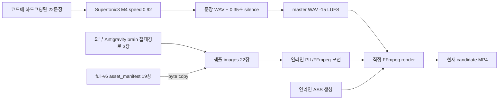

# HA002 3분 컨텍스트 샘플 품질 재구축 Implementation Plan

> **For agentic workers:** REQUIRED SUB-SKILL: Use superpowers:subagent-driven-development (recommended) or superpowers:executing-plans to implement this plan task-by-task. Steps use checkbox (`- [ ]`) syntax for tracking.

**Goal:** `HA002-sample-3m-context-final.mp4`를 임시 수동 샘플에서 벗어나, 170~190초 `quick_3m` 계약·사실 승인·자산 계보·시청각 QA·원자적 릴리스 게이트를 모두 통과하는 재현 가능한 파생 빌드로 재구축한다.

**Architecture:** 승인된 `full-v6-001`을 원본으로 삼되 MP4를 잘라 쓰지 않고, 문장 ID 기반 `context_sample_manifest`가 대본·근거·이미지·승인을 투영한다. 이후 기존 정본 파이프라인의 TTS → 실측 타이밍 → 시각 재사용/생성 → QA/사람 승인 → 모션 → 자막 → 렌더 → postflight → release 단계를 그대로 사용한다. 현재 후보는 감사 증거로 동결하고 개선본은 `sample-3m-v2-001`에 새로 만든다.

**Tech Stack:** Python 3.12+ (현재 검증 환경 3.13.5), pytest, JSON Schema, FFmpeg/ffprobe 25 CFR, Supertonic3 HTTP, ASS subtitles, existing Human Archive manifest/freshness/visual/release libraries.

**Spec:** `docs/superpowers/specs/2026-08-27-narration-aligned-visual-workflow-design.md`, `docs/superpowers/specs/2026-08-21-pompeii-video-quality-audit-design.md`, `CLAUDE.md`, `human_archive/README.md`, 본 문서의 2026-08-31 로컬 감사 결과.

---

## 1. 감사 대상과 최종 판정

### 대상

- 후보: `human_archive/runs/ep02_jang_huibin/sample-3m-context-final/candidate/HA002-sample-3m-context-final.mp4`
- 후보 SHA-256: `96F7909D78E6BE1C8DA141CF1A80B8F61B69B2019B36860A4485B168FE960573`
- 생성기로 확인된 파일: `human_archive/scripts/build_context_sample_3m.py`
- 가장 가능성 높은 실행 경로: 저장소 루트에서 `python human_archive/scripts/build_context_sample_3m.py`
- 단, 실행 로그와 당시 Git revision이 없어 실제 shell invocation은 확정할 수 없다.

### 릴리스 판정

**HOLD / NOT RELEASE-READY.** 인코딩과 A/V 동기 자체는 양호하지만, `quick_3m` 최소 길이에 31.16초 미달하고 사실·자산·승인·build·release manifest가 없으며 정식 freshness/visual/postflight 게이트를 우회했다. 파일명에 `final`이 있어도 게시 가능한 정본으로 간주하지 않는다.

현재 후보는 삭제·덮어쓰기하지 않는다. 아래 개선은 새 빌드 `human_archive/runs/ep02_jang_huibin/sample-3m-v2-001/`에서 수행한다.

### 감사 증거

- AV 원자료: `human_archive/audits/ep02_sample_3m_2026-08-31/video_agent/`
- 대표 프레임: `human_archive/audits/ep02_sample_3m_2026-08-31/root/representative_frames_9.jpg`
- 전체 타임라인 연락시트: `human_archive/audits/ep02_sample_3m_2026-08-31/root/video_timeline_contact_sheet.jpg`
- 훅 이미지 비교: `human_archive/audits/ep02_sample_3m_2026-08-31/root/custom_hook_images.jpg`
- 무음 분해: `human_archive/audits/ep02_sample_3m_2026-08-31/video_agent/audio_gap_decomposition.csv`
- 자막/모션 정렬: `human_archive/audits/ep02_sample_3m_2026-08-31/video_agent/subtitle_motion_alignment.csv`

---

## 2. 현 영상 정량 감사

| 항목 | 실측 | 판정 |
|---|---:|---|
| 길이 | 138.840초 (2:18.84) | **FAIL** — `quick_3m` 170~190초보다 31.16초 짧음 |
| 컨테이너/크기 | MP4/isom, 81,183,094 bytes | PASS |
| 영상 | H.264 High L4.1, 1920×1080, yuv420p limited, BT.709, progressive | PASS |
| 프레임 | 25 CFR, 3,471프레임, PTS 간격 0.040초 | PASS |
| 오디오 | AAC-LC, 48 kHz, stereo dual-mono, 약 160.8 kbps | 기술 PASS, 공간 설계 미흡 |
| A/V 길이 차 | 영상 138.840초 / 오디오 138.837초, 3 ms | PASS |
| 라우드니스 | -15.0 LUFS, LRA 4.4 LU, true peak -3.9 dBFS | PASS |
| 블랙/프리즈 | 검출 0건 | PASS |
| 모션/자막 | 22 clips / 22 cues, 시작 오차 최대 1프레임 | PASS |
| 마지막 자막 | 영상보다 30 ms 늦게 종료 | 허용범위이나 새 빌드에서는 0 ms 이내로 고정 |
| 자막 가독성 | 평균 4.63 CPS, 최대 4.94 CPS, 줄 최대 19자 | PASS |
| 무음 비율 | -45 dB, 0.2초 기준 37.069초 / 26.7% | **FAIL** — 체감 템포 저하 |

기술적 장점은 보존한다. 즉 1080p, 25 CFR, BT.709, A/V 1프레임 이내, 현재 라우드니스, 두 줄 자막 규칙은 개선본의 회귀 방지 기준이다.

### 오디오 무음의 확정 원인

`SupertonicHttpProvider.synthesize_phrase()`는 요청 기본값으로 `silence_duration=0.35`를 보낸다. 생성된 22개 WAV에는 실제로 다음 여백이 들어 있다.

- 선행 무음: 0.390~0.617초, 평균 0.501초
- 후행 무음: 0.460~0.681초, 평균 0.597초
- 여기에 샘플 빌더가 문장 사이 `silence.wav` 0.350초를 21회 추가한다.
- 최종 문장 경계 무음: 1.310~1.524초, 평균 1.426초

즉 경계 하나의 체감 공백은 대략 `이전 WAV 후행 0.597 + 삽입 0.350 + 다음 WAV 선행 0.501`이다. 인코딩 후 실측 평균은 1.426초이며, 의도한 0.35초보다 경계당 평균 1.076초, 전체 21경계에서 약 22.6초가 더 길다.

이것은 취향 문제가 아니라 구현 중복이다. 개선본에서는 **pause owner를 한 곳으로 제한**한다. TTS 원본 WAV는 보존하되 앞뒤 여백을 측정·trim하고, 타임라인 빌더만 0.30~0.35초의 최종 gap을 소유한다.

### 타임코드별 핵심 시각·편집 문제

| 구간 | 문제 | 개선 방향 |
|---|---|---|
| 00:00.00~00:12.19 | 1번은 사실적/세밀한 선비, 2번은 컬러 사극 일러스트로 이후 단색 doodle과 스타일이 급격히 다름 | 동일 `doodle_seonbi_v1` 스타일로 재생성; canonical host identity 고정 |
| 00:12.54~00:18.53 | 이미지 안에 `사약 (Royal Execution)`과 세로 글자가 생성되어 있음 | 소스 이미지 텍스트 0건; 설명은 renderer overlay만 사용 |
| 00:12.54~00:18.53 | 강제 사약 장면이 사실 재현처럼 강하게 보이며 다음의 “기록 없음” 반전보다 먼저 인상을 고정할 수 있음 | ‘사극적 통념’임을 무대/그림자/가면 같은 비문자 은유로 표현하고 즉시 반박 컷으로 연결 |
| 00:18.88 | 컬러·세밀화에서 희소한 흑백 doodle로 하드컷 | 첫 프레임부터 동일 스타일 또는 의도된 transition manifest 사용 |
| 전 문장 경계 21곳 | 1.310~1.524초 무음 때문에 말이 끊기고 자막이 음성 전후에 오래 남음 | 최종 경계 0.35±0.10초, cue는 실제 발화 경계에 맞춤 |
| 전 구간 | 실제 모션 이름 6종 중 일부가 같은 궤적을 공유하고 `zoom_out`도 zoom-in 함 | 공용 `motion_engine_v3`의 구분된 궤적 사용, endpoint test 추가 |
| 전 구간 | narration-only dual-mono로 밤 분위기·사료 장면의 공간감이 없음 | 권리 메타데이터가 있는 ambience/music/foley만 낮은 레벨로 혼합; 없으면 명시적 voice-only 승인 필요 |

Canonical host로 명확히 식별되는 장면은 현재 22개 중 2개(9.1%)로 `visual_pacing_profiles.yaml`의 8~12%에는 맞는다. 그러나 `channel_profiles.yaml`은 15~25%를 요구해 정책이 충돌한다. 더구나 기본 채널 프로필은 `delivery_profile: doodle_docu_12m`을 참조하지만 이 ID는 현재 `delivery_profiles.yaml`에 정의되어 있지 않다. 새 빌드 전 host ratio와 delivery profile 참조를 단일 설정원으로 통합한다.

---

## 3. 생성 계보와 구조적 문제

### 확인된 현재 경로



1. `build_context_sample_3m.py`가 출력 폴더, 외부 `C:\Users\shs\.gemini\antigravity\brain\4c9955d8-905b-44cb-a249-e670f6131c96`, 22개 대사, 이미지 ID, 모션을 모두 코드에 고정한다.
2. 1~3번 이미지는 외부 brain 파일과 SHA가 동일하다. 생성 prompt/model/response/승인 정보는 sample에 없다.
3. 4~22번 이미지는 `full-v6-001`의 19개 자산과 byte-identical이다. 11개는 v5 재사용 계보, 8개는 Flow 계보지만 sample에는 source/target request·approval SHA가 전달되지 않는다.
4. 원본 자산을 못 찾으면 `manifest_assets[0]`을 복사하는 fail-open fallback이 있어 잘못된 장면도 성공할 수 있다.
5. 표준 `verify_visual_assets`, freshness, `render_episode_v2`, `postflight_release`를 호출하지 않고 직접 FFmpeg로 후보를 덮어쓴다.
6. 모션 subprocess의 return code를 확인하지 않는다. 모션 타입 이름과 실제 궤적도 일치하지 않는다.

### 정본 대비 누락 산출물

| 필수 산출물/게이트 | sample | full-v6 정본 | 판정 |
|---|---|---|---|
| delivery/episode contract | 없음 | 있음 | FAIL |
| source script snapshot + SHA | 없음 | 있음 | FAIL |
| claim/source/fact/persona report와 승인 | 없음 | 있음 | FAIL |
| sentence/scene audio manifest | 없음 | 있음 | FAIL |
| shot timing/contract | 코드 메모리 안에만 존재 | 있음 | FAIL |
| visual brief/image request manifest | 없음 | 있음 | FAIL |
| asset provenance/reuse approval | 없음 | 있음 | FAIL |
| OCR/중복/semantic QA report | 없음 | 있음 | FAIL |
| visual human approval | 없음 | 있음 | FAIL |
| build manifest/freshness | 없음 | 있음 | FAIL |
| release report/approval | 없음 | 있음 | FAIL |
| candidate technical encoding | 있음 | 있음 | PASS |

`verify_upstream_hash_freshness()`에 sample을 넣으면 asset manifest, scene audio manifest, visual approval이 없어서 실패한다. `verify_visual_assets.py --build`도 asset manifest 부재로 즉시 실패한다. 이것이 정상적인 fail-closed 동작이며, 샘플 빌더가 해당 검증을 호출하지 않은 것이 문제다.

### 대본·사실 승인 drift

- 하드코딩 대사 22개 중 17개는 현재 v6 정본 문장과 exact match다.
- 5개(샘플 순번 7, 10, 12, 14, 21)는 exact match가 아니다.
- 특히 12번의 “중전 처소 밑에서 바늘 꽂힌 저주 인형이 쏟아져”는 정본의 관련 문구를 위치·행위·강도까지 압축/변형한다. 사실 여부를 이 감사에서 재판정하지 않으며, **새로운 표현이므로 별도 fact/editorial review가 필요**하다고 판정한다.
- v6 `fact_check_report_v2.json`은 전체 `REVIEW_REQUIRED`였고 87개 paraphrase review가 사람 승인으로 해소되어 있다. 그러나 sample이 해당 문장 ID와 approval SHA를 담지 않으므로 그 승인이 자동으로 이전되지 않는다.

### 테스트 사각지대

관련 기존 테스트 8개, 23건은 모두 통과했다. 이는 공용 단위 기능이 동작한다는 뜻이지 sample의 적합성 증명이 아니다. 현재 테스트는 다음을 잡지 못한다.

- `sample-3m-context-final` 또는 `build_context_sample_3m.py` end-to-end 실행
- 외부 절대경로와 미보존 custom image provenance
- missing asset 시 첫 자산 fallback
- 138.84초가 `quick_3m`에도 실패한다는 계약
- TTS WAV padding과 builder gap의 중복
- source→audio→subtitle→motion→candidate SHA chain 부재
- postflight `upstream_hashes`가 항상 `{}`로 기록되는 결함

---

## 4. 개선안 결정

| 안 | 내용 | 장점 | 결론 |
|---|---|---|---|
| A. 현재 monolith만 패치 | 하드코딩 스크립트에 trim·검사 몇 개 추가 | 빠름 | **기각** — 정본 파이프라인과 이중 구현·drift 지속 |
| B. 승인 원본의 파생 build | 문장 ID projection manifest를 만들고 기존 정본 파이프라인 전 단계 재사용 | 계보·재현·QA·릴리스 가능 | **채택** |
| C. full-v6 MP4 단순 구간 추출 | 원본 승인 보존이 쉬움 | 3분용 서사 재편집과 독립 자막/이미지 대응이 약함 | 백업안 |

기본 제품 계약은 이미 존재하는 `quick_3m`을 사용한다.

- publishable: `true`
- target: 180초
- 허용: 170~190초
- 빌드 내부 운영 목표: 175~185초

현재 공백을 정상화하면 영상은 오히려 약 115초 전후로 짧아진다. 그러므로 정적 화면이나 무음을 늘려 3분을 맞추지 않는다. v6의 승인된 문장 중 훅→반박→사건→정치적 맥락→사사 절차→열린 질문을 보강하여 실측 TTS가 175~185초가 될 때까지 의미 있는 내용을 추가한다.

### 목표 경로


---

## 5. Global Constraints

- 현재 `sample-3m-context-final`의 파일은 감사 증거이므로 수정·삭제·덮어쓰기하지 않는다.
- 새 산출물은 `sample-3m-v2-001`에만 생성한다.
- 모든 publishable build는 `delivery_profile=quick_3m`을 명시하고 170~190초를 통과해야 한다.
- 로컬 사용자 절대경로를 manifest의 유일한 원본으로 사용하지 않는다. 외부 파일은 content-addressed import, prompt/response/provider/license/approval SHA를 가져야 한다.
- source asset이 없거나 SHA가 다르면 실패한다. 임의 자산 fallback은 금지한다.
- fact/persona/visual/release 승인은 승인 대상의 정확한 SHA에 결속한다. 상위 build 승인을 암묵적으로 상속하지 않는다.
- TTS raw WAV는 불변 보존하고, processed WAV와 trim bounds를 별도 manifest에 기록한다.
- 문장 간 pause는 타임라인 빌더 한 곳만 소유한다. provider padding과 builder gap을 동시에 사용하지 않는다.
- 기본 AI 이미지에는 글자·숫자·캡션·라벨·워터마크가 0건이어야 한다. 필요한 텍스트는 overlay manifest를 통해 렌더한다.
- 모션·오디오·FFmpeg child process는 non-zero return code에서 즉시 실패한다.
- renderer는 `.part`를 완성·검증한 뒤 atomic replace한다.
- media binary는 기존 ignore 정책을 유지하되, schema/config/code/test/manifests/approvals/reports는 버전 관리한다.
- 구현 중 unrelated dirty worktree 파일을 수정하거나 정리하지 않는다.

---

## 6. 실행 계획

### Task 0: 현재 후보 동결과 재현 가능한 감사 baseline

**Files:**

- Create: `human_archive/audits/ep02_sample_3m_2026-08-31/audit_manifest.json`
- Create: `human_archive/audits/ep02_sample_3m_2026-08-31/audit_summary.md`
- Test: `human_archive/tests/test_context_sample_audit_baseline.py`

**Estimated effort:** 0.5 day

- [x] `test_context_sample_audit_baseline.py`에 후보 SHA, 크기, duration, stream spec, 22 audio/image/motion 개수, 22 subtitle cue를 고정하는 실패 테스트를 작성한다.
- [x] 테스트를 실행해 audit manifest가 없어서 FAIL하는지 확인한다.

  ```powershell
  python -m pytest human_archive/tests/test_context_sample_audit_baseline.py -q
  ```

- [x] `audit_manifest.json`에 후보 및 모든 생성 증거 파일의 SHA-256, 측정 명령, 측정 시각, 도구 버전을 기록한다.
- [x] `audit_summary.md`에 본 문서 1~3장의 판정과 미확인 사항(실제 shell history, builder revision, custom prompt/model/승인자)을 기록한다.
- [x] 기존 후보를 다시 hash하여 `96F7909D78E6BE1C8DA141CF1A80B8F61B69B2019B36860A4485B168FE960573`과 일치하는지 확인하고 테스트를 PASS시킨다.
- [x] 감사 JSON/Markdown만 stage하고 MP4/WAV/JPG는 stage하지 않는다.

  ```powershell
  git add docs/superpowers/plans/2026-08-31-ha002-context-sample-quality-rebuild.md human_archive/audits/ep02_sample_3m_2026-08-31/audit_manifest.json human_archive/audits/ep02_sample_3m_2026-08-31/audit_summary.md human_archive/tests/test_context_sample_audit_baseline.py
  git commit -m "docs: baseline HA002 context sample audit"
  ```

### Task 1: 파생 샘플 contract/schema와 fail-closed validator

**Files:**

- Create: `human_archive/schemas/context_sample_build_v1.schema.json`
- Create: `human_archive/scripts/lib/context_sample.py`
- Create: `human_archive/scripts/verify_context_sample_build.py`
- Modify: `human_archive/scripts/build_context_sample_3m.py`
- Test: `human_archive/tests/test_context_sample_contract.py`
- Build artifact: `human_archive/runs/ep02_jang_huibin/sample-3m-v2-001/source/context_sample_manifest.json`

**Estimated effort:** 1 day

- [ ] schema 테스트를 먼저 작성한다. 다음 경우 모두 FAIL해야 한다: delivery profile 누락, source script SHA 불일치, rewrite 승인 누락, 외부 절대경로만 존재, asset SHA 누락, source asset 누락, unsupported motion, duplicate sample shot ID.
- [ ] 정상 fixture가 다음 필드를 강제하도록 schema를 정의한다.

  ```json
  {
    "schema_version": 1,
    "episode_id": "HA002",
    "build_id": "sample-3m-v2-001",
    "delivery_profile": "quick_3m",
    "source_build_id": "full-v6-001",
    "source_artifacts": {
      "script_sha256": "419A0581536F3E2EA580CEA180A885211F51E9DA122E1A01E08B0E25565A832E",
      "claims_sha256": "F0D64B6B2BD268F487E5B22D0871BCEE482EC66BC1866DB6710742D93654DCD7",
      "fact_report_sha256": "51329F76C2A0D0B0263B4FB9036E2605B5772AB0DAF0470E902ED31E4D73C8DA",
      "fact_approval_sha256": "CC9F8756A296B926D79F91D222BBC212D68CE6B804B3F2B332B4D04A6B0A1FBE",
      "persona_report_sha256": "2CD39DF409CC4FC26C2CED59ABF7DB7B6DE6C97214917E9A58A3A44CE8C0E852"
    },
    "segments": [
      {
        "sample_sentence_id": "HA002-Q3-001",
        "source_sentence_ids": ["HA002-S001"],
        "edit_mode": "exact",
        "display_text": "에헴! 여러분, 사극 드라마 속 장희빈의 최후 기억하십니까?",
        "tts_text_sha256": "F6EBFB3B184E3105ED621DC79D509ECAF5F5F93E3BFDF7AFC9E686600A617D9C",
        "claim_ids": ["CLM-JH-001"],
        "evidence_span_ids": [
          "SRC-SUKJONG-SILLOK:SPAN-01",
          "SRC-SEUNGJEONGWON:SPAN-01",
          "SRC-INHYEON-JEON:SPAN-01"
        ],
        "editorial_approval_sha256": null
      }
    ]
  }
  ```

- [ ] `context_sample.py`에 `load_context_sample_manifest()`, `validate_source_bindings()`, `validate_segment_approval()`, `resolve_delivery_profile()`를 구현한다.
- [ ] `edit_mode=exact`이면 선택된 source sentence의 텍스트와 byte-for-byte 일치하게 하고, `rewrite`이면 text SHA를 포함하는 local fact/editorial approval을 강제한다.
- [ ] `build_context_sample_3m.py`를 import-time 실행 monolith에서 얇은 CLI로 교체한다. 필수 옵션은 `--build`, `--source-build`, `--context-manifest`, `--delivery-profile`이다.
- [ ] 하드코딩 `brain_dir`, 직접 `write_bytes`, `manifest_assets[0]` fallback, 직접 최종 FFmpeg 렌더를 제거한다.
- [ ] validator가 누락/불일치를 한 번에 목록화하되 exit code 1로 fail-closed하는지 테스트한다.
- [ ] 전체 계약 테스트를 PASS시킨다.

  ```powershell
  python -m pytest human_archive/tests/test_context_sample_contract.py -q
  ```

- [ ] Commit.

  ```powershell
  git add human_archive/schemas/context_sample_build_v1.schema.json human_archive/scripts/lib/context_sample.py human_archive/scripts/verify_context_sample_build.py human_archive/scripts/build_context_sample_3m.py human_archive/tests/test_context_sample_contract.py
  git commit -m "feat: add SHA-bound context sample contract"
  ```

### Task 2: 승인 문장 기반 3분 대본 projection과 재승인

**Files:**

- Create: `human_archive/scripts/compile_context_sample_script.py`
- Test: `human_archive/tests/test_context_sample_script_projection.py`
- Build artifacts under `human_archive/runs/ep02_jang_huibin/sample-3m-v2-001/source/`:
  - `script_candidate.json`
  - `claim_inventory_v2.json`
  - `fact_check_report_v2.json`
  - `persona_report_v2.json`
  - `source_snapshot_manifest_v2.json`
  - `approvals/fact_review_approval_v1.json`
  - `episode_contract.yaml`

**Estimated effort:** 1 day plus human fact/editorial review

- [ ] projection 테스트를 작성한다: exact 17개는 원문·ID·claim/evidence binding을 보존하고, 기존 5개 변경문은 승인 없이 FAIL해야 한다.
- [ ] `compile_context_sample_script.py`가 `context_sample_manifest.json`에서 독립 `script_candidate.json`을 만들되 모든 문장에 source ID 배열과 edit mode를 남기게 구현한다.
- [ ] 현재 22문장을 기준으로 하되, 훅→사극 통념→사료 반박→취선당 사건→정치적 맥락→사사 절차→열린 질문의 흐름을 유지하면서 승인된 v6 문장을 추가한다.
- [ ] duration을 무음이나 느린 속도로 부풀리지 않는다. Supertonic 실측 결과가 175~185초가 되도록 승인된 의미 단위를 추가·조정한다.
- [ ] `episode_contract.yaml`은 아래 고정 키를 사용한다. context manifest의 `delivery_profile`과 episode contract의 `format_profile`이 다르면 validator가 실패해야 한다.

  ```yaml
  schema_version: 1
  episode_id: HA002
  build_id: sample-3m-v2-001
  format_profile: quick_3m
  publishable: true
  target_duration_sec: 180
  min_duration_sec: 170
  max_duration_sec: 190
  ```

- [ ] 현재 exact match가 아닌 샘플 7, 10, 12, 14, 21번은 다음 중 하나만 허용한다: v6 원문으로 복원하거나, `rewrite`로 남기고 새 fact/editorial approval을 받는다.
- [ ] 사실·페르소나 검사를 실행한다.

  ```powershell
  python human_archive/scripts/verify_script_facts.py --script human_archive/runs/ep02_jang_huibin/sample-3m-v2-001/source/script_candidate.json --claims human_archive/runs/ep02_jang_huibin/sample-3m-v2-001/source/claim_inventory_v2.json --sources human_archive/runs/ep02_jang_huibin/sample-3m-v2-001/source/source_snapshot_manifest_v2.json --report human_archive/runs/ep02_jang_huibin/sample-3m-v2-001/source/fact_check_report_v2.json
  python human_archive/scripts/validate_seonbi_persona.py --script human_archive/runs/ep02_jang_huibin/sample-3m-v2-001/source/script_candidate.json --policy human_archive/config/seonbi_narration_policy.yaml --report human_archive/runs/ep02_jang_huibin/sample-3m-v2-001/source/persona_report_v2.json
  ```

- [ ] `fail_count=0`, `unsupported_count=0`, `forbidden_wording_count=0`, `unresolved_conflict_count=0`을 확인한다.
- [ ] REVIEW_REQUIRED 항목은 문장·claims·sources·reports의 정확한 SHA로 사람 승인을 기록한다.

  ```powershell
  python human_archive/scripts/record_fact_review_approval.py --script human_archive/runs/ep02_jang_huibin/sample-3m-v2-001/source/script_candidate.json --fact-report human_archive/runs/ep02_jang_huibin/sample-3m-v2-001/source/fact_check_report_v2.json --persona-report human_archive/runs/ep02_jang_huibin/sample-3m-v2-001/source/persona_report_v2.json --claims human_archive/runs/ep02_jang_huibin/sample-3m-v2-001/source/claim_inventory_v2.json --sources human_archive/runs/ep02_jang_huibin/sample-3m-v2-001/source/source_snapshot_manifest_v2.json --output human_archive/runs/ep02_jang_huibin/sample-3m-v2-001/source/approvals/fact_review_approval_v1.json --reviewer-id shs --approval-source human_review
  ```

- [ ] 테스트를 PASS시키고 metadata만 commit한다.

  ```powershell
  python -m pytest human_archive/tests/test_context_sample_script_projection.py -q
  git add human_archive/scripts/compile_context_sample_script.py human_archive/tests/test_context_sample_script_projection.py human_archive/runs/ep02_jang_huibin/sample-3m-v2-001/source
  git commit -m "feat: compile approved HA002 quick sample script"
  ```

### Task 3: TTS padding 중복 제거와 실측 발화 타임라인

**Files:**

- Modify: `human_archive/scripts/lib/tts_provider.py`
- Modify: `human_archive/scripts/lib/audio_timeline.py`
- Modify: `human_archive/scripts/build_sentence_audio_master.py`
- Modify: `human_archive/scripts/lib/sentence_audio_timeline.py`
- Create: `human_archive/tests/test_sentence_audio_padding.py`
- Modify: `human_archive/tests/test_sentence_audio_timeline.py`
- Create: `human_archive/tests/test_context_sample_timeline.py`

**Estimated effort:** 1.5 days

- [ ] synthetic WAV fixture로 0.50초 lead + 1.00초 tone + 0.60초 tail을 만들고 active bounds, trim, 보존 padding, hash provenance 테스트를 먼저 작성한다.
- [ ] 두 문장을 이었을 때 provider padding과 builder gap을 중복시키면 테스트가 FAIL하도록 한다.
- [ ] `tts_provider.py`가 `silence_duration`과 provider URL/voice/speed/total_step/server response identity를 provenance에 반환하게 한다. publishable sample 호출은 provider `silence_duration=0.0`을 명시한다.
- [x] `audio_timeline.py`에 `measure_active_bounds(path, threshold_db=-45.0, min_silence_sec=0.10)`와 `trim_outer_silence(raw, processed, keep_lead_sec=0.08, keep_tail_sec=0.10)`을 추가한다.
- [ ] raw WAV는 `audio/raw/`, processed WAV는 `audio/sentences/`에 분리하고 raw/processed SHA, active_start/end, trim amount를 sentence manifest에 기록한다.
- [ ] trim이 자음 onset/문장 말미를 자르지 않도록 cold-open 전체 문장을 waveform+청취로 사람 검토한다.
- [ ] gap은 `seonbi_narration_policy.yaml`의 0.30초를 기본으로 하고, 강조/section 전환만 manifest의 `pause_after_sec=0.70`으로 명시한다.
- [ ] `speed=0.96`, `pitch=-0.5 semitone` 정책을 적용한다. 현재 FFmpeg의 `rubberband` 지원을 사용해 pitch ratio `0.971532`를 적용하고 길이는 유지한다.
- [ ] voice stem은 -16 LUFS로 정규화하고, 2-pass 측정 실패 시 single-pass silent fallback하지 말고 실패한다. 적용 뒤 라우드니스를 재측정한다.
- [ ] subtitle/motion 소비용 row에 `wav_start_sec`, `spoken_start_sec`, `spoken_end_sec`, `wav_end_sec`를 모두 기록한다.
- [ ] 실제 Supertonic으로 전 문장을 생성하고 다음을 검증한다.

  - 최종 일반 문장 경계: 0.25~0.45초
  - section pause: manifest 값 ±0.10초
  - trimmed lead ≤0.15초, tail ≤0.15초
  - 음소 clipping 0건
  - master duration: 175~185초 운영 목표, 170~190초 hard gate

- [ ] 테스트를 PASS시킨다.

  ```powershell
  python -m pytest human_archive/tests/test_sentence_audio_padding.py human_archive/tests/test_sentence_audio_timeline.py human_archive/tests/test_context_sample_timeline.py -q
  ```

- [ ] Commit.

  ```powershell
  git add human_archive/scripts/lib/tts_provider.py human_archive/scripts/lib/audio_timeline.py human_archive/scripts/build_sentence_audio_master.py human_archive/scripts/lib/sentence_audio_timeline.py human_archive/tests/test_sentence_audio_padding.py human_archive/tests/test_sentence_audio_timeline.py human_archive/tests/test_context_sample_timeline.py
  git commit -m "fix: make narration gap single-owned and measurable"
  ```

### Task 4: 오디오 레이어 정책과 권리 provenance

**Files:**

- Create: `human_archive/scripts/mix_documentary_audio.py`
- Create: `human_archive/schemas/audio_mix_manifest_v1.schema.json`
- Create: `human_archive/tests/test_audio_mix_manifest.py`
- Modify: `human_archive/config/seonbi_narration_policy.yaml`
- Modify: `human_archive/config/narration_policy.yaml`
- Build artifact: `human_archive/runs/ep02_jang_huibin/sample-3m-v2-001/audio_mix_manifest.json`

**Estimated effort:** 1 day plus licensed/owned asset selection

- [ ] audio mix schema 테스트를 먼저 작성한다. music/ambience/foley에 source URI 또는 managed path, SHA-256, creator, license ID, allowed platform, expiry가 없으면 publishable build를 FAIL시킨다.
- [ ] `seonbi_narration_policy.yaml`을 authoritative policy로 정하고 일반 `narration_policy.yaml`의 speed/gap 중복값은 이를 참조하거나 동일성 검증 대상으로 바꾼다.
- [ ] `mix_documentary_audio.py`가 다음 stem을 받게 한다: narration center, night ambience -28 dB, event-based foley -22 dB, music -18 dB, speech 구간 -4 dB ducking.
- [ ] 모든 레이어가 없을 때 조용히 narration-only로 통과하지 않는다. contract의 `audio_mix_mode=layered_documentary` 또는 SHA-bound `voice_only_exception_approval` 중 하나를 요구한다.
- [ ] 최종 mix를 -15 LUFS 목표로 정규화하고 true peak ≤ -1 dBTP를 검증한다. narration intelligibility가 항상 우선이어야 한다.
- [ ] 음악·효과음은 내용의 사실성을 암시하지 않도록 과장된 비명/충격음/공포 효과를 금지한다.
- [ ] 테스트와 샘플 mix 청취를 통과한다.

  ```powershell
  python -m pytest human_archive/tests/test_audio_mix_manifest.py -q
  ```

- [ ] Commit.

  ```powershell
  git add human_archive/scripts/mix_documentary_audio.py human_archive/schemas/audio_mix_manifest_v1.schema.json human_archive/tests/test_audio_mix_manifest.py human_archive/config/seonbi_narration_policy.yaml human_archive/config/narration_policy.yaml
  git commit -m "feat: add licensed documentary audio mix gate"
  ```

### Task 5: 시각 자산 계보·스타일·OCR QA 재구축

**Files:**

- Modify: `human_archive/config/channel_profiles.yaml`
- Modify: `human_archive/config/visual_pacing_profiles.yaml`
- Modify: `human_archive/scripts/lib/channel_profiles.py`
- Test: `human_archive/tests/test_context_sample_visual_qa.py`
- Test: `human_archive/tests/test_visual_pacing_policy_consistency.py`
- Build artifacts under `human_archive/runs/ep02_jang_huibin/sample-3m-v2-001/`:
  - `visual_brief_manifest.json`
  - `image_request_manifest.json`
  - `image_reuse_plan.json`
  - `image_reuse_review_approval.json`
  - `asset_manifest.json`
  - `visual_content_report.json`
  - `contact_sheet.jpg`
  - `approvals/visual_approval.json`

**Estimated effort:** 1.5 days plus generation/review latency

- [ ] visual QA 테스트를 먼저 작성한다. generated text, realistic face, style mismatch, service mark, duplicate, stale request SHA, stale approval SHA, missing source asset, host ratio drift가 모두 fail-closed해야 한다.
- [ ] host ratio의 단일 기준을 `visual_pacing_profiles.yaml` 8~12%로 정한다. `channel_profiles.yaml`의 15~25% 중복값을 제거하거나 8~12%로 맞추고 consistency test를 추가한다.
- [ ] `channel_profiles.yaml`의 미정의 `doodle_docu_12m` 참조도 해결한다. 기본 프로필은 실제 존재하는 `standard_docu`를 참조하고, quick sample은 build contract의 `quick_3m`이 명시적으로 override하게 한다. 모든 channel delivery profile ID가 `delivery_profiles.yaml`에 존재하는지 같은 consistency test에서 검사한다.
- [ ] 기존 custom 1~3번은 현 상태로 재사용하지 않는다.
  - shot 1: canonical 갓쓴 stick-figure 쉽선비, 정면 강의 포즈, generated text 없음
  - shot 2: 악녀 클리셰를 드라마 무대/깨진 사발/과장된 실루엣으로 표현, realistic face 없음
  - shot 3: 강제 사약이 ‘극화된 통념’임을 무대 커튼/가면/그림자로 표현, 문자·영문·세로 글자 없음
- [ ] v6 19개 자산은 byte-copy가 아니라 `build_semantic_image_reuse_plan.py` → 사람 review → `materialize_semantic_image_reuse.py`로 가져온다.
- [ ] 모든 reuse row에 source build/shot/file/request SHA, target request SHA, decision, review approval SHA를 저장한다.
- [ ] target semantic brief와 맞지 않는 source asset은 자동 대체하지 않고 새 image request로 전환한다.
- [ ] 이미지 생성/재사용 후 request validation, OCR, generated-text/service-mark, pHash duplicate, semantic/historical/dignity, host pacing QA를 실행한다.

  ```powershell
  python human_archive/scripts/build_semantic_image_reuse_plan.py --source-build human_archive/runs/ep02_jang_huibin/full-v6-001 --target-build human_archive/runs/ep02_jang_huibin/sample-3m-v2-001 --output human_archive/runs/ep02_jang_huibin/sample-3m-v2-001/image_reuse_plan.json --host-ratio 0.10 --host-min-non-host-gap 7
  python human_archive/scripts/materialize_semantic_image_reuse.py --source-build human_archive/runs/ep02_jang_huibin/full-v6-001 --target-build human_archive/runs/ep02_jang_huibin/sample-3m-v2-001 --plan human_archive/runs/ep02_jang_huibin/sample-3m-v2-001/image_reuse_plan.json --review-approval human_archive/runs/ep02_jang_huibin/sample-3m-v2-001/image_reuse_review_approval.json --dry-run
  python human_archive/scripts/validate_image_requests.py --build human_archive/runs/ep02_jang_huibin/sample-3m-v2-001
  python human_archive/scripts/verify_visual_assets.py --build human_archive/runs/ep02_jang_huibin/sample-3m-v2-001
  python human_archive/scripts/build_contact_sheet.py --build human_archive/runs/ep02_jang_huibin/sample-3m-v2-001 --output human_archive/runs/ep02_jang_huibin/sample-3m-v2-001/contact_sheet.jpg
  ```

- [ ] cold-open과 coverage contact sheet를 사람 검토한 뒤 정확한 manifest/report SHA로 visual approval을 기록한다.

  ```powershell
  python human_archive/scripts/record_visual_approval.py --build human_archive/runs/ep02_jang_huibin/sample-3m-v2-001 --reviewer-id shs
  ```

- [ ] 합격 기준: generated text/service mark 0, unsupported semantic 0, duplicate policy violation 0, canonical style 위반 0, victim dignity violation 0, host ratio 8~12%, 최대 연속 host 2, non-host gap 정책 통과.
- [ ] 테스트를 PASS시키고 code/config/metadata를 commit한다.

  ```powershell
  python -m pytest human_archive/tests/test_context_sample_visual_qa.py human_archive/tests/test_visual_pacing_policy_consistency.py -q
  git add human_archive/config/channel_profiles.yaml human_archive/config/visual_pacing_profiles.yaml human_archive/scripts/lib/channel_profiles.py human_archive/tests/test_context_sample_visual_qa.py human_archive/tests/test_visual_pacing_policy_consistency.py human_archive/runs/ep02_jang_huibin/sample-3m-v2-001/*.json human_archive/runs/ep02_jang_huibin/sample-3m-v2-001/approvals
  git commit -m "feat: gate quick sample visual lineage and style"
  ```

### Task 6: 공용 모션 엔진과 실제 발화 경계 자막

**Files:**

- Modify: `human_archive/scripts/lib/motion_engine_v3.py`
- Modify: `human_archive/scripts/build_motion_clips_v2.py`
- Modify: `human_archive/scripts/build_motion_clips_v3.py`
- Modify: `human_archive/scripts/build_subtitles_v2.py`
- Create: `human_archive/tests/test_motion_trajectory_semantics.py`
- Modify: `human_archive/tests/test_motion_clips_v2.py`
- Modify: `human_archive/tests/test_subtitles_v2.py`

**Estimated effort:** 1 day

- [ ] trajectory 테스트를 먼저 작성한다: `push_in`, `pull_out`, `pan_left`, `pan_right`, `tilt_up`, `tilt_down`, `static`의 시작/끝 zoom·x·y가 서로 의미 있게 달라야 한다.
- [ ] 기존 `kenburns_zoom_pan_out`이 zoom-in하는 회귀와 `pan_right`/`hero_push`가 동일한 회귀를 테스트로 고정한다.
- [ ] `build_motion_clips_v2.py`가 자체 궤적을 복제하지 않고 `motion_engine_v3.trajectory()`를 사용하게 한다.
- [ ] unsupported motion은 기본 효과로 조용히 바꾸지 말고 오류로 중단한다.
- [ ] rawvideo FFmpeg process의 stdin write/close 예외와 `proc.wait()` non-zero return code를 검사한다.
- [ ] 각 clip의 프레임 수를 `round(scene_duration*25)`로 만들고 manifest에 frame count/actual duration/hash를 기록한다.
- [ ] `build_subtitles_v2.py`가 WAV 파일 경계가 아니라 `spoken_start_sec`/`spoken_end_sec`를 사용하게 한다.
- [ ] font preflight를 추가하고 Malgun Gothic이 없으면 대체 폰트를 조용히 쓰지 말고 실패한다.
- [ ] 자막 수용 기준: 음성 onset 오차 ≤50 ms, 종료 오차 ≤80 ms, 영상 밖 cue 0, overlap 0, 최대 2줄, 줄당 hard max 20자.
- [ ] 테스트를 PASS시킨다.

  ```powershell
  python -m pytest human_archive/tests/test_motion_trajectory_semantics.py human_archive/tests/test_motion_clips_v2.py human_archive/tests/test_subtitles_v2.py -q
  ```

- [ ] Commit.

  ```powershell
  git add human_archive/scripts/lib/motion_engine_v3.py human_archive/scripts/build_motion_clips_v2.py human_archive/scripts/build_motion_clips_v3.py human_archive/scripts/build_subtitles_v2.py human_archive/tests/test_motion_trajectory_semantics.py human_archive/tests/test_motion_clips_v2.py human_archive/tests/test_subtitles_v2.py
  git commit -m "fix: align motion semantics and spoken subtitles"
  ```

### Task 7: build/release hash chain과 postflight 강화

**Files:**

- Modify: `human_archive/scripts/lib/build_manifest.py`
- Modify: `human_archive/scripts/render_episode_v2.py`
- Modify: `human_archive/scripts/postflight_release.py`
- Modify: `human_archive/scripts/release_episode.py`
- Create: `human_archive/tests/test_quick_3m_delivery_gate.py`
- Create: `human_archive/tests/test_context_sample_release_e2e.py`
- Modify: `human_archive/tests/test_atomic_release_gate.py`
- Create or modify: `human_archive/tests/test_postflight_release.py`

**Estimated effort:** 1 day

- [ ] duration boundary 테스트를 먼저 작성한다: 169.99 FAIL, 170.00 PASS, 190.00 PASS, 190.01 FAIL. profile/contract가 없으면 publishable promotion FAIL.
- [ ] `postflight_release.py`의 170/190 및 840/1560 하드코딩을 제거하고 `delivery_profiles.yaml`을 유일한 범위 설정원으로 사용한다. contract의 `format_profile`이 존재하지 않으면 실패한다.
- [ ] build manifest가 source, fact/persona approvals, sentence audio, shot timing, image request/asset/visual approval, motion, subtitle, audio mix의 path·SHA를 모두 요구하도록 한다.
- [ ] `render_episode_v2.py`가 렌더 전에 `verify_upstream_hash_freshness()`와 `verify_visual_assets()`를 반드시 실행하게 유지하고 context sample용 필수 artifact도 포함한다.
- [ ] candidate를 `.part`로 렌더한 뒤 ffprobe/decode 검증을 통과한 경우에만 atomic replace한다.
- [ ] `postflight_release.py`의 `upstream_hashes: {}` 결함을 수정한다. build manifest에서 실제 upstream hash map을 읽어 release report에 복사하고, 보고서 생성 시 다시 hash 검증한다.
- [ ] 다음 postflight gate를 추가/고정한다.
  - duration 170~190초
  - 1920×1080, SAR 1:1, 25 CFR, yuv420p, progressive, BT.709 limited
  - A/V duration 차 ≤0.040초
  - integrated loudness -16~-14 LUFS, true peak ≤-1 dBTP
  - black/freeze/decode error 0
  - subtitle end ≤ video end, cue/spoken alignment 기준 통과
  - upstream hash map non-empty and fresh
- [ ] `release_episode.py`가 `overall_status=PASS`, publishable contract, exact candidate SHA를 담은 release approval 없이는 promotion하지 못하게 한다.
- [ ] 테스트를 PASS시킨다.

  ```powershell
  python -m pytest human_archive/tests/test_quick_3m_delivery_gate.py human_archive/tests/test_context_sample_release_e2e.py human_archive/tests/test_atomic_release_gate.py human_archive/tests/test_postflight_release.py -q
  ```

- [ ] Commit.

  ```powershell
  git add human_archive/scripts/lib/build_manifest.py human_archive/scripts/render_episode_v2.py human_archive/scripts/postflight_release.py human_archive/scripts/release_episode.py human_archive/tests/test_quick_3m_delivery_gate.py human_archive/tests/test_context_sample_release_e2e.py human_archive/tests/test_atomic_release_gate.py human_archive/tests/test_postflight_release.py
  git commit -m "fix: bind quick sample release to upstream hashes"
  ```

### Task 8: 새 build 생성, 사람 승인, 릴리스 승격

**Files:**

- Build: `human_archive/runs/ep02_jang_huibin/sample-3m-v2-001/`
- Candidate: `human_archive/runs/ep02_jang_huibin/sample-3m-v2-001/candidate/HA002-sample-3m-v2-001.mp4`
- Report: `human_archive/runs/ep02_jang_huibin/sample-3m-v2-001/release_report.json`
- Approval: `human_archive/runs/ep02_jang_huibin/sample-3m-v2-001/approvals/release_approval.json`
- Final: `human_archive/runs/ep02_jang_huibin/sample-3m-v2-001/final/HA002-sample-3m-v2-001.mp4`

**Estimated effort:** 0.5 day plus generation and human review

- [ ] 전체 관련 테스트를 먼저 실행한다.

  ```powershell
  python -m pytest human_archive/tests/test_context_sample_*.py human_archive/tests/test_sentence_audio_*.py human_archive/tests/test_motion_*.py human_archive/tests/test_subtitles_v2.py human_archive/tests/test_atomic_release_gate.py human_archive/tests/test_postflight_release.py -q
  ```

- [ ] source contract와 projection manifest를 검증한다.

  ```powershell
  python human_archive/scripts/verify_context_sample_build.py --build human_archive/runs/ep02_jang_huibin/sample-3m-v2-001 --phase source
  ```

- [ ] 실제 Supertonic audio master와 실측 shot timing을 생성한다.

  ```powershell
  python human_archive/scripts/build_sentence_audio_master.py --script human_archive/runs/ep02_jang_huibin/sample-3m-v2-001/source/script_candidate.json --build human_archive/runs/ep02_jang_huibin/sample-3m-v2-001 --audio-mode supertonic3 --tts-url http://127.0.0.1:3093 --gap-sec 0.30
  python human_archive/scripts/plan_narration_shots.py --script human_archive/runs/ep02_jang_huibin/sample-3m-v2-001/source/script_candidate.json --audio human_archive/runs/ep02_jang_huibin/sample-3m-v2-001/sentence_audio_manifest.json --profile human_archive/config/visual_pacing_profiles.yaml --claims human_archive/runs/ep02_jang_huibin/sample-3m-v2-001/source/claim_inventory_v2.json --output human_archive/runs/ep02_jang_huibin/sample-3m-v2-001/shot_timing_manifest.json --shot-id-prefix ctx
  ```

- [ ] visual brief/request/reuse/generation/QA/contact sheet/visual approval을 Task 5 순서대로 완료한다.
- [ ] motion, subtitles, final audio mix를 생성한다.

  ```powershell
  python human_archive/scripts/build_motion_clips_v2.py --build human_archive/runs/ep02_jang_huibin/sample-3m-v2-001
  python human_archive/scripts/build_subtitles_v2.py --build human_archive/runs/ep02_jang_huibin/sample-3m-v2-001
  python human_archive/scripts/mix_documentary_audio.py --build human_archive/runs/ep02_jang_huibin/sample-3m-v2-001
  ```

- [ ] 표준 renderer로 candidate를 만든다.

  ```powershell
  python human_archive/scripts/render_episode_v2.py --build human_archive/runs/ep02_jang_huibin/sample-3m-v2-001 --output human_archive/runs/ep02_jang_huibin/sample-3m-v2-001/candidate/HA002-sample-3m-v2-001.mp4
  ```

- [ ] postflight를 실행하고 report의 모든 gate가 PASS인지 확인한다.

  ```powershell
  python human_archive/scripts/postflight_release.py --input human_archive/runs/ep02_jang_huibin/sample-3m-v2-001/candidate/HA002-sample-3m-v2-001.mp4 --build human_archive/runs/ep02_jang_huibin/sample-3m-v2-001 --contract human_archive/runs/ep02_jang_huibin/sample-3m-v2-001/source/episode_contract.yaml --report human_archive/runs/ep02_jang_huibin/sample-3m-v2-001/release_report.json
  ```

- [ ] 사람은 실제 candidate를 처음부터 끝까지 보고 다음을 승인한다: 사실 표현, 희생자 존엄, 훅의 오해 유발 여부, generated text 0, 스타일 일관성, 문장 경계 템포, BGM/효과음 권리와 과장 여부, 자막 sync.
- [ ] exact candidate SHA를 담은 `release_approval.json`을 기록한 뒤에만 final로 승격한다.

  ```powershell
  python human_archive/scripts/release_episode.py --candidate human_archive/runs/ep02_jang_huibin/sample-3m-v2-001/candidate/HA002-sample-3m-v2-001.mp4 --report human_archive/runs/ep02_jang_huibin/sample-3m-v2-001/release_report.json --approval human_archive/runs/ep02_jang_huibin/sample-3m-v2-001/approvals/release_approval.json --final human_archive/runs/ep02_jang_huibin/sample-3m-v2-001/final/HA002-sample-3m-v2-001.mp4 --topic-id HA002
  ```

- [ ] release 후 audit baseline을 재검증하고 final SHA를 metadata에 기록한다.

### Task 9: 문서·회귀·운영 상태 정리

**Files:**

- Modify: `CLAUDE.md`
- Modify: `human_archive/README.md`
- Modify: `human_archive/analytics/episode_metrics.csv` only after real publish metrics exist
- Create: `human_archive/tests/test_workflow_status_docs.py`

**Estimated effort:** 0.5 day

- [ ] 문서 회귀 테스트를 작성해 v6의 실제 상태와 문서의 “pilot 전” 상태가 다시 어긋나지 않게 한다.
- [ ] `CLAUDE.md`와 README에서 v6가 full visual approval/candidate/release PASS까지 존재한다는 현재 상태를 반영한다.
- [ ] quick sample의 정본 경로, `context_sample_manifest`, 외부 asset import 금지, single-owned pause, release gate를 문서화한다.
- [ ] 현재 `human_archive/`가 Git에서 통째로 untracked인 상태를 해소하되 media는 계속 ignore한다. authoritative scripts/config/schema/tests와 작은 manifests/approvals/reports를 추적한다.
- [ ] 실제 게시 전에는 retention 수치를 만들지 않는다. 게시 후 15초/30초 retention, average view duration, corrections, policy failure를 `record_episode_kpi.py`로 추가한다.
- [ ] 전체 회귀 테스트를 실행한다.

  ```powershell
  python -m pytest human_archive/tests -q
  ```

- [ ] Commit.

  ```powershell
  git add CLAUDE.md human_archive/README.md human_archive/tests/test_workflow_status_docs.py
  git commit -m "docs: align Human Archive workflow status and quick sample runbook"
  ```

---

## 7. 최종 수용 기준

### G0 — 계약·대본·계보

- [ ] `delivery_profile=quick_3m`, publishable true, 170~190초
- [ ] source script/claims/fact/persona/approvals의 path와 SHA가 모두 존재하고 fresh
- [ ] 모든 문장이 source ID에 연결되며 rewrite는 exact text SHA 승인 보유
- [ ] 외부 절대경로-only asset 0, missing source fallback 0

### G1 — 오디오·자막

- [ ] 일반 문장 경계 무음 0.35±0.10초; 의도적 pause는 manifest와 일치
- [ ] processed WAV lead/tail 각각 ≤0.15초, 음소 clipping 0
- [ ] 최종 -16~-14 LUFS, true peak ≤-1 dBTP
- [ ] A/V 차 ≤0.040초
- [ ] subtitle onset ≤50 ms, end ≤80 ms, 영상 밖 cue 0, overlap 0, 2줄/20자 제한 통과

### G2 — 시각·모션

- [ ] generated text/number/label/watermark/service mark 0
- [ ] photorealistic/3D/anime/realistic-face 등 channel forbidden style 0
- [ ] semantic/historical/victim-dignity failure 0
- [ ] duplicate policy violation 0
- [ ] host ratio 8~12%, max consecutive host 2, gap rule 통과
- [ ] 각 motion 이름이 distinct tested trajectory를 사용
- [ ] clip frame 합계와 candidate frame 수 일치

### G3 — 인코딩·릴리스

- [ ] 1920×1080, SAR 1:1, 25 CFR, yuv420p limited, progressive, BT.709
- [ ] decode/black/freeze error 0
- [ ] build manifest upstream hash map non-empty and fresh
- [ ] release report overall PASS
- [ ] release approval의 candidate SHA와 실제 candidate SHA exact match
- [ ] final promotion 후 final SHA 기록

### G4 — 사람 검토

- [ ] 처음부터 끝까지 실시간 재생 검토 완료
- [ ] 00:00~00:20 훅이 “사극 통념”과 “사료 반박”을 혼동시키지 않음
- [ ] 5개 기존 rewrite 또는 그 대체 문구의 fact/editorial 승인 완료
- [ ] 음악·효과음의 권리와 의미 과장 여부 승인
- [ ] contact sheet와 final candidate가 같은 asset SHA를 사용

하나라도 실패하면 `final` 승격을 중단한다. 기술 PASS가 사실·승인·계보 FAIL을 상쇄하지 않는다.

---

## 8. 위험과 롤백

| 위험 | 대응 | 롤백 |
|---|---|---|
| TTS 서버/model update로 음색·길이 변화 | request/server provenance + raw WAV SHA 보존, 실측 기반 downstream 재생성 | 마지막 승인 raw/processed WAV로 rebuild |
| trim이 초성/종성을 자름 | 80/100ms guard, cold-open 전수 청취, waveform report | trim 비활성화 후 provider padding 0 + 재합성 |
| 3분 맞추려 내용이 산만해짐 | 175~185초 운영 목표, approved sentence만 추가, 구조 beat 검사 | 원문 exact selection으로 축소 후 다시 실측 |
| 이미지 생성 비결정성 | request/response/card/file SHA와 사람 승인 결속 | 승인된 asset hash로 materialize |
| reused image가 새 문장 의미와 불일치 | target request SHA + semantic review 강제 | 해당 shot만 새 생성 |
| audio asset 권리 불명 | license manifest 없는 layer는 publishable gate 실패 | voice-only exception을 별도 사람 승인하거나 권리 확인 asset으로 교체 |
| 정책 파일 재충돌 | authoritative profile 1개 + consistency test | 마지막 일관된 config commit으로 복원 |
| 새 파이프라인 실패가 현 샘플을 훼손 | 새 build ID와 atomic output | `sample-3m-v2-001`만 폐기; 기존 sample은 그대로 보존 |

---

## 9. 예상 일정과 완료 정의

- 엔지니어링: 7~9 작업일
- 이미지 생성/사실·시각·최종 사람 승인: provider 대기 포함 별도 1~3일
- 총 예상: 8~12 작업일

**Definition of Done:** `sample-3m-v2-001`의 candidate가 G0~G4를 모두 통과하고, non-empty upstream hashes가 있는 release report와 exact candidate SHA release approval로 final에 승격되며, 새 회귀 테스트와 운영 문서가 동일 revision에서 통과한 상태다.

