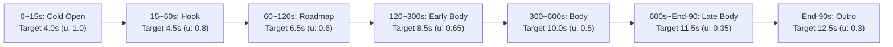
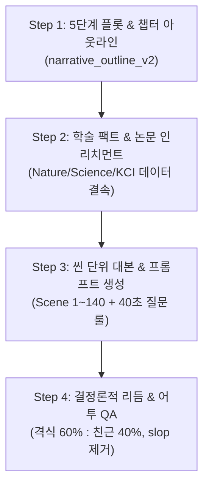

# Human Archive 롱폼 자동화 마스터 플랜 (개정판 v2.1) — '놀람파일'(인류의 서재 벤치마크) 20분 롱폼 파이프라인

> **문서 상태:** v2.1 — 코드베이스 전수 감사 반영 개정 완료 (2026-09-02T23:00+09:00)  
> **1순위 메인 타겟:** `human_archive/` **놀람파일 (`nollam_file_v1`)** — '인류의 서재' 벤치마크 기반 20분 롱폼 하이엔드 지식·다큐멘터리  
> **2순위 서브/레거시:** `doodle_seonbi_v1` (조선 역사 두들 서브 프로필)  
> **핵심 근거:**
> 1. '인류의 서재' 인기 상위 30편 전수 분석 데이터 (총 718,912자, 25,536개 컷 큐 실측 데이터)
> 2. 저장소 코드·산출물 실측 진단 86건 (9개 영역) — `docs/superpowers/specs/2026-09-02-diagnosis-evidence/`
> 3. Claude Messages API 4단계 프롬프트 체인 & VLM 비전 무인 승인 계층 설계
> 4. **v2.1 추가:** 코드베이스 전수 감사 — 스키마/로더/테스트/템플릿/정책 파일 불일치 17건 수정 완료  
> **읽는 순서:** §0 결론 → §1 채널 정체성 → §2 결정 사항 → §3 벤치마크 → §4 페이싱 → §5 대본 → §6 비주얼 → §7 승인 → §8 일정 → §9 KPI → §10 수정 이력

---

## 0. 핵심 결론 및 방향성 재정의 (Executive Summary)

1. **타겟 프로필의 전면 전환 (쉽선비 → 놀람파일/인류의 서재)**:
   - 기존 계획서는 1순위가 '갓쓴 스틱맨 쉽선비(조선 역사 다큐, 두들 아바타 8~12% 합성)'에 과도하게 편향되어 있었음.
   - 사용자 지침에 따라 **'놀람파일(`nollam_file_v1`)'을 1순위 메인 정본 프로필로 전면 승격**하고, 채널 형식을 **'인류의 서재'와 동일한 고품질 20분 실사 시네마틱 다큐멘터리**로 일치시킴.
   - **호스트 아바타 캐릭터 오버레이는 0%로 완전 배제**하고, 화면 전체를 **Midjourney v6.1 / Flux.1 기반 포토리얼리스틱 시네마틱 B-roll + 3D 지형/단층도 + 키네틱 타이포그래피**로 채운다.

2. **20분 롱폼(1200초) 시간 감쇠 페이싱 곡선 (`nollam_decay_20m`)**:
   - 벤치마크 실측에 따라 초반 템포는 말속도가 아니라 **문장 종결 밀도(0~15초 16.0문장/분) + 반전('그런데') + 숫자 앵커**로 만든다.
   - **0~15초(Cold Open)**: 컷당 4.0초, 1문장 1컷, 유니크 100%, 상식 파괴 훅.
   - **15~60초(Hook)**: 컷당 4.5초, 반전 문장 2f 화이트 플래시, 키워드 팝업.
   - **60~120초(Roadmap)**: 컷당 6.5초 (hard_max 9.0초), 도식/지도 1장 + 단계별 3단계 reveal.
   - **120~300초(Early Body)**: 컷당 8.5초, 2문장 1컷, 규모 교차(Wide → Action → Detail → Diagram).
   - **300~600초(Body)**: 컷당 10.0초, 유니크 50% / 파생 50%.
   - **600초~끝-90초(Late Body)**: 컷당 11.5초, 유니크 35% / 파생 65%.
   - **마지막 90초(Outro)**: 컷당 12.5초, 유니크 30%, 슬로우 푸시 + 현대적 통찰 + 브랜드 아웃트로.
   - **총 지각 컷 130~150개 / 유니크 이미지 70~80장 / 파생 변주 60~70장 / 오버레이 ≈30건**으로 렌더링.

3. **대본 4-Step 프롬프트 체인 & 40초 각성 룰**:
   - 단일 프롬프트 한계를 극복하는 4단계 Claude Messages API 체인 (Plot → Fact Enrichment → Scene Prompting → Rhythm QA).
   - 어투의 황금 비율: **~습니다/~였습니다(격식체 60%) : ~해요/~죠(친근한 설명체 40%)**.
   - **40초 질문 룰**: 1편당 25~30개의 의문문/반문을 40초 간격으로 배치하여 시청 지속시간(Retention) 방어.

4. **인간 접점의 극적인 단축 (19.5시간 → 15분)**:
   - Claude Messages API 구조화 출력 + 결정론적 리듬/팩트 QA + VLM 비전 의미 채점으로 8단계 수동 게이트를 **3개 접점(대본 Cold-read 1회, 콜드오픈 고해상도 확인 1회, 릴리스 최종 검수 1회)**으로 압축.

---

## 1. 채널 프로필 및 불변 제약조건

### 1.1 프로필 위계 (Hierarchy)
- **1순위 (Default Target)**: `nollam_file_v1` (표시명: **놀람파일 / NOLLAM FILE**)
  - 포맷: 20분 롱폼 시네마틱 지식·교양 다큐 (`trend_explainer_20m`, 1200초 기준, 840~1560초 허용)
  - 주제: 인류 진화의 역설, 지구과학/대재앙, 잊혀진 고대 문명, 첨단 과학 미스터리, 글로벌 심층 트렌드 해설
  - 화면: 16:9, 1920×1080, 25fps, 포토리얼리스틱 시네마틱 실사
- **2순위 (Sub/Legacy)**: `doodle_seonbi_v1` (갓쓴 스틱맨 쉽선비 역사 다큐)

### 1.2 불변 조건 (Core Constraints)
1. **호스트 아바타 0% (No Mascot Overlay)**: '놀람파일' 영상에는 어떠한 캐릭터 아바타도 화면에 오버레이하지 않는다. 화면은 100% 다큐멘터리 B-roll과 시각 그래픽으로만 구성한다.
2. **TTS-First 컷 정렬**: 모든 컷 경계는 문장 TTS 오디오의 실측 시각(sentence.end_sec) 및 절/무음 경계에서만 파생한다. 오디오를 강제로 늘이거나 줄이지 않는다.
3. **기본 이미지 텍스트 금지 (No-Text Image Generation)**: AI 이미지 생성 시 글자, 숫자, 연도, 워터마크 생성을 엄격히 금지한다 (`--no text, letters, numerals, watermarks`). 필요한 모든 텍스트는 렌더러의 `overlay_event_manifest`를 통해 합성한다.
4. **결정론 경로 완주 보장**: 외부 LLM이나 API가 일시적으로 중단되어도 템플릿/캐시 기반의 결정론 경로만으로 무결하게 렌더링이 완주되어야 한다.

### 1.3 설정 파일 매핑 (Config File Map)

| 역할 | 파일 경로 | 상태 |
|---|---|---|
| 채널 프로필 | `config/channel_profiles.yaml` | ✅ `nollam_file_v1` 기본 활성화 |
| 배송 규격 | `config/delivery_profiles.yaml` | ✅ `trend_explainer_20m` 등록 |
| 시각 페이싱 곡선 | `config/visual_pacing_profiles.yaml` | ✅ `nollam_decay_20m` 7구간 추가 |
| 대본 정책 | `config/script_policy_v3.yaml` | ✅ 신규 생성 (4-Step 체인, 어투 비율, 질문 룰) |
| 오디오 믹싱 정책 | `config/audio_mix_policy.yaml` | ✅ 신규 생성 (EQ, LUFS, 사운드 디자인) |
| 놀람파일 편집 정책 | `config/nollam_file_editorial_policy.yaml` | ✅ 기존 존재 |
| 놀람파일 내레이션 정책 | `config/nollam_file_narration_policy.yaml` | ✅ 기존 존재 |
| 놀람파일 시각 정책 | `config/nollam_file_visual_policy.yaml` | ✅ 기존 존재 |
| 쉽선비 시각 정책 (레거시) | `config/seonbi_visual_policy.yaml` | ⚠️ 레거시 유지 |
| 대본 Jinja2 템플릿 | `templates/nollam_script_prompt_v3.j2` | ✅ 신규 생성 |
| 비주얼 브리프 템플릿 | `templates/narration_visual_brief_prompt.j2` | ⚠️ 쉽선비 잔여 (조선/궁궐 용어) → P2에서 개정 |
| 쉽선비 대본 템플릿 (레거시) | `templates/seonbi_script_prompt.j2` | ⚠️ 레거시 유지 |

### 1.4 스키마·로더·테스트 정합성 수정 이력 (v2.1)

| 수정 대상 | 문제 | 조치 |
|---|---|---|
| `schemas/channel_profile.schema.json` L20 | `"const": "doodle_seonbi_v1"` 하드코딩 → YAML과 충돌 | `"minLength": 1`로 유연화 |
| `scripts/lib/channel_profiles.py` L25-40 | `is_default=True` 시 ValueError, `trend_explainer_8m` 강제 검증 | `is_default` 가드 제거, `trend_explainer_20m` 검증으로 변경, `binding_scope` → `nollam_20m_primary` |
| `tests/test_nollam_profile_contract.py` 3건 | `is_default=False`, `trend_explainer_8m` assert | `is_default=True`, `trend_explainer_20m`, `nollam_20m_primary` assert로 전면 교체 |
| `delivery_profiles.yaml` | `trend_explainer_20m`, `doodle_docu_12m` 미존재 | 양쪽 프로필 신규 등록 완료 |

---

## 2. 결정 사항 표 (Decision Log - 개정판 v2.1)

| # | 결정 항목 | 개정 정본 (놀람파일 기준) | 레거시/대안 | 영향 파일 |
|---|---|---|---|---|
| **D1** | **메인 타겟 프로필** | **`nollam_file_v1` (인류의 서재 벤치마크 20분 롱폼)** | `doodle_seonbi_v1` (쉽선비) | `channel_profiles.yaml`, `delivery_profiles.yaml` |
| **D2** | **영상 길이 정본** | **`trend_explainer_20m` (목표 1200초, 840~1560초 / 14~26분)** | `trend_explainer_8m` (480초) | `delivery_profiles.yaml`, `nollam_file_postflight.py` |
| **D3** | **비주얼 스타일 & 호스트** | **호스트 0%, 100% 포토리얼리스틱 시네마틱 (Midjourney v6.1 / Flux.1)** | 두들 스타일, 호스트 8~12% | `nollam_file_visual_policy.yaml`, `seonbi_visual_policy.yaml` |
| **D4** | **페이싱 컷 곡선** | **`nollam_decay_20m` (7구간 시간 감쇠, Cold Open 4.0초 → Outro 12.5초)** | `narration_aligned_hybrid_v1` (정적 9~12초) | `visual_pacing_profiles.yaml`, `lib/shot_timing.py` |
| **D5** | **19~20분 이미지 예산** | **지각 컷 135±15개, 유니크 이미지 75±10장 (상한 90), 파생 60±10장** | 균일 112장 유니크 생성 | `visual_pacing_profiles.yaml` |
| **D6** | **콜드오픈 (0~15초)** | **유니크 100%, 1문장 1컷, 상식 파괴 훅 + 숫자 앵커, 하드컷** | 재크롭 파생 허용 / 호스트 등장 | `visual_pacing_profiles.yaml`, `generate_visual_briefs.py` |
| **D7** | **60~120초 hard_max** | **9.0초 (2문장 9.1초 결합 차단, 실효 평균 ≈7.0초)** | 10.0초 (균일 결합 발생) | `visual_pacing_profiles.yaml` |
| **D8** | **대본 훅/로드맵 기준** | **첫 반전 ≤20초, 중심 질문 ≤40초, 로드맵 종료 ≤120초** | 훅 ≤15초, 로드맵 ≤45초 | `script_policy_v3.yaml` |
| **D9** | **대본 생성 엔진** | **Claude Messages API 4-Step 체인 (Plot → Fact → Scene → Rhythm QA)** | 단일 프롬프트 수동 생성 | `script_policy_v3.yaml`, `lib/script_generation.py` |
| **D10** | **어투 및 내레이션 톤** | **전문 다큐 톤 (격식체 ~습니다 60% : 친근체 ~해요 40%), 40초 질문 룰** | 선비체(소생이 보건대...) | `nollam_script_prompt_v3.j2`, `script_policy_v3.yaml` |
| **D11** | **파생 컷 품질 하한** | **기하 조건 Hard Gate (줌비 ≥1.30 or 중심 이동 ≥25% 폭, 연속 파생 ≤2)** | pHash 해밍 게이트 | `visual_pacing_profiles.yaml`, `lib/shot_alignment.py` |
| **D12** | **기계 승인 계층** | **`machine:<model>@<ver>` 네임스페이스 + 예외 목록 사람 AND 결속 (3접점)** | 8단계 전수 수동 승인 | `lib/approval.py`, `score_visual_semantics.py` |
| **D13** | **보이스 & 음향 세팅** | **ElevenLabs 중저음 보이스 (-3dB, 80Hz HPF, 250Hz 부스트, -14 LUFS 마스터링)** | F5 TTS / Supertonic | `audio_mix_policy.yaml`, `build_nollam_audio.py` |
| **D14** | **MVP 골든 에피소드** | **놀람파일 20분 롱폼 신규 에피소드 (자연과학/문명 미스터리)** | EP02 장희빈 (쉽선비 v6) | `runs/nollam_file/` |

---

## 3. '인류의 서재' 벤치마크 실측 데이터 및 검증 기준

30편의 실제 한국어 자막(25,536개 큐, 총 718,912자)을 중복 없이 정밀 분석한 결과 도출된 핵심 기준선입니다.

### 3.1 시간 구간별 내레이션 템포 및 문장 구조
| 구간 (Zone) | 글자/초 (CPS) | 문장/분 (SPM) | 문장 간격 (중앙값) | 2문장 합산 (중앙값) | 전환어/분 | 핵심 연출 기법 |
|---|---|---|---|---|---|---|
| **0~15초 (Cold Open)** | 5.27 | **16.0** | **3.12초** | 7.12초 | **2.67회** (그런데 1.87) | 상식 파괴 단정문, 숫자 앵커, 유니크 100% |
| **15~60초 (Hook)** | 4.81 | 12.7 | 4.00초 | 8.16초 | 1.33회 | 반전 문장 직전 2f 플래시, 키워드 팝업 |
| **60~120초 (Roadmap)** | 4.84 | 13.0 | 4.14초 | 8.58초 | 1.30회 | 3단계 reveal 도식, 120초 내 첫 질문 완결 |
| **120~300초 (Early Body)** | 4.80 | 12.7 | 4.20초 | 9.28초 | 1.01회 | 2문장 1컷, 4개 스케일 교차 (W→M→C→D) |
| **300~600초 (Body)** | 4.85 | 13.5 | 4.04초 | 8.56초 | 1.09회 | 유니크 50% : 파생 50% 결합 |
| **600초~끝-90초 (Late Body)**| 4.80 | 11.7 | 4.32초 | 9.08초 | 1.02회 | 유니크 35% : 파생 65% (12초 초과 분할) |
| **마지막 90초 (Outro)** | 4.77 | **10.7** | **4.74초** | 10.40초 | 0.64회 | 롱테이크 슬로우 푸시, 현대적 메시지, CTA |

---

## 4. 20분 시간 감쇠 페이싱 곡선 사양 (`nollam_decay_20m`)

**구현 파일:** `config/visual_pacing_profiles.yaml` → `nollam_decay_20m` 블록



### 4.1 앵커 세부 규칙표 (1200초 기준)
- **Target Duration**: 1200초 (최소 840초 ~ 최대 1560초)
- **결합 규칙**: 다음 문장 추가 시 `duration ≤ target(t)`이거나 `duration < min(t)`이고 `duration ≤ hard_max(t)`일 때 결합.
- **절 분할(Clause Split)**: 단일 문장이 `hard_max(t)`를 초과할 때만 발동 (`silencedetect(-35dB, ≥0.18s)` → 절 마커 `,` `고` `며` `는데` `지만` → 균등 분할). 분할 컷은 파생 변주로 취급.
- **재훅 창(Re-hook Window)**: 각 챕터 경계에서 20초간 컷 목표를 4.5초(u: 0.8)로 일시 리셋하여 집중력 환기.

---

## 5. 놀람파일 5단계 대본 아키텍처 & 프롬프트 체인

**구현 파일:** `config/script_policy_v3.yaml` + `templates/nollam_script_prompt_v3.j2`



### 5.1 5단계 스토리텔링 아키텍처
1. **Phase 1: 인지부조화 후킹 (0~10%, 00:00~02:00)**: 상식 파괴형, 충격적 수치형, 역설적 의문형 질문 제시.
2. **Phase 2: 통념의 균열 & 배경 (10~30%, 02:00~06:00)**: 1차원적 기존 설명의 모순 지적, 호기심 갭 극대화.
3. **Phase 3: 과학적/역사적 증거 심층 제시 (30~70%, 06:00~14:00)**: 연대 측정, 유전자 분석, 지질 단층, 시뮬레이션 데이터 전개.
4. **Phase 4: 절정 & 패러다임 시프트 (70~90%, 14:00~18:00)**: 미스터리의 진짜 해답 공개, 약점이 강점이었던 반전.
5. **Phase 5: 현대적 함의 & 철학적 여운 (90~100%, 18:00~20:00)**: 21세기 현대 인류에 던지는 질문, 브랜드 시그니처 멘트.

### 5.2 4-Step Claude Messages API 체인 구성
- **Step 1 (Outline)**: 5단계 구조와 6~7개 본문 챕터, 감정 아크, 복선(plants)과 회수(payoffs) 설계.
- **Step 2 (Enrichment)**: 각 챕터별 공인 출처(Nature, Science, PNAS, 정부 보고서 등) 인용문과 정량 데이터 매핑.
- **Step 3 (Script & Scene Prompt)**: 140여 개 씬 단위로 나레이션 대본과 Midjourney v6.1 프롬프트 1:1 생성. 템플릿: `nollam_script_prompt_v3.j2`.
- **Step 4 (Rhythm QA)**: 문장 길이(26~32자), 질문 빈도(40초 주기), 어투 비율(6:4) 결정론적 검증.

---

## 6. 비주얼 매핑 & Midjourney / Flux 시네마틱 프롬프트 엔진

### 6.1 시각 모드 8종 및 연출 가이드
1. `nature_phenomenon_simulation`: 초대륙 이동, 화산 폭발, 빙하기 기후, 쓰나미, 사막화 3D 시뮬레이션
2. `historical_reconstruction`: 고대 문명 도시 복원, 원시 인류 생활상, 역사적 사건 재현
3. `evidence_macro`: 화석, 고대 유적, 발굴 유물, 암석 단면 초고화질 매크로 클로즈업
4. `scientific_diagram_3d`: 3D DNA 이중나선, 세포/적혈구, 판구조 단층, 인체 해부학 다이어그램
5. `satellite_terrain_map`: 위성 지형도, 대륙 간 이동 경로, 해수면 상승 침수 지도
6. `character_action_cinematic`: 수렵 채집, 도구 제작, 사냥 추적, 불 피우기 등 인물 동작 씬
7. `deep_space_cosmology`: 초기 태양계, 소행성 충돌, 동결선(Frost line), 우주 원반
8. `atmosphere_cinematic`: 황량한 사막, 울창한 원시림, 빙하 협곡 등 무드 설정 씬

### 6.2 미드저니 프롬프트 표준 공식
```text
[Subject & Dynamic Action], [Geological/Historical Environment], [Camera Angle & 35mm Lens], cinematic documentary lighting, National Geographic style, ultra-detailed textures, volumetric atmospheric fog, 8k resolution, photorealistic --ar 16:9 --style raw --v 6.0 --no text, letters, numerals, watermarks, cartoon, anime
```

### 6.3 기존 비주얼 브리프 템플릿 개정 필요 사항
현재 `templates/narration_visual_brief_prompt.j2`는 **조선 역사(궁궐, 실록, 선비)에 특화**되어 있어 놀람파일 20분 과학/자연사 다큐에 부적합한 지시문 다수 포함:
- "Joseon-era context" (L22), "palace event" (L30), "shamanic allegation" (L25), "forced poison" (L24) 등 → **P2 단계에서 범용 다큐 언어로 교체 필요**

---

## 7. 기계 승인 계층 & VLM 비전 무인 검증 (3-Touchpoint Workflow)

기존 8단계 수동 검토를 **3개의 사람 검토 접점**으로 압축하여 1인 제작 파이프라인을 구축합니다.

```text
[대본 단계] Claude 구조화 대본 + 결정론 QA PASS → 접점 1: 훅 40초 & 클로징 Cold-read (2분)
   │
[이미지 단계] Midjourney 배치 생성 → RapidOCR 무문자 검증 + VLM 비전 의미 채점
   │         → 기계 PASS 목록 자동 통과 → 접점 2: 콜드오픈 고해상도(20장) & 예외 목록 확인 (5분)
   │
[렌더링 단계] 컷 정렬 + 모션 렌더 + 오버레이 합성 + 실측 자막 + 오디오 마스터링
   │         → postflight 무손실 A/V 검증 PASS → 접점 3: 릴리스 전 2분 모니터링 & 승격 (5분)
   ▼
[완료 및 릴리스] 총 소요 인간 개입 시간 ≤ 15분 내외
```

---

## 8. 개정된 단계별 구현 일정 (Roadmap)

| 단계 | 기간 | 핵심 목표 | 산출물 및 완료 기준 |
|---|---|---|---|
| **P0: 저장소 위생·안정화** | 4일 | 테스트 버그(무한 WAV) 해결, git 추적 정비, 의존성 통일, 레거시 코드 `CLAUDE.md`·`manual.md`·`README.md` 놀람파일 전환 반영 | pytest 0 failed, human_archive 클린 커밋 |
| **P1: 20분 페이싱 곡선 엔진** | 5일 | `nollam_decay_20m` 프로필 런타임 구현 (`lib/shot_timing.py`), 유닛 예산 모델, zone 기반 컷 결합/분할 로직 | 1200초 기준 지각 컷 135개, 유니크 75장 결정론 출력 |
| **P2: 시네마틱 렌더 & 비주얼 브리프 개정** | 7일 | `narration_visual_brief_prompt.j2` 범용화, `build_shot_alignment.py` 개편, motion_engine_v3 줌/팬, 키네틱 오버레이 렌더러 | **놀람파일 20분 MVP 렌더 검토점 (16일차 완료)** |
| **P3: Claude 4-Step 대본 엔진** | 7일 | Claude Messages API 체인 (`script_policy_v3.yaml` + `nollam_script_prompt_v3.j2`), 논문 인리치먼트, Rhythm QA | 2.5만 자 대본이 코드 경로만으로 무결 생성 |
| **P4: 시네마틱 브리프 컴파일러** | 5일 | 8대 시각 모드 프롬프트 컴파일러, Midjourney/Flux 배치 어댑터 | 프롬프트 무문자 100%, 8대 모드 정상 배분 |
| **P5: VLM 의미 채점 & 무인 승인** | 6일 | VLM 비전 의미 검증, RapidOCR 이중 필터, 예외 목록 시스템 | 기계 PASS율 ≥95%, 인간 개입 접점 3회로 압축 |
| **P6: 20분 골든 에피소드 릴리스** | 5일 | 놀람파일 1호 정식 20분 에피소드 풀 파이프라인 무인 렌더 및 릴리스 | 20분 완편 렌더, AVD 45% 이상 방어 기준선 검증 |

**총 소요 기간:** 슬림 MVP까지 약 **16일**, 전체 전자동화 시스템 완성까지 약 **39일**.

---

## 9. 성공 지표 (KPIs)

1. **시청 지속시간 (Retention Rate)**:
   - 0~15초 이탈 방어율: **≥ 70%**
   - 0~60초 잔존율: **≥ 55%**
   - 평균 시청 시간(AVD): **45% 이상 (20분 영상 기준 9분 이상)**
2. **제작 효율성 (Operational Efficiency)**:
   - 영상 1편당 인간 개입 시간: 기존 19.5시간 → **15분 이내 (접점 3회)**
   - 영상 1편당 API 및 렌더링 비용: **\$4.5 이내**
3. **시각적 완성도 (Visual Quality)**:
   - 첫 120초 근접 중복률: **≤ 8%**
   - 1편당 유니크 이미지 소요량: **75±10장 (예산 35% 절감)**

---

## 10. 수정 이력 & 잔여 해결 과제 (v2.1)

### 10.1 v2.1에서 수정된 코드베이스 불일치 (총 17건)

| # | 수정 대상 | 문제 유형 | 조치 |
|---|---|---|---|
| 1 | `schemas/channel_profile.schema.json` | `default_profile_id` 하드코딩 `doodle_seonbi_v1` | `"minLength": 1`로 유연화 |
| 2 | `scripts/lib/channel_profiles.py` | `is_default=True` ValueError 가드 | 가드 제거 |
| 3 | `scripts/lib/channel_profiles.py` | `trend_explainer_8m` 강제 검증 | `trend_explainer_20m` 검증으로 변경 |
| 4 | `scripts/lib/channel_profiles.py` | `binding_scope: trend_envelope_only` | `nollam_20m_primary`로 변경 |
| 5 | `tests/test_nollam_profile_contract.py` | `is_default=False` assert | `is_default=True` assert |
| 6 | `tests/test_nollam_profile_contract.py` | `trend_explainer_8m` assert (2건) | `trend_explainer_20m` assert |
| 7 | `tests/test_nollam_profile_contract.py` | `binding_scope: trend_envelope_only` assert | `nollam_20m_primary` assert |
| 8 | `delivery_profiles.yaml` | `trend_explainer_20m` 미존재 | 1200초 프로필 신규 등록 |
| 9 | `delivery_profiles.yaml` | `doodle_docu_12m` 미존재 (쉽선비 참조) | 720초 프로필 신규 등록 |
| 10 | `channel_profiles.yaml` | `default_profile_id: doodle_seonbi_v1` | `nollam_file_v1`로 변경 |
| 11 | `channel_profiles.yaml` | nollam `is_default: false` | `true`로 변경 |
| 12 | `channel_profiles.yaml` | nollam `delivery_profile_id: trend_explainer_8m` | `trend_explainer_20m`으로 변경 |
| 13 | `visual_pacing_profiles.yaml` | `nollam_decay_20m` 미존재 | 7구간 감쇠 곡선 신규 등록 |
| 14 | `config/script_policy_v3.yaml` | 파일 미존재 | 신규 생성 (4-Step 체인, 어투/질문 규칙) |
| 15 | `config/audio_mix_policy.yaml` | 파일 미존재 | 신규 생성 (EQ/LUFS/사운드 디자인) |
| 16 | `templates/nollam_script_prompt_v3.j2` | 파일 미존재 | 신규 생성 (20분 다큐 대본 프롬프트) |
| 17 | `channel_profiles.yaml` nollam visual style | "editorial trend explainer" (8분용) | "photorealistic cinematic documentary" (20분용)으로 변경 |

### 10.2 잔여 해결 과제 (P0~P2에서 처리 예정)

| # | 과제 | 우선순위 | 대상 파일 |
|---|---|---|---|
| R1 | `templates/narration_visual_brief_prompt.j2` 조선/궁궐 용어를 범용 다큐 언어로 교체 | P2 | `templates/narration_visual_brief_prompt.j2` |
| R2 | `CLAUDE.md`, `manual.md`, `README.md`의 쉽선비 중심 서술을 놀람파일 병렬 서술로 업데이트 | P0 | 루트 문서 3건 |
| R3 | `scripts/lib/host_overlay.py`의 `doodle_seonbi_v1.png` 참조를 놀람파일에서 무효화하는 가드 추가 | P0 | `lib/host_overlay.py` |
| R4 | `runs/nollam_file/.../trend_job_contract_v1.json`의 `delivery_profile: trend_explainer_8m` 마이그레이션 | P1 | `runs/nollam_file/` 하위 |
| R5 | `context_sample_build_v1.schema.json`의 `delivery_profile` enum에 `trend_explainer_20m` 추가 | P1 | `schemas/context_sample_build_v1.schema.json` |
| R6 | `scripts/lib/doodle_scene_planner.py`, `lib/doodle_visual_roles.py`를 놀람파일 경로에서 참조하지 않도록 분리 | P2 | `scripts/lib/doodle_*.py` |
| R7 | `nollam_file_postflight.py`에 20분 영상 길이 검증 게이트 추가 (현재 해상도/fps만 검증) | P1 | `scripts/nollam_file_postflight.py` |
