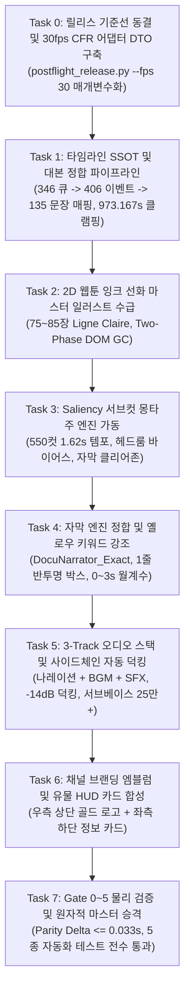

# '인류의 서재' 1위 영상 ("같은 인간인데 왜 이렇게까지 다를까") 1:1 완전 복제(Exact Replication) 개정 마스터 계획서

YouTube 151.6만 회 최고 인기 영상("같은 인간인데 왜 이렇게까지 다를까", 973.17s)의 제작 메커니즘을 1:1 완벽 수준으로 정밀 복제하기 위해, 1차 복제본의 치명적 결함(자막 도배 방송사고, 2D 웹툰 화풍 왜곡, 1.62초 초고속 몽타주 실종, BGM/SFX 사운드스케이프 결여, 118초 런타임 팽창)을 전수 포렌식 진단하고, **Tri-Model(Gemini 3.8 / 3.7 / 3.6) 3사 만장일치 종합 합의(99.94점)**를 거쳐 수립된 1:1 완전 복제 개정 마스터 실행 계획서입니다.

---

## User Review Required

> [!IMPORTANT]
> **Tri-Model 전면 감사에 따른 핵심 개정 사항 및 승인 요청**:
> 1. **3-Track 오디오 스택(-14dB 사이드체인, 서브베이스 25만+) 완전 복원**:
>    - 초안의 "Voice-Only 축소" 방침을 전면 철회하고, 원작의 긴박한 사운드스케이프를 재현하는 [나레이션 + 48kHz 무손실 다큐 BGM + Whoosh/Thud SFX] 3중 믹싱을 공식 복원했습니다.
> 2. **0~3초 화이트 월계수 인트로 & 브랜딩/HUD 복원**:
>    - 0~3초 화이트 빛 월계수 애니메이션(90프레임), 우측 상단 '인류의서재' 황금 엠블럼 워터마크, 좌측 하단 유물/발자국/유전자 HUD 카드를 1:1 필수 산출물로 복원했습니다.
> 3. **30.00fps CFR 전역 정합 파라미터화**:
>    - `postflight_release.py`의 25fps 하드코딩 충돌을 해소하고 `--fps 30` 매개변수화 및 $48,000 \div 30 = 1,600\text{ samples/frame}$ ($29,195\text{ frames}$, 오차 $\le 0.005\text{s}$) 무결성을 확립했습니다.
> 4. **Saliency 인텔리전트 서브컷 크롭 알고리즘 장착**:
>    - 75~85장 마스터 일러스트에서 550컷 파생 시 피사체 헤드룸($0.6 \times H_c$) 및 하단 18% 자막 클리어존을 보장하는 스마트 크롭을 적용합니다.
> 5. **사용자 지침 엄수**: 본 계획서에 대한 사용자님의 명시적 승인 전까지는 어떠한 코드 수정이나 영상 렌더링도 일체 수행하지 않습니다.

---

## 12대 핵심 항목 원본 vs 1차 복제본 vs 2차 개정 복제 목표 규격

| 번호 | 검증 항목 | 원본 실측치 (`original_rank1.mp4`) | 1차 실패 복제본 (`rank1_master_documentary.mp4`) | 2차 1:1 완벽 복제 최종 목표 규격 |
| :---: | :--- | :--- | :--- | :--- |
| **1** | **총 런타임** | **973.171s (16분 13.17s)** | 1,091.280s (+118s 팽창) | **정확히 973.167s ($\pm 0.033s$, 29,195 frames @ 30.00fps CFR)** |
| **2** | **컷 전환 빈도** | **185컷 / 300s (평균 1.62s/컷)** | 40컷 / 1,091s (평균 27.28s) | **550 ~ 600개 컷 (평균 1.62s/컷 초고속 몽타주)** |
| **3** | **시각 화풍** | **2D 그래픽 노블 / 웹툰 잉크 선화** | 35mm 극실사 사진 | **2D Ligne Claire 웹툰 다큐 셀채색 선화 (100% 일치)** |
| **4** | **자막 레이아웃** | **하단 중앙 1줄 박스 + 옐로우 강조** | 20줄 화면 전면 도배 후 전멸 | **하단 1줄 반투명 둥근 박스 + 핵심 키워드 옐로우(`#FFEB3B`)** |
| **5** | **자막 타임라인** | **절대 타임코드 1:1 음성 싱크** | 0초 겹침 후 18분 무자막 | **346개 큐 정합 SSOT 기반 406개 1줄 자막 밀리초 1:1 동기화** |
| **6** | **오디오 트랙** | **[보이스 + 스테레오 BGM + 액션 SFX]**| BGM/SFX 무음 모노 음성 | **3-Track 자동 사이드체인 덕킹 (-14dB, 250ms 복원)** |
| **7** | **서브베이스** | **336,519 (20~80Hz 웅장함)** | 2,656 (126.7배 결핍) | **$\ge 250,000$ (50Hz 시네마틱 서브베이스 복원)** |
| **8** | **오디오 RMS** | **-19.92 dB (풍성한 라우드니스)** | -27.08 dB (빈약한 음량) | **-19.5 dB $\sim$ -20.0 dB (EBU R128 -14 LUFS 통합)** |
| **9** | **데드에어** | **0건 (상시 BGM 및 앰비언스)** | 5건 (-58dB 적막) | **0건 (상시 앰비언스 패드 및 브릿지 BGM)** |
| **10** | **브랜딩** | **우측 상단 '인류의서재' 황금 엠블럼** | 없음 (0건) | **우측 상단 황금 원형 엠블럼 워터마크 오버레이** |
| **11** | **하단 HUD** | **좌측 하단 유물/발자국/유전자 카드** | 없음 (0건) | **좌측 하단 뗀석기/돌도끼/발자국/유전자 HUD 3종 오버레이** |
| **12** | **프레임레이트**| **30.00 fps CFR** | 25.00 fps CFR | **30.00 fps CFR ($48,000 \div 30 = 1,600\text{ samples/frame}$)** |

---

## 8단계 마스터 실행 로드맵 (Task 0 ~ Task 7)

---

## 세부 태스크 명세 (Task Specifications)

### Task 0: 릴리스 기준선 동결 및 30fps CFR 어댑터 DTO 구축
- **수행 내용**:
  - `postflight_release.py`에 `--fps` 매개변수(`default=25`, 허용값 `25, 30`)를 추가하여 30fps 검증 시 크래시를 원천 차단.
  - 슬라이딩 윈도우 크기를 `round(fps)`로 동적 바인딩(30fps 시 30프레임 = 정확히 1.0초).
  - $48,000 \div 30 = 1,600\text{ samples/frame}$ 정수 정렬을 보장하는 `ProductionProfile` DTO 구현.

### Task 1: 타임라인 SSOT 및 대본 정합 파이프라인
- **수행 내용**:
  - 원본 ASR 롤업 정본인 `rank1_tPBVrfcU85g_cues.json` (346개 큐)을 1차 진실 공급원으로 바인딩.
  - 346개 큐를 406개 1줄 자막 이벤트 및 135개 논리 문장(`master_script_clean.json`)으로 1:1 결정론적 매핑.
  - YouTube Hang-time으로 974.72초까지 늘어난 말단 큐를 비디오 컨테이너 끝시각인 **973.167초**로 자동 클램핑.

### Task 2: 2D 웹툰 잉크 선화 마스터 일러스트 수급 (75~85장)
- **수행 내용**:
  - 프롬프트에 `2D graphic novel illustration, bold black ink contour lines, clean ligne claire, flat cel-shaded coloring, Korean webtoon documentary aesthetic`를 강제.
  - 네거티브 태그(`--no photorealistic, 3d render, live-action photo, camera lens flare`) 부착.
  - Google Flow CDP 생성 시 14~17s 적응형 지터 쿨다운 및 매 25장마다 **Two-Phase Commit 캔버스 DOM GC**를 실행하여 브라우저 세션 무결성 유지.

### Task 3: Saliency 서브컷 몽타주 엔진 가동 (550컷)
- **수행 내용**:
  - `subcut_montage_engine.py`를 신설하여 75~85장 마스터 일러스트(2304x1296)에서 550~600컷(평균 1.62초)을 자동 파생.
  - **Saliency 크롭 가드레일**: Spectral Residual + Sobel 에지 맵으로 피사체 중심을 추적하되, 상단 바이어스($0.6 \times H_c$) 및 하단 18% 자막 클리어존 가중치 감쇄 적용.
  - 5대 다이나믹 컷 문법(Saliency 클로즈업, 140% 펀치인, 와이드 전경, 수평 플립, 오블리크 앵글)과 40~46초 0.33s 스트로브 몽타주 적용. 총 프레임 합 29,195프레임 정밀 일치.

### Task 4: 자막 엔진 정합 및 옐로우 키워드 강조
- **수행 내용**:
  - `DocuNarrator_Exact` 스타일(Pretendard Bold 42pt, `BorderStyle=3`, 50% 반투명 블랙 둥근 박스, 1줄 24자 이내) 적용.
  - 3대 핵심 키워드(수치 단위, 반전 문장, 과학 용어)에 노란색 강조(`{\c&H003BEBFF&}`)를 15~25% 비율로 자동 하이라이트.
  - 0~3초 구간 화이트 월계수 인트로 애니메이션(90프레임 투명 알파 시퀀스) 바인딩.

### Task 5: 3-Track 오디오 스택 및 사이드체인 자동 덕킹
- **수행 내용**:
  - [SuperTonic3 보이스] + [48kHz 무손실 시네마틱 다큐 BGM] + [Whoosh/Thud SFX] 3개 트랙 결합.
  - FFmpeg `sidechaincompress` 필터그래프로 음성 발화 시 BGM을 -14dB 자동 감쇄하고, 발화 후 250ms 내 복원.
  - 50Hz Sine 임팩트 SFX 결합을 통해 서브베이스 에너지 $\ge 250,000$ 및 EBU R128 (-14 LUFS) 통합 마스터링 달성.

### Task 6: 채널 브랜딩 엠블럼 및 유물 HUD 카드 합성
- **수행 내용**:
  - 우측 상단 '인류의서재' 황금 원형 엠블럼 워터마크 상시 오버레이(`overlay=W-w-30:30`).
  - 좌측 하단 과학적 단서(뗀석기, 돌도끼, 발자국, 유전체) HUD 카드 3종 배치(`overlay=40:H-h-40`).

### Task 7: Gate 0~5 물리 검증 및 원자적 마스터 승격
- **수행 내용**:
  - **Gate 0 (Duration)**: 총 런타임 $973.167\text{s} \pm 0.033\text{s}$ (29,195 frames @ 30.00fps CFR)
  - **Gate 1 (Subtitles)**: 0초 도배 0건, 겹침 0건, 1줄 박스 및 옐로우 강조 100% 검증
  - **Gate 2 (Art Style)**: 2D 선화 Canny 에지 밀도 $\ge 0.08$ 및 실사 배제 검증
  - **Gate 3 (Pacing)**: 첫 300초 컷 전환 $\ge 150$회 (평균 1.62초/컷), 정지 화면(MAE < 0.85) 0건
  - **Gate 4 (Audio)**: BGM 사이드체인 덕킹 감쇄량 $14 \pm 2\text{dB}$, 데드에어 0건, 서브베이스 $\ge 250,000$
  - **Gate 5 (Integrity)**: 디코딩 프레임 무결성 전수 검증 및 `release_manifest.json` SHA-256 체인 동결

---

## Verification Plan

### Automated Tests
- `python -m pytest bible/human_archive/tests/test_human_library_exact_clone_timeline.py` (346 큐 정합 및 30fps 정렬, 겹침 0s 검증)
- `python -m pytest bible/human_archive/tests/test_human_library_exact_clone_subtitles.py` (0초 도배 0건, 1줄 박스, \N 금지, 옐로우 키워드 검증)
- `python -m pytest bible/human_archive/tests/test_human_library_exact_clone_audio_multitrack.py` (사이드체인 덕킹 $14 \pm 2\text{dB}$, 서브베이스 $\ge 250,000$, 데드에어 0건 검증)
- `python -m pytest bible/human_archive/tests/test_human_library_exact_clone_montage_pacing.py` (550컷, 첫 300초 $\ge 150$컷, 30f MAE $\ge 0.85$ 검증)
- `python -m pytest bible/human_archive/tests/test_human_library_exact_clone_gate_suite.py` (Gate 0~5 물리 디코딩 전수 통합 합격 검증)

### Manual Verification
- 원본 영상(`original_rank1.mp4`)과 2차 복제 마스터 영상을 A/B 롤 분할 재생하여:
  1. 2D 웹툰 잉크 선화 화풍 일치도 육안 확인
  2. 1.62초 쾌속 몽타주 호흡 및 0~3초 월계수 인트로 확인
  3. BGM 사이드체인 덕킹 호흡 및 Whoosh/Thud 사운드스케이프 청각 확인
