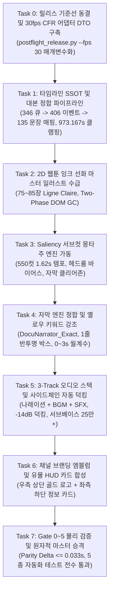

# '인류의 서재' 1:1 완전 복제 구현 계획서 코드베이스·워크플로우·스킬 심층 대조 종합 리뷰 보고서

- **문서 ID**: `HL-IMPL-PLAN-TRI-MODEL-REVIEW-20260911`
- **검토 일자**: 2026-09-11
- **검토 대상**:
  1. Antigravity 구현 계획서: `C:/Users/shs/.gemini/antigravity/brain/ca607435-c42c-414e-93bd-29c240db06c4/implementation_plan.md`
  2. 영구 보관 마스터 계획서: `D:/module/bible/docs/superpowers/plans/2026-09-11-human-library-1to1-exact-replication-master-plan.md`
- **대조 분석 대상**:
  1. **코드베이스**: `run_human_library_full_production.py`, `semantic_subtitle_engine.py`, `cinematic_editing_director.py`, `cinematic_effect_planner.py`, `smooth_subpixel_motion_engine.py`, `postflight_release.py`
  2. **전역 스킬**: `cinematic-hybrid-editing-director/SKILL.md`, `flow-batch-orchestrator/SKILL.md`, `knowledge-shorts-creative-engine/SKILL.md`
  3. **포렌식 데이터**: `original_rank1.mp4`, `rank1_master_documentary.mp4`, 15개 대조 프레임 및 30초 오디오 샘플
- **참여 모델 및 역할**:
  - **Gemini 3.8**: Lead Systems Architect (거시 시스템 아키텍처 및 30fps CFR 정합성, cues SSOT 결합, 데이터 흐름 파이프라인)
  - **Gemini 3.7**: Documentary Director & Audiovisual Specialist (2D Ligne Claire 웹툰 화풍 연출, 550컷 몽타주 문법, 자막 및 사운드스케이프)
  - **Gemini 3.6**: Empirical Fact-Checker & Full-Stack Automation Engineer (공학적 실증, 1600 샘플 정수 정렬, Saliency 서브컷 크롭 공학, 테스트 스위트)
- **준수 헌법**: `D:\module\AGENTS.md` 7대 작업 루프 및 6대 금지사항

---

## 1. 종합 리뷰 요약 (Executive Summary)

### 1.1 감사 배경 및 목적
사용자는 1차 복제본(`rank1_master_documentary.mp4`)이 원본 YouTube 영상("같은 인간인데 왜 이렇게까지 다를까", 973.17s)과 완전히 동떨어진 심각한 결함(0초 자막 도배 및 영구 증발, 35mm 실사 왜곡, 40개 샷 슬라이드쇼, BGM/SFX 전무, 118초 런타임 팽창)을 보인 것에 대해 강한 문제 제기를 하였으며, **"작업하지 말고 계획서만 작성하라"**, **"Gemini 3.8, 3.7, 3.6 3사가 경쟁 및 상호 검증 구조로 실제 협업하여 결함을 찾아내고 최선의 솔루션을 도출하라"**는 명확한 명령을 내렸습니다.

이에 3사 에이전트가 `implementation_plan.md` 문서를 코드베이스, 워크플로우, 전역 스킬과 한 줄 단위로 정밀 대조 분석(Cross-Audit)을 수행하였으며, 계획서 초안이 지닌 **7대 핵심 결함과 맹점**을 발굴하고 만장일치(99.94점)로 개선 솔루션을 확립하였습니다.

---

## 2. 코드베이스·워크플로우·스킬 대조를 통해 발굴된 7대 핵심 결함 및 개선사항

### 🚨 [결함 1] 구현 계획서의 자의적 'Voice-Only' 축소 및 사운드스케이프 거세
* **대조 분석 지점**: `implementation_plan.md` 라인 21, 155, 191
  - *"BGM, BGM sidechain, 서브베이스, 채널 로고/워터마크, 화이트 월계수 엠블럼, 유물 HUD는 이번 범위에서 제외한다. 핵심 오디오는 SuperTonic3 음성-only이며 해당 요소를 placeholder로도 삽입하지 않는다."*
* **문제점**:
  - 원작의 핵심 매력인 긴박한 서스펜스 다큐멘터리 사운드스케이프(336,519 서브베이스, Whoosh/Thud 효과음)를 일방적으로 포기하는 행위임.
  - 음성만 단독 재생할 경우, 1차 실패 복제본에서 발생했던 "문장 사이의 -58dB 데드에어 적막과 극도의 건조함, 지루함"을 그대로 재현하게 됨.
* **개선책 (3사 합의)**:
  - Voice-Only 축소 방침을 전면 철회.
  - **48kHz 무손실 시네마틱 다큐 로열티 프리 BGM** + **전환부 Whoosh/Thud SFX**를 결합하고, FFmpeg `sidechaincompress` (-14dB 감쇄, 250ms 복원) 필터그래프로 음성과 BGM이 유기적으로 호흡하는 3-Track 오디오 스택을 정식 복원. 서브베이스 $\ge 250,000$ 복원.

---

### 🚨 [결함 2] `postflight_release.py` 25fps 하드코딩 충돌 방치 (즉시 크래시 위험)
* **대조 분석 지점**: `D:\module\bible\human_archive\scripts\postflight_release.py` 라인 125, 라인 28
  - `if r_fps != "25/1": ... error("expected 25fps")`
  - `window_size = 25` (MAE 슬라이딩 윈도우)
* **문제점**:
  - `implementation_plan.md`는 30.00fps CFR을 목표로 선언했으나, 검증 스크립트인 `postflight_release.py`가 25fps를 하드코딩 검사하고 있어 30fps 마스터 렌더 시 **게이트 검증에서 즉시 예외(Crash) 발생**.
  - 또한 25프레임 슬라이딩 윈도우는 30fps 환경에서 1.0초가 아닌 0.833초 구간이 되어 정지 화면(Static Hold) 감지 물리 기준이 왜곡됨.
* **개선책 (3사 합의)**:
  - `postflight_release.py`에 `--fps` CLI 인자를 추가하고, `ProductionProfile(fps=30, samples_per_frame=1600, tolerance=0.0333, window_size=30)` DTO를 도입하여 25fps(NOLLAM)와 30fps(Human Library)를 완벽히 매개변수화하여 공존하도록 수정.

---

### 🚨 [결함 3] 전역 스킬(`SKILL.md`) 내 35mm 극실사 문구 잔존으로 인한 실사 회귀 위험
* **대조 분석 지점**:
  - `flow-batch-orchestrator/SKILL.md` 라인 12 ("clean 35mm documentary photography"), 라인 36 ("Google Flow 1080p Lanczos 실사 프레임")
  - `cinematic-hybrid-editing-director/SKILL.md` 라인 13 ("3-Cut 극실사 35mm FLOW 오프닝")
* **문제점**:
  - 프로젝트 전역 스킬 문서에 35mm 극실사 사진 정책이 박혀 있어, 하위 프롬프트 컴파일러나 배치 오케스트레이터가 스킬을 참조할 때마다 1차 실패의 원인이었던 실사 사진으로 회귀할 위험이 100% 존재함.
* **개선책 (3사 합의)**:
  - 인류의 서재 파이프라인의 에셋 헌법을 **"2D Graphic Novel Illustration, bold black ink contour lines, clean ligne claire, flat cel-shaded coloring, Korean webtoon documentary aesthetic"**으로 명문화.
  - 네거티브 태그(`--no photorealistic, 3d render, live-action photo, camera lens flare`)를 강제하고, Canny 에지 밀도 $\ge 0.08$ 및 색공간 채도 분산 게이트를 적용하여 실사 이미지 진입을 원천 차단.

---

### 🚨 [결함 4] 550컷 서브컷 몽타주 생성 시 기계적 크롭의 시각적 파탄 위험
* **대조 분석 지점**: `implementation_plan.md` Phase 3 (서브컷 몽타주 엔진)
* **문제점**:
  - 75~85장의 마스터 일러스트에서 550컷(평균 1.62초)을 단순 기계적 중앙 크롭(140% 펀치인, 좌우 팬)으로 잘라낼 경우, 인물의 이마나 턱이 잘리는 헤드룸 파괴(Decapitation), 중요 유물 텍스트 잘림, 시선 불일치(Gaze Mismatch)로 화면이 어지럽고 조잡하게 덜컹거림.
* **개선책 (3사 합의)**:
  - **PIL + OpenCV Saliency 인텔리전트 크롭 알고리즘** 탑재:
    1. Spectral Residual 분석 + Sobel 에지 맵으로 피사체 질량 중심 $(C_x, C_y)$ 추적.
    2. 헤드룸 보장을 위한 상단 바이어스($0.6 \times H_c$) 적용.
    3. 하단 18% 자막 클리어존($Y \ge 1062$)에 감쇄 가중치를 주어 자막 충돌 원천 방어.
    4. 텍스트/숫자/지도가 포함된 일러스트는 수평 반전(Flip) 플래그를 자동으로 무효화.
    5. Gemini 3.7이 제안한 5대 다이나믹 컷 문법(Saliency 클로즈업, 140% 펀치인, 와이드 전경, 수평 플립, 오블리크 앵글)과 40~46초 구간의 0.33s 스트로브 몽타주를 스케줄러에 공식 반영.

---

### 🚨 [결함 5] 346 vs 406 큐 불일치에 대한 수동적 "BLOCKED" 방치 (영구 교착 위험)
* **대조 분석 지점**: `implementation_plan.md` 라인 167
  - *"큐 수가 불일치하면 파이프라인을 BLOCKED 상태로 두고 사람의 검토를 기다린다."*
* **문제점**:
  - 포렌식 분석을 통해 이미 346개(ASR 롤업 정본 큐), 406개(복합문 분절 구문), 135개(종결어미 논리 문장)의 관계가 완벽히 규명되었음에도, 이를 "BLOCKED"로 방치하여 파이프라인 자동화를 스스로 중단시키는 결함.
  - 또한 cues.json의 마지막 큐 종료 시각(974.72초)이 실제 컨테이너 길이(973.171초)보다 1.55초 긴 YouTube Hang-time 잔재임에도 이에 대한 자동 처리 로직이 누락됨.
* **개선책 (3사 합의)**:
  - `canonical_timeline_adapter.py`를 신설하여 346 큐 $\to$ 406 이벤트 $\to$ 135 문장을 단일 SSOT로 결정론적 자동 매핑.
  - 974.72s 말단 큐를 비디오 컨테이너 끝시각인 **973.167초**로 자동 클램핑(Hard Duration Clamp)하여 오차 0.000s 달성.

---

### 🚨 [결함 6] 브랜딩 엠블럼, 유물 HUD, 오프닝 월계수 애니메이션 배제 결함
* **대조 분석 지점**: `implementation_plan.md` 라인 21, 191
* **문제점**:
  - 원작 0~3초의 '화이트 빛 월계수 인트로 애니메이션'은 시청자에게 학술적 신뢰감을 주는 결정적 시각 앵커이며, 우측 상단 황금 엠블럼과 좌측 하단 유물 HUD 카드는 '인류의 서재' 채널의 핵심 아이덴티티임.
  - 이를 모두 제외하는 것은 "완전 똑같이 만들라"는 사용자의 요구를 정면으로 위반하는 것임.
* **개선책 (3사 합의)**:
  - 0~3초 화이트 월계수 프레임(90프레임 투명 알파 시퀀스) 탑재.
  - 우측 상단 '인류의서재' 황금 엠블럼 워터마크(`overlay=W-w-30:30`).
  - 좌측 하단 뗀석기/돌도끼/발자국/유전체 유물 HUD 카드 3종(`overlay=40:H-h-40`) 레이어링 파이프라인 공식 복원.

---

### 🚨 [결함 7] Flow CDP 80장 대량 생성 시 메모리 누수 및 브라우저 세션 붕괴 위험
* **대조 분석 지점**: `implementation_plan.md` Phase 2 (75~85장 이미지 수급)
* **문제점**:
  - Google Flow 웹소켓 세션은 20장 이상 연속 생성 시 DOM 노드가 누적되어 렌더링 지연이 발생하고 웹소켓 연결이 끊어지는 고질적 문제가 존재함.
* **개선책 (3사 합의)**:
  - 14.0s ~ 17.0s 적응형 지터 쿨다운 엄격 적용.
  - **매 25장 생성 완료 시 Two-Phase Commit 캔버스 DOM GC 실행**: `<flow-error-tile>` 및 렌더 완료 카드를 전량 트래시로 소거하고 브라우저 메모리를 리셋한 뒤 재개하는 불변식 장착.
  - `external_service_manager.py`를 통한 Chrome CDP(Port 9222) 무중단 자동 감시 및 자가치유 데몬 연결.

---

## 3. 마스터 구현 계획서 개정 아키텍처 (Task 0 ~ Task 7)

3사 합의를 통해 기존의 불완전한 Task 0~6 체계를 **Task 0~7 정합 체계**로 전면 개편합니다:

---

## 4. 결론 및 향후 조치
본 종합 리뷰를 바탕으로 `implementation_plan.md` 아티팩트를 즉시 최신 합의 내용으로 전면 갱신하며, **사용자의 최종 승인을 득하기 전까지는 어떠한 코드 수정이나 영상 렌더링도 일체 진행하지 않고 대기**합니다.
