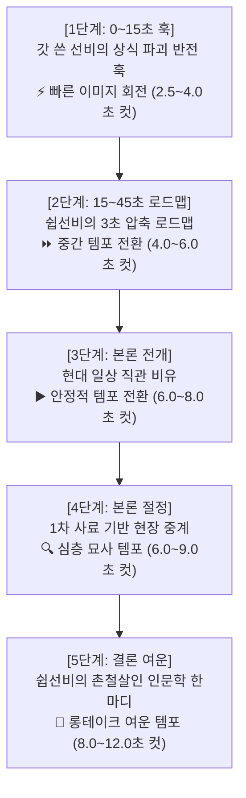

# [상세 기획 및 명세서] '쉽선비' (쉽게 역사 알려주는 선비) 채널 & 대본 생성 아키텍처

- **문서 버전**: v1.1.0
- **작성 일자**: 2026-08-21
- **채널명**: **쉽선비** (쉽게 역사 알려주는 선비 / ShipSeonbi)
- **채널 슬로건**: *"역사가 어렵다구요? 이 선비가 귀에 쏙 넣어 드리지요!"* (`quick_3m` 형식에 한해 *"딱 3분 만에"* 슬로건 허용)
- **표준 러닝타임 기준**: **1200초 (20분) ± 30%** (허용 범위: **840초 ~ 1560초 / 14분 ~ 26분**)
- **타겟 오디언스**: 2040 직장인 및 역사/인문학에 관심 있는 유튜브 시청자 (지적 호기심 + 도파민 충족)

---

## 1. 채널 기획 배경 및 시장 자료 분석

### 1.1 유튜브 역사 콘텐츠 시장 트렌드
1. **기존 교과서식 다큐멘터리의 한계**: 
   - 딱딱한 어조(`~했다. ~이다.`), 난해한 고문서/지질학 용어, 나열식 연표로 인해 초반 이탈률이 높아지는 가설적 현상 관찰.
2. **자극적 역사 렉카/쇼츠의 한계**:
   - 흥미 위주의 팩트 왜곡, 사료에 없는 허구 날조로 인해 장기적 채널 신뢰도 하락.
3. **'쉽선비'의 블루오션 포지셔닝**:
   - **"모든 사실 segment가 검토된 근거에 연결되고 미해결 이슈 0건의 신뢰성"** ➕ **"조선 선비의 사이다 같은 구어체 & 3초 현대 직관 비유"**의 결합.
   - 지적인 충족감과 유쾌한 엔터테인먼트를 동시에 제공.

### 1.2 벤치마킹 및 차별화 분석 (정성적 관찰)

| 채널 유형 | 대표 사례 | 장점 | 단점 | '쉽선비' 차별화 포인트 |
|---|---|---|---|---|
| **정통 다큐형** | KBS 역사저널, 히스토리 | 높은 사료 접근성 | 느린 템포, 교과서 톤 | **갓 쓴 괴짜 선비 캐릭터의 유쾌한 입담** |
| **스토리텔링형** | 조승연의 탐구생활 | 깊이 있는 통찰, 흥미 유발 | 긴 러닝타임, 배경지식 요구 | **3초 현대 직관 비유 (덤프트럭, 주주총회 등)** |
| **쉬운 설명형** | 슈카월드, 1분만 | 빠른 이해, 직관적 비유 | 시각적 씬 연출 다소 제한 | **시네마틱 AI 비주얼 + 팩트/근거 가드레일** |

---

## 2. '쉽선비' 캐릭터 페르소나 & 화법 바이블

### 2.1 캐릭터 프로필
- **외형**: 갓과 도포를 단정하게 갖춰 입었으나, 손에는 두루마리 대신 최신 태블릿이나 붓을 들고 시공간을 유쾌하게 넘나드는 괴짜 조선 선비.
- **성격**: 
  - 겉으로는 헛기침을 하며 근엄한 척하지만, 실상은 속이 뻥 뚫리는 사이다 입담꾼.
  - 모르는 척 능청을 떨다가도 핵심 사료를 들이밀며 고정관념을 통쾌하게 부수는 전략가.
  - 비극적 역사 앞에서는 인간의 존엄과 아픔에 진심으로 공감하는 따뜻한 인문학자.

### 2.2 시그니처 화법 & 어휘 사전 (Lexicon)

```yaml
signature_voice:
  honorifics: "친근한 경어체 + 선비 특유의 구어체 (~지요, ~했답니다, ~이지 뭡니까!, ~라는 말씀!)"
  
  openings:
    - "다들 ~라고 알고 계시지요? 허허, 천만의 말씀!"
    - "자, 이리오너라! 오늘 선비가 기가 막힌 이야기를 하나 가져왔답니다."
    - "역사가 어렵다구요? 이 선비가 귀에 쏙 넣어 드리지요." # quick_3m 형식만 "딱 3분 만에" 허용

  transitions:
    - "쉽게 말해 이런 겁니다."
    - "현대로 치면 ~인 셈이지요."
    - "사료를 가만~히 뜯어보면 기가 막힌 반전이 숨어있지요."
    - "도대체 왜 그랬을까요? 가만있어 보자..."

  closings:
    - "비극 앞 인간의 선택은 언제나 오늘날 우리에게 묵직한 울림을 줍니다."
    - "오늘 선비가 준비한 이야기는 여기까지입니다. 다음에도 귀에 쏙 박히는 역사로 찾아오지요!"
```

### 2.3 금지 표현 및 행동 수칙 (Do Not)
- ❌ **"안녕하세요 구독자 여러분, 오늘은 ~에 대해 알아보겠습니다"** (낡은 인트로 금지)
- ❌ **"좋아요와 구독, 알림 설정 부탁드립니다"** (중간 흐름 끊기 금지)
- ❌ 역사적 팩트에 없는 가짜 대화 날조 (사료 왜곡 금지)
- ❌ 시종일관 가볍거나 희생자를 조롱하는 태도 (인문학적 품격 유지)

---

## 3. 대본 생성 5단계 스토리텔링 & 시각 페이싱 아키텍처



### 3.1 시각 페이싱 전략 (Progressive Slowdown)
- **영상 초반 (0:00 ~ 3:00)**: **빠른 이미지 회전/컷 전환 (2.5초 ~ 4.0초)**. 긴박한 역사적 사건과 상식 파괴 훅으로 시청자 초반 30초 이탈을 강력 차단.
- **로드맵 및 배경 전개**: **중간 템포 전환 (4.0초 ~ 6.0초)**. 핵심 모순과 역사적 지리/인물 정보 전달.
- **본론 및 사료 중계**: **점진적 슬로우 전환 (6.0초 ~ 9.0초)**. 사료 원문 인용과 학술 근거에 집중할 수 있도록 안정적인 카메라 워크 적용.
- **결론 및 인문학적 통찰**: **롱테이크 여운 (8.0초 ~ 12.0초)**. 폼페이 유적지의 현대적 풍경과 잔잔한 선비의 성찰로 깊은 여운 부여.

### 3.2 단계별 작법 상세 가이드

1. **[0~15초] 1단계: 상식 파괴 반전 훅 (Counter-Intuitive Hook)**
   - 대중이 당연하게 여기던 통념을 1문장으로 뒤엎음. (빠른 컷 회전)
   - *공식*: `[대중적 편견 언급] + "허허, 천만의 말씀!" + [사료 기반 반전 사실 제시]`

2. **[15~45초] 2단계: 쉽선비의 3초 압축 로드맵 (3-Second Roadmap)**
   - 시청자가 영상을 끝까지 봐야 하는 명확한 이유와 핵심 질문 제시.
   - *공식*: `"그렇다면 도대체 왜 [핵심 모순]? 오늘 이 선비와 함께 [시간/사건 범위]를 낱낱이 파헤쳐 보시지요!"`

3. **[본론 1] 3단계: 현대 일상 직관 비유 (Modern Day Analogy)**
   - 전문 용어(부석, 테프라, 원로원 등)가 나올 때마다 현대인의 일상(덤프트럭, 아파트 2층, 주주총회)에 1:1 대응. (실제 발화 3.5초 이내)
   - *공식*: `"쉽게 말해 [현대 일상 비유]인 셈이지요. 버틸 재간이 있겠습니까?"`

4. **[본론 2] 4단계: 1차 사료 현장 중계 (Primary Source Live Commentary)**
   - 사료의 기록을 박제된 문서가 아니라 선비가 현장에서 망원경으로 보듯 중계.
   - *공식*: `"사료를 보면 [관찰자/사료명]이 붓을 쥐고 기록하길, '[핵심 인용구]'라고 적었답니다."`

5. **[결론] 5단계: 촌철살인 인문학 통찰 (Humanistic Insight & Outro)**
   - 단순 사건 나열을 넘어 인간의 본성과 삶의 지혜로 귀결. (롱테이크)
   - *공식*: `[역사적 사건의 교훈] + "오늘날 우리에게 묵직한 질문을 던집니다." + [선비 시그니처 작별인사]`
