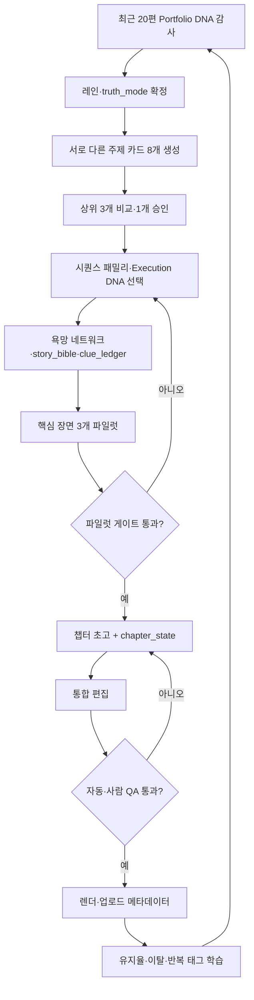

# 계획서: 주제·대본 다양성·풍부함·품질 강화 (v2.0)

> **개정일:** 2026-08-10  
> **상태:** 방향 승인 완료 — 구현 기준 문서  
> **대상:** `modern/v12_*` 기반 주제 발굴·기획·대본 생성·품질검수 워크플로우  
> **핵심 결정:** 하나의 채널 안에서 5개 콘텐츠 레인을 운영하고, 실화성·서사 구조·실행 방식·분량을 별도 축으로 통제한다.  
> **범위:** 주제 발굴 → 사실성 분류 → 구조·캐릭터 설계 → 집필 → QA → 업로드 후 학습. 영상·TTS는 연결 규약까지만 포함한다.

---

## 0. 결론부터

현재 파이프라인은 `story_contract`, `character_matrix`, `evidence_cards`, 15비트, 챕터 상태 관리 등 기본 골격은 좋다. 그러나 실제 산출물의 다양성과 장기 운영성을 막는 병목은 다음 네 가지다.

1. 장르 이름은 여러 개지만 사건 엔진이 **기록 발견 → 증거 수집 → 공개 폭로 → 응징**으로 수렴한다.
2. 주제 차원의 변주만 있고, 시점·시간구조·정보 비대칭·장면 엔진·대사 리듬 같은 **실행 차원의 다양성**은 관리하지 않는다.
3. 100분 고정 목표가 이야기 크기보다 먼저 결정되어 일부 실행 경로가 반복문장으로 분량을 채운다.
4. ‘실화 기반’ 콘텐츠에 필요한 출처·동의·익명화·각색 이력·표시 규칙이 없다.

따라서 v2.0은 다음을 채택한다.

- 채널은 하나로 유지하되 `L1~L5` 콘텐츠 레인을 사용한다.
- 작품마다 `truth_mode`를 먼저 확정하고, 검증되지 않은 이야기에 ‘실화’ 표현을 쓰지 않는다.
- 후보는 12~24개 대량 생성 대신 **서로 다른 8개 카드**를 만들고 상위 3개만 비교한다.
- Story DNA뿐 아니라 **Execution DNA**와 최근 20편의 포트폴리오 지문을 저장한다.
- 기본 분량을 100분으로 고정하지 않고 이야기 복잡도에 따라 15~120분 중 선택한다.
- 동일 문장 순환 삽입은 `FILLER_REPEAT_BLOCK`으로 즉시 실패시킨다.
- Writer/Editor 역할은 분리하되, 단계마다 다수 비평가를 연쇄 호출하는 구조는 단일 편집 게이트로 단순화한다.
- 업로드 후 지표는 같은 레인·비슷한 길이끼리 비교해 다음 기획에 반영한다.

---

## 1. 감사 범위와 확인된 근거

### 1.1 확인한 핵심 파일

- `modern/v12_modern_main_SONNET.md`
- `modern/motif_bank.md`
- `modern/참고_장르별_요소풀_slim.md`
- `modern/참고_비트구조_체크리스트_slim.md`
- `modern/참고_캐릭터_말투_문체_slim.md`
- `modern/부록_양식.md`
- `modern/주제_추천_다음작품.md`
- `modern/duration_default.md`
- `modern/HANDOFF.md`
- `modern/checks.py`
- `modern/runs/smoke_g1/*`
- `modern/runs/smoke_g4/*`

### 1.2 현재 구조의 강점

| 강점 | 유지할 이유 |
|---|---|
| `story_contract` | 기획 의도와 금지사항을 산출물 계약으로 고정할 수 있다. |
| `character_matrix` | 인물별 역할·욕망·갈등을 구조화할 토대가 있다. |
| `evidence_cards` | 미스터리·법정·고발형에서 단서의 출처와 회수 시점을 관리하기 좋다. |
| 15비트와 챕터 상태 | 장편의 인과·연속성을 추적할 수 있다. |
| 허구 고지 규칙 | 시청자 오인을 줄이는 최소 안전장치가 이미 있다. |
| `checks.py` | 품질 규칙을 자동 게이트로 옮길 수 있는 진입점이 있다. |

### 1.3 우선 수정할 문제

| 우선도 | 문제 | 확인 내용 | 영향 |
|---|---|---|---|
| P0 | 반복문장으로 분량 확장 | `modern/runs/smoke_g4/build_chapters.py`의 `expand()`가 고정 문장을 순환 삽입한다. | 장편일수록 내용 밀도·신뢰·수익화 적합성이 급락한다. |
| P0 | 분량 기준 충돌 | `duration_default.md`는 100분, `주제_추천_다음작품.md`는 12~25분, 다른 진단 문서는 12~55분을 권한다. | 작성기·검수기·렌더러가 서로 다른 목표를 따른다. |
| P0 | 실화성 계약 부재 | 허구 고지는 있으나 실화 출처·동의·익명화·각색 변경을 기록하는 구조가 없다. | 오인·사생활·명예·합성미디어 리스크가 커진다. |
| P1 | 사건 엔진 편중 | 모티프와 요소풀이 문서·녹취·CCTV·장부 같은 `[정보]`와 폭로형 결말에 치우친다. | 제목만 달라지고 체감 플롯은 반복된다. |
| P1 | 실행 다양성 부재 | 주제·직업·장소는 바뀌어도 전지적 해설, 선형 시간, 같은 반전 위치가 반복될 수 있다. | 시청자가 초반부터 전개를 예측한다. |
| P1 | 후보 과다·비평가 과다 | 12~24개 후보와 다중 Critic은 비용과 지연을 늘리지만 차이를 보장하지 않는다. | 생성량은 늘고 선택 품질은 불안정해진다. |
| P2 | 유사도 임계치 근거 부족 | 임베딩 cosine `< 0.72` 같은 단일 수치가 실제 채널 데이터로 보정되지 않았다. | 좋은 변주를 탈락시키거나 복제형 플롯을 통과시킬 수 있다. |

### 1.4 반복도 표본 감사

간이 문장 단위 감사 결과는 다음과 같다. 이 수치는 문학적 품질 자체가 아니라 **정확 반복 오염 여부**를 보는 진단값이다.

| 산출물 | 문자 수 | 문장 수 | 고유 문장 수 | 고유 문장 비율 |
|---|---:|---:|---:|---:|
| `smoke_g1` 최종본 | 22,465 | 1,189 | 1,148 | 약 96.6% |
| `smoke_g4` 최종본 | 21,891 | 1,010 | 361 | 약 35.7% |

`smoke_g4`에서는 “복도에서 휠체어가…”류 문장이 각각 30회 이상 되풀이된다. 이 결과는 프롬프트 미세 조정이 아니라 **분량 확장 알고리즘 제거와 자동 차단**이 먼저임을 뜻한다.

---

## 2. 운영 모델: 단일 채널, 5개 콘텐츠 레인

채널의 공통 약속은 “감정적으로 선명하고, 인과가 납득되며, 끝난 뒤 한 장면이 남는 한국형 드라마”로 유지한다. 장르별 채널을 분리하는 대신 작품 생성 전 레인을 지정한다.

| 레인 | 시청자 약속 | 필수 엔진 | 피해야 할 기본값 |
|---|---|---|---|
| `L1 TRUE` 검증 실화 | 실제 인물·사건의 선택과 여운 | 출처·교차검증·동의·후일담 | 확인 안 된 미담, 자극적 각색, 피해자 재현 소비 |
| `L2 HEART` 감동 합성허구 | 평범한 관계가 행동으로 변하는 감정 | 욕망 충돌·작은 선택·누적된 대가 | 질병·죽음·가난만으로 우는 구조 |
| `L3 TWIST` 공정 반전 | 다시 보면 단서가 보이는 놀라움 | 정보 비대칭·3개 단서·재해석 | 꿈, 갑툭튀 쌍둥이, 만능 CCTV, 악역 자백 |
| `L4 MAKJANG` 고밀도 멜로·복수 | 과장된 사건을 인물의 대가로 설득 | 관계 비밀·권력 역전·후폭풍 | 비밀 무한 추가, 취약집단 고통의 구경거리화 |
| `L5 ROTATION` 실험 회차 | 익숙한 채널에서 만나는 새로운 맛 | 코미디·힐링·직장·오컬트 등 순환 | 기존 폭로극에 장르 외피만 교체 |

### 2.1 최근 10편 포트폴리오 규칙

- 기본 편성은 각 레인 2편씩이다.
- `L1`은 검증 가능한 소재가 없으면 억지로 채우지 않는다. 그 자리는 `L2` 또는 `L5`로 대체한다.
- 최근 10편에서 한 레인은 최소 1편, 최대 3편을 권장한다.
- 같은 핵심 모티프 계열은 10편 중 최대 2편, 같은 폭로 장치는 최근 4편 중 최대 1편을 권장한다.
- 같은 결말 유형은 최근 5편 중 최대 2편으로 제한한다.
- 같은 `POV + 시간구조` 조합을 3편 연속 사용하지 않는다.
- 규칙 위반은 무조건 폐기 대신 `NOVELTY_OVERRIDE`에 이유와 차별점을 기록해야 통과한다.

이 규칙은 장르 수를 세는 것이 아니라 **시청자가 체감하는 반복**을 줄이기 위한 운영 가드레일이다.

---

## 3. 실화성 분류와 출처 계약

### 3.1 `truth_mode` 5단계

| 값 | 사용 조건 | 공개 문구 원칙 |
|---|---|---|
| `TRUE_VERIFIED` | 복수의 신뢰 가능한 출처로 핵심 사실을 교차검증 | “확인된 자료를 바탕으로 재구성했습니다.” |
| `TRUE_PERMISSIONED` | 당사자·권리자 자료와 명시적 사용 동의가 있음 | 동의 범위와 각색 여부를 설명란에 표시 |
| `INSPIRED_COMPOSITE` | 여러 사례의 공통 패턴을 합성하고 식별자를 제거 | “여러 사례에서 영감을 얻어 재구성한 창작물입니다.” |
| `FICTION_REALISTIC` | 현실적으로 보이지만 인물·사건은 창작 | “등장인물과 사건은 허구입니다.” |
| `FICTION_HEIGHTENED` | 반전·막장·오컬트 등 과장된 창작 | 영상 시작·설명란에 창작극임을 명확히 표시 |

금지 규칙:

- 출처가 하나뿐이거나 당사자 확인이 불가능한 사연을 `TRUE_VERIFIED`로 표시하지 않는다.
- “실화 100%”, “실제 CCTV”, “실제 녹취” 같은 문구는 근거 파일이 없으면 제목·썸네일·대사에서 금지한다.
- 실제 인물을 합성하거나 사실처럼 보이는 AI 장면을 사용하면 플랫폼의 altered/synthetic content 공개 항목을 검토한다.
- 미성년자, 성폭력, 중증질환, 현재 진행 중인 분쟁, 비공개 개인은 자동으로 사람 검토 대상으로 보낸다.

### 3.2 `source_packet.md` 필수 항목

`TRUE_VERIFIED`와 `TRUE_PERMISSIONED`는 다음 항목이 모두 있어야 기획 단계로 진행한다.

```yaml
truth_mode: TRUE_VERIFIED
working_title: ""
core_claims:
  - claim_id: C01
    statement: ""
    source_urls: []
    source_dates: []
    cross_check: ""
    confidence: high|medium|low
people:
  consent_status: obtained|not_required|pending|denied
  consent_scope: ""
  anonymization: ""
adaptation_log:
  chronology_changes: []
  merged_characters: []
  invented_dialogue: []
sensitive_topics: []
visual_disclosure:
  realistic_ai_used: false
  upload_disclosure_required: false
reviewer: ""
reviewed_at: ""
```

운영 원칙:

- 사실 주장과 창작 대사를 분리한다.
- 사건 순서 변경·인물 합성·대사 창작은 `adaptation_log`에 남긴다.
- 출처 URL만 저장하지 말고 핵심 주장을 어떤 출처가 지지하는지 연결한다.
- 동의 철회 또는 중대한 반증이 생기면 게시 보류 상태로 되돌릴 수 있어야 한다.
- 공개된 글이라도 영상 각색과 신상 노출 권리가 자동으로 생기는 것은 아니라는 전제로 검토한다.

---

## 4. 다양성은 세 층으로 관리한다

### 4.1 Portfolio DNA — 최근 작품 간 차이

최근 20편을 `modern/portfolio_state.json`에 저장한다.

```json
{
  "episode_id": "E0001",
  "lane": "L3_TWIST",
  "truth_mode": "FICTION_REALISTIC",
  "premise_motif": "도난된 음성 기록",
  "relationship_core": "경비원-입주민",
  "conflict_source": "신뢰와 생계",
  "reveal_mechanism": "시간이 뒤섞인 안내방송",
  "ending_type": "관계 회복형",
  "pov": "제한적 1인칭",
  "chronology": "역순 단서형",
  "scene_engine": "잠복과 오해",
  "narration_distance": "근접",
  "dialogue_rhythm": "짧은 문답",
  "visual_grammar": "폐쇄공간·고정구도"
}
```

### 4.2 Story DNA — 무엇에 관한 이야기인가

각 주제 카드는 최소 다음 축을 갖는다.

- 레인과 `truth_mode`
- 주인공의 구체적 욕망
- 관계 핵심과 가치 충돌
- 사건을 시작시키는 선택
- 압박을 키우는 시스템 또는 인물
- 핵심 모티프와 증거/오브젝트
- 되돌릴 수 없는 중간 결정
- 클라이맥스의 도덕적 선택
- 결말 유형과 남는 감정
- 기존 20편과 겹치는 축

### 4.3 Execution DNA — 어떻게 체험하게 할 것인가

같은 소재라도 아래 축 중 최소 3개가 최근 유사작과 달라야 한다.

- `pov`: 1인칭 고백 / 제한적 3인칭 / 교차시점 / 목격자 시점
- `chronology`: 선형 / 역순 / 두 시간대 교차 / 제한시간 / 반복되는 하루
- `information_asymmetry`: 주인공만 모름 / 시청자만 앎 / 모두 오해 / 두 인물이 절반씩 앎
- `scene_engine`: 협상 / 돌봄 / 추적 / 공동작업 / 경쟁 / 의식·행사 / 잠입 / 여행
- `narration_distance`: 내면 밀착 / 관찰형 / 다큐형 / 편지·음성 기록형
- `dialogue_rhythm`: 짧은 공방 / 침묵 중심 / 장광설 대치 / 유머와 역설
- `visual_grammar`: 폐쇄공간 / 이동 동선 / 계절 변화 / 물건 중심 / 군중과 고립
- `reveal_position`: 초반 약속 / 중반 전복 / 후반 재해석 / 결말 후일담

임베딩 유사도는 참고 신호로만 쓴다. `< 0.72` 같은 고정 숫자를 즉시 하드 게이트로 삼지 않고, 실제 채널 20~50편의 중복 판정 결과로 경계값을 보정한다.

---

## 5. 주제 발굴: 8개 카드, 상위 3개, 최종 1개

### 5.1 생성 규칙

한 번에 8개 카드를 만들되 다음 조건을 강제한다.

- 최소 4개 레인을 포함한다.
- 같은 주인공 직업은 최대 2개다.
- 가족 갈등 외 관계축을 최소 4개 포함한다: 동료, 이웃, 사제, 고객, 경쟁자, 낯선 동행 등.
- `[정보]` 모티프만 쓰지 않는다. `[행동]`, `[공간]`, `[관계]`, `[시간]`, `[의례]`, `[물건]` 모티프를 분산한다.
- ‘비밀 문서가 발견된다’와 ‘공개 폭로로 악역이 무너진다’를 기본 결말로 두지 않는다.
- 후보마다 `한 줄 약속`, `차별화 근거`, `가장 위험한 진부함`을 함께 쓴다.

### 5.2 카드 형식

```yaml
card_id: TC-01
lane: L2_HEART
truth_mode: FICTION_REALISTIC
working_title: "폐업 하루 전, 세탁소에 도착한 스무 벌의 교복"
one_line_promise: "끝내 돌려주지 못한 옷들이 한 동네의 오래된 오해를 푼다."
protagonist:
  role: "세탁소 주인"
  want: "조용히 문을 닫고 떠나기"
  fear: "자신의 실수가 드러나는 것"
relationship_core: "주인-옛 고객들"
conflict_value: "체면 대 책임"
inciting_choice: "주인 없는 교복들을 직접 배달한다"
midpoint_irreversible_choice: "폐업 보증금을 포기하고 한 사람을 찾는다"
climax_choice: "명예 회복보다 잘못을 공개한다"
ending_type: "씁쓸한 공동체 회복"
execution_dna:
  pov: "교차시점"
  chronology: "현재 하루 + 옷별 짧은 과거"
  scene_engine: "배달과 재회"
novelty_risk: "물건마다 사연을 붙이는 옴니버스 상투성"
production_risk: "등장인물 수"
```

### 5.3 선택 점수

| 항목 | 배점 | 질문 |
|---|---:|---|
| 인물의 능동성 | 15 | 주인공이 최소 3번 중요한 결정을 내리는가? |
| 인과와 압박 | 15 | 사건이 우연이 아니라 선택의 결과로 커지는가? |
| 감정의 구체성 | 15 | 감정이 행동·관계·대가로 보이는가? |
| 공정한 놀라움 | 15 | 반전이 없어도 새 정보가 과거 장면을 재해석하는가? |
| 포트폴리오 차별성 | 20 | 최근 20편과 Story/Execution DNA가 실제로 다른가? |
| 제작 가능성 | 10 | 영상·TTS·장면 수·자료 권리가 감당 가능한가? |
| 채널 약속 | 10 | 채널의 감정적 품질과 어울리는가? |
| **합계** | **100** |  |

상위 3개를 제시할 때 점수만 보여주지 말고 **왜 다른지, 무엇이 실패할 수 있는지**를 함께 보여준다. 최종 선택 뒤에는 나머지 카드를 폐기하지 않고 포트폴리오 큐에 저장하되, 다음 생성 시 그대로 재출력하지 않는다.

---

## 6. 레인별 15개 시퀀스 패밀리

기존 15비트는 내부 박자표로 유지하되, 작품 전체의 사건 엔진은 아래 시퀀스 중 하나를 고른다. 같은 시퀀스를 써도 Execution DNA는 달라야 한다.

| ID | 레인 | 시퀀스 골격 |
|---|---|---|
| `T01` | L1 | 평범한 현재 → 작은 사실 발견 → 자료 교차검증 → 당사자의 선택 → 제한된 공개 → 후일담 |
| `T02` | L1 | 현재의 결과 → 서로 다른 두 증언 → 모순 확인 → 숨겨진 희생 규명 → 관계 회복 여부 선택 |
| `T03` | L1 | 공동체의 오래된 관습 → 한 사람의 이탈 → 기록과 기억의 충돌 → 변화의 대가 → 현재 영향 |
| `H01` | L2 | 단절된 일상 → 어쩔 수 없는 공동작업 → 작은 배려의 누적 → 오래된 오해 노출 → 행동으로 사과 |
| `H02` | L2 | 서로 반대 목표 → 제한시간 동행 → 역할 역전 → 각자의 손해 감수 → 완전하지 않은 화해 |
| `H03` | L2 | 잃어버린 물건/약속 → 여러 사람을 거치는 여정 → 주인공의 책임 발견 → 돌려줄 것과 남길 것 선택 |
| `W01` | L3 | 명백해 보이는 범인 → 세 개의 불일치 → 관점의 빈칸 → 앞선 장면 재해석 → 대가 있는 진실 |
| `W02` | L3 | 시청자만 아는 위험 → 주인공의 잘못된 목표 → 단서의 이중 의미 → 목표 반전 → 공모 여부 선택 |
| `W03` | L3 | 두 인물의 절반짜리 진실 → 서로의 방해 → 제3의 목적 드러남 → 공동 선택 → 남는 의심 한 조각 |
| `M01` | L4 | 지위 추락 → 숨은 동맹 → 첫 역공 실패 → 관계 비밀 공개 → 공개 승리와 사적 상실 |
| `M02` | L4 | 유언/계약의 조건 → 가족 연합 재편 → 가짜 승자 탄생 → 조건의 진짜 의미 → 상속보다 큰 선택 |
| `M03` | L4 | 결혼/혈연의 모순 → 적과 임시 공조 → 두 번째 배신 → 권력 역전 → 복수 중단 또는 완수의 대가 |
| `R01` | L5 | 직장 규칙의 모순 → 작은 편법 → 편법의 연쇄 확산 → 집단 코미디 → 의외의 제도 개선 |
| `R02` | L5 | 낯선 공간에 고립 → 사소한 돌봄 과제 → 각자의 사연이 행동으로 노출 → 떠날 기회 → 머물 이유 |
| `R03` | L5 | 초자연적 징후 → 현실적 설명과 충돌 → 믿음이 관계를 시험 → 두 해석 모두 가능한 결말 → 감정적 확정 |

시퀀스 선택 후 반드시 적는다.

- 이 구조에서 가장 예상 가능한 지점
- 그 예상을 피하기 위해 바꿀 Execution DNA 2개
- 기존 15비트 중 압축·확장할 비트
- 레인 약속을 어기지 않는 결말의 범위

---

## 7. 캐릭터를 ‘설정표’가 아니라 욕망 네트워크로 만든다

### 7.1 주요 인물 필드

```yaml
character_id: C01
public_want: "겉으로 원하는 것"
private_need: "인정하지 않는 결핍"
fear: "잃을 수 없는 것"
false_belief: "처음에 믿는 잘못된 명제"
leverage: "다른 인물에게 줄 수 있거나 빼앗을 수 있는 것"
boundary: "넘지 않겠다고 믿는 선"
irreversible_choices: []
price_paid: "결말에서 치르는 대가"
change_or_refusal: "변화하거나 끝까지 거부하는 방식"
speech_dna:
  sentence_length: short|mixed|long
  honorific_strategy: ""
  concealment_style: "질문으로 회피/농담/침묵/과잉 설명"
  forbidden_words: []
  repeated_gesture: ""
```

### 7.2 관계 엣지

인물 쌍마다 다음 다섯 값을 기록한다.

- `wants_from`: 상대에게 원하는 것
- `withholds`: 주지 않는 것
- `misreads`: 상대를 오해하는 방식
- `power_source`: 돈·직위·정보·돌봄·죄책감 등
- `turning_scene`: 힘의 방향이 바뀌는 장면

### 7.3 캐릭터 품질 규칙

- 주인공은 최소 3회의 되돌릴 수 없는 선택을 한다.
- 조력자는 정보 전달기가 아니라 자기 목표와 손해를 가진다.
- 악역은 단순 악행 목록이 아니라 스스로 정당하다고 믿는 가치와 유혹을 가진다.
- 핵심 인물은 결말에서 변화하거나, 변화 거부의 대가를 치른다.
- 감정명사를 설명하는 대신 행동·말의 누락·잘못된 선택·물건 취급으로 드러낸다.
- 인물별 대사 리듬을 분리하고, 이름을 가린 상태에서도 화자를 어느 정도 구분할 수 있어야 한다.

---

## 8. 공정한 반전 규칙

반전은 횟수가 아니라 **재해석의 질**로 평가한다.

### 8.1 핵심 규칙

- 핵심 반전은 작품당 1~2개로 제한한다.
- 각 핵심 반전에는 최소 3개의 사전 단서가 필요하다.
  - 눈에 보였지만 중요성을 몰랐던 단서 1개
  - 처음과 나중의 뜻이 달라지는 단서 1개
  - 대사가 아닌 행동·공간·소품 단서 1개
- 공개 순간은 과거를 재해석할 뿐 아니라 주인공의 다음 선택을 바꿔야 한다.
- 반전을 알아낸 대가가 있어야 한다: 관계 손실, 명예 손상, 기회 포기, 자기 책임 인정 등.
- 우연은 사건을 시작할 수 있지만 해결해서는 안 된다.

### 8.2 차단할 가짜 반전

- 앞서 암시하지 않은 쌍둥이·출생 비밀·기억상실
- “모두 꿈이었다” 또는 장난 촬영이었다는 무효화
- 필요할 때만 나타나는 완벽한 CCTV·녹취·유전자 검사
- 악역의 긴 자백으로 모든 빈칸을 메우는 결말
- 새 인물·새 문서가 마지막 10%에 등장해 문제를 해결하는 구조
- 반전 뒤 인물의 감정·관계·목표가 달라지지 않는 정보 놀음

### 8.3 `clue_ledger`

```yaml
- twist_id: TW01
  reveal: ""
  clue_id: CL01
  first_appearance: "chapter/scene"
  surface_meaning: ""
  true_meaning: ""
  visible_without_spoiling: true
  payoff_scene: ""
```

Editor는 초고를 읽고 난 뒤가 아니라, 반전을 모르는 첫 독자 관점과 반전을 아는 재독 관점으로 각각 한 번 검사한다.

---

## 9. 막장도 품질 규칙 안에서 과감하게 만든다

막장 레인은 얌전하게 만들 필요가 없다. 대신 충격의 수보다 **관계 변화와 후폭풍**을 늘린다.

### 9.1 강도 다이얼

| 강도 | 성격 | 운영 |
|---:|---|---|
| 1 | 현실 멜로, 관계 오해 중심 | 상시 가능 |
| 2 | 한 개의 큰 비밀, 제한된 권력 역전 | 상시 가능 |
| 3 | 두세 개 비밀과 공개 대치, 명확한 대가 | 기본 권장 |
| 4 | 출생·상속·배신이 결합된 고자극 회차 | 사람 검토 후 제한 운영 |
| 5 | 폭력·성적 착취·취약집단 고통을 충격으로 소비 | 자동 차단 |

### 9.2 Shock budget

- 독립된 핵심 비밀은 최대 3개다.
- 충격 사건 1개마다 최소 2개의 결과 장면을 둔다.
  - 즉각적 관계 변화
  - 현실적 비용 또는 장기 후유증
- 마지막 비밀은 기존 비밀의 의미를 깊게 해야지 새 세계관을 추가하면 안 된다.
- 복수 성공만으로 끝내지 말고, 주인공이 무엇을 닮게 되었는지 또는 지키지 못했는지를 보여준다.

### 9.3 금지되는 감정 지름길

- 질병·장애·가난·고아 설정을 인격이나 눈물의 자동 증명으로 사용
- 미성년자 학대·성폭력·자해를 반전 소품이나 썸네일 충격으로 사용
- 피해자의 선택보다 가해자의 카리스마를 중심에 놓기
- 여러 취약성을 한 인물에게 쌓아 감정을 강요하기
- 결과 장면 없이 공개 망신만 반복하기

---

## 10. 분량은 이야기 크기의 결과여야 한다

### 10.1 단일 기준표

`modern/duration_default.md`, 추천 문서, 작성 프롬프트, 검사기에서 이 표를 하나의 진실 원천으로 사용한다.

| 유형 | 목표 길이 | 적합한 이야기 |
|---|---:|---|
| Quick | 15~25분 | 한 관계, 한 선택, 한 핵심 반전 |
| Standard | 25~45분 | 주 플롯 1개 + 얕은 보조선 1개 |
| Deep | 45~70분 | 가족·복수·미스터리, 보조선 1~2개 |
| Special | 80~120분 | 3막이 각각 독립 목표를 갖는 대형 이야기 |
| Anthology | 총 80~120분 | 25~35분 이야기 3편을 하나의 정서 주제로 묶음 |

문자 수는 고정 상수가 아니라 실제 TTS 샘플의 `chars_per_second`로 역산한다. 최소 3개 완성본의 렌더 시간을 측정해 화자·쉼표·감정 지시에 따른 차이를 보정하고, 최종 오디오 길이를 기준값으로 삼는다.

### 10.2 100분 단일 이야기 승인 조건

다음 조건을 모두 만족하지 못하면 45~70분으로 줄이거나 3편 앤솔로지로 전환한다.

- 주 플롯 외에 독립 욕망을 가진 보조선이 2개 이상이다.
- 주인공의 목표 상태가 최소 3회 질적으로 변한다.
- 각 막이 고유한 질문·갈등·결과를 가진다.
- 10분 파일럿 구간이 반복 설명 없이 작동한다.
- 동일 기능 장면을 합친 뒤에도 필요한 길이다.
- 반복문장·풍경문장 순환 없이 목표 분량에 도달한다.

### 10.3 확장 우선순위

분량이 부족하면 아래 순서로 확장한다.

1. 이미 일어난 선택의 **후폭풍**
2. 인물이 손해를 감수해야 하는 **새 결정 장면**
3. 주 플롯과 충돌하는 **보조 인물의 욕망선**
4. 앞선 장면을 바꾸는 **단서·오해·회수**
5. 장소·행동·대화에만 존재하는 **장면 고유 디테일**
6. 필요한 경우에만 짧은 회상

절대 허용하지 않는 확장:

- 정해진 문장 배열을 목표 글자 수까지 순환 삽입
- 같은 감정 설명을 표현만 바꿔 반복
- 이미 확인된 사실을 인물마다 다시 설명
- 기능이 같은 갈등·협박·폭로 장면을 추가

---

## 11. 생성 워크플로우 v2



### 11.1 단계별 산출물과 게이트

| 단계 | 산출물 | 통과 조건 |
|---|---|---|
| 0. Portfolio Audit | `portfolio_state.json`, 빈도 보고서 | 최근 20편의 레인·모티프·결말·Execution DNA가 채워짐 |
| 1. Truth Gate | `truth_mode`, 필요 시 `source_packet.md` | 표시 문구·출처·동의·민감성 검토 완료 |
| 2. Ideation | `topic_cards.json` 8개 | 레인·관계·모티프·실행축 분산 |
| 3. Selection | 상위 3개 비교표, 승인 카드 1개 | 점수뿐 아니라 실패 위험과 차별성 기록 |
| 4. Architecture | 시퀀스 ID, 15비트, Execution DNA | 최근작 반복 위반 없음 또는 override 근거 있음 |
| 5. Story Bible | 욕망 네트워크, 타임라인, 단서장부 | 인물 선택·단서·연속성 선행 검증 |
| 6. Pilot | 첫 90초, 첫 대치, 반전 직전 장면 | 훅·인물 목소리·장면성 테스트 통과 |
| 7. Draft | 챕터 원고, `chapter_state` | 각 장면에 목표·갈등·변화가 있음 |
| 8. Integrated Edit | 통합본, 변경 로그 | 인과·리듬·대사·중복을 한 편집자가 통합 검토 |
| 9. QA | `qa_report.json` | 하드 블록 0건, 품질 점수 통과 |
| 10. Learning | `analytics_log.csv`, 실패 태그 | 동일 레인·유사 길이끼리 비교 가능한 데이터 저장 |

### 11.2 역할 단순화

- `Orchestrator`: 상태와 산출물 계약만 관리한다.
- `Researcher`: L1 또는 실제 정보가 필요한 작품에서만 호출한다.
- `Planner`: 카드·시퀀스·욕망 네트워크를 만든다.
- `Writer`: 승인된 계약 안에서 장면을 쓴다.
- `Editor`: 구조 편집과 문장 편집을 한 번씩 수행하며 Writer와 분리한다.
- `QA`: 결정적 규칙을 검사하고 보고서만 낸다.

같은 초고에 여러 Critic을 병렬로 붙여 상충하는 조언을 누적하지 않는다. 단계당 최종 판단자는 1명이며, 수정 이유를 `change_log`에 남긴다.

---

## 12. 파일 계약과 권장 구조

```text
modern/
├─ config/
│  ├─ content_lanes.yaml
│  ├─ truth_modes.yaml
│  ├─ duration_matrix.yaml
│  └─ qa_thresholds.yaml
├─ templates/
│  ├─ source_packet.md
│  ├─ topic_card.yaml
│  ├─ story_bible.yaml
│  ├─ clue_ledger.yaml
│  └─ qa_report.json
├─ memory/
│  └─ portfolio_state.json
├─ runs/<episode_id>/
│  ├─ project_contract.yaml
│  ├─ topic_cards.json
│  ├─ story_bible.yaml
│  ├─ chapter_state/
│  ├─ draft/
│  ├─ final/
│  └─ qa_report.json
└─ analytics/
   └─ analytics_log.csv
```

`project_contract.yaml` 최소 필드:

```yaml
episode_id: ""
lane: L3_TWIST
truth_mode: FICTION_REALISTIC
target_duration_min: 35
sequence_id: W01
makjang_intensity: 0
core_twists: 1
portfolio_exceptions: []
content_disclosure: "등장인물과 사건은 허구입니다."
source_packet_required: false
filler_allowlist:
  - "의도된 짧은 후렴 또는 호명"
```

---

## 13. 자동 QA와 사람 QA

### 13.1 하드 블록

다음 중 하나라도 해당하면 렌더 단계로 진행하지 않는다.

- `truth_mode` 누락 또는 공개 문구와 불일치
- L1인데 `source_packet`의 핵심 주장·출처·검토 상태가 불완전
- 실제 개인 식별 정보와 동의·공익성 검토 누락
- 타임라인·나이·관계·사망 여부 등 치명적 연속성 충돌
- 핵심 반전의 사전 단서가 3개 미만
- 마지막 10%에 등장한 새 정보가 갈등을 해결
- 동일 비주제 문장이 3회 이상 정확 반복
- 3문장 이상 블록이 그대로 재등장
- 목표 분량을 맞추기 위한 순환 삽입 코드 탐지
- 금지된 강도 5 막장 또는 취약집단 고통의 충격 소비
- 실제 같은 합성 장면을 사용하면서 필요한 공개 항목을 누락

### 13.2 `FILLER_REPEAT_BLOCK`

초기 기준은 다음과 같이 두고 실제 정상 원고로 보정한다.

- 완전히 동일한 비대사·비후렴 문장 3회 이상: `BLOCK`
- 3문장 이상 동일 블록 2회 이상: `BLOCK`
- 챕터별 고유 문장 비율 `< 0.80`: `BLOCK_REVIEW`
- 챕터별 고유 문장 비율 `0.80~0.90`: `WARN`
- 같은 의미의 감정 설명이 3회 이상: 의미 유사도 경고 + 사람 확인
- 허용된 호명·의식문·의도적 후렴은 `filler_allowlist`에 사유를 기록

고유 문장 비율은 스타일 판단의 보조값이다. 수치만으로 좋은 반복을 없애지 않되, `smoke_g4` 같은 기계적 순환은 예외 없이 차단한다.

### 13.3 품질 점수 100점

| 항목 | 배점 |
|---|---:|
| 인물 욕망·능동성·관계 변화 | 20 |
| 인과·압박·클라이맥스 선택 | 20 |
| 포트폴리오·실행 차별성 | 15 |
| 감정의 구체성과 절제 | 15 |
| 반전 공정성 또는 정보 회수 | 10 |
| 장면 고유성·감각·행동 | 10 |
| 대사 화자 구분·리듬 | 5 |
| 제작 가능성·표시 정확성 | 5 |
| **합계** | **100** |

- 기본 통과선: 82점.
- 인물 또는 인과 항목이 12점 미만이면 총점과 무관하게 재작성한다.
- L1은 사실성 게이트, L3은 단서 공정성, L4는 결과 장면을 추가 가중 검토한다.
- 점수는 모델의 자기확신이 아니라 근거 장면 ID와 함께 기록한다.

---

## 14. 업로드 후 학습 루프

YouTube의 공식 Audience Retention 안내는 첫 30초 유지, 급락 지점(dips), 반복 시청 또는 공유 구간(spikes)을 따로 보도록 권한다. 작품끼리 비교할 때도 같은 형식·비슷한 길이의 영상과 비교해야 한다.

`analytics_log.csv` 권장 필드:

```text
episode_id,publish_date,lane,truth_mode,duration_min,sequence_id,
pov,chronology,ending_type,first_30s_retention,avg_percentage_viewed,
major_dip_time,major_spike_time,returning_viewer_share,comment_tags,
qa_score,repeat_warning_count,decision
```

운영 규칙:

- 한 편의 성과로 프롬프트 전체를 바꾸지 않는다. 같은 레인·길이 표본이 최소 3편 쌓인 뒤 가설을 세운다.
- 첫 30초 급락은 제목/썸네일 약속과 첫 장면의 불일치를 먼저 검사한다.
- 중반 급락은 설명 과다, 목표 정체, 동일 기능 장면을 태깅한다.
- spike는 무조건 복제하지 않고, 그 구간이 선택·정보·감정·시각 변화 중 무엇 때문인지 분류한다.
- 댓글은 사실 판정 근거가 아니라 혼란·몰입·캐릭터 호감의 정성 신호로만 사용한다.
- `L1`과 `L4`, 20분과 100분을 같은 평균으로 직접 비교하지 않는다.

---

## 15. 구현 순서

### P0 — 품질 오염 제거

1. `build_chapters.py`류의 순환형 `expand()` 제거.
2. `checks.py`에 `FILLER_REPEAT_BLOCK`, 반복 블록, 고유 문장 비율 검사를 추가.
3. 분량 기준을 `duration_matrix.yaml` 하나로 통합하고 기존 충돌 문서가 이를 참조하게 변경.
4. `truth_mode`와 공개 문구를 `project_contract` 필수값으로 지정.
5. L1용 `source_packet` 템플릿과 게시 보류 게이트 추가.

완료 기준:

- `smoke_g4`가 현재 상태로는 반드시 실패한다.
- 반복문장 제거 후 분량이 부족하면 자동 패딩하지 않고 `INSUFFICIENT_STORY_MATERIAL`을 반환한다.
- 같은 설정으로 두 번 실행해도 분량 규칙과 공개 문구가 동일하게 적용된다.

### P1 — 다양성과 서사 품질

1. `content_lanes.yaml`과 15개 시퀀스 패밀리 추가.
2. `topic_cards.json`을 8개 후보·상위 3개 비교 형식으로 변경.
3. `portfolio_state.json`에 최근 20편의 Story/Execution DNA 저장.
4. 캐릭터 매트릭스를 욕망 네트워크와 `speech_dna`로 확장.
5. `clue_ledger`와 막장 강도·Shock budget 추가.
6. 핵심 장면 3개 파일럿 게이트 도입.

완료 기준:

- 테스트 배치 10편에서 5개 레인이 최소 1회씩 등장한다.
- 같은 `POV + 시간구조 + 결말` 조합이 3편 연속 나오지 않는다.
- L3 테스트는 반전마다 3개 단서와 회수 장면을 가진다.
- L4 테스트는 충격 1개당 결과 장면 2개를 가진다.

### P2 — 데이터 기반 보정

1. 업로드 지표와 기획 DNA를 에피소드 ID로 연결.
2. 레인·길이별 기준선을 만들고 유사도 임계치를 실제 중복 판정으로 보정.
3. 실패 태그를 다음 8개 카드 생성의 감점 근거로 사용.
4. 월 1회 최근 20편 포트폴리오 감사를 자동 생성.

완료 기준:

- 모든 성과 비교에 레인과 길이 조건이 붙는다.
- 프롬프트 변경에는 최소 3편의 같은 조건 표본과 변경 가설이 기록된다.
- 자동 추천을 사람이 뒤집을 수 있고 그 이유가 다음 보정에 남는다.

---

## 16. 다양하고 풍부한 샘플 방향

아래는 실제 제작 확정안이 아니라 레인 차이를 검증하기 위한 예시다.

| 레인 | 가제 | 중심 엔진 | 뻔함을 피하는 장치 |
|---|---|---|---|
| L1 | `새벽 버스의 마지막 정류장` | 검증된 운행 기록과 여러 목격자의 서로 다른 기억 | 영웅 미담으로 단순화하지 않고 선택의 비용과 후일담 포함 |
| L2 | `폐업 하루 전, 세탁소에 도착한 스무 벌의 교복` | 배달을 통한 관계 재회 | 질병·죽음 대신 책임·체면·작은 행동으로 감정 형성 |
| L2 | `아버지가 버린 화분을 매일 옮긴 경비원` | 공동 돌봄과 오해 | 숨은 재벌·유산 없이 행동의 의미가 관계를 바꿈 |
| L3 | `아파트 방송실에서 매일 사라지는 47초` | 시간 누락과 교차시점 | CCTV 한 방 해결 대신 소리·동선·말버릇 단서 3개 |
| L3 | `장례식에 온 사람은 모두 같은 거짓말을 했다` | 집단이 공유한 선의의 거짓말 | 죽은 사람의 비밀보다 남은 사람들의 공모 선택이 핵심 |
| L4 | `장례식에서 돌아온 며느리가 유언장을 찢었다` | 상속 조건·가족 연합·권력 역전 | 새 출생비밀 대신 이미 보인 계약 문구의 의미가 뒤집힘 |
| L4 | `회장 부인이 청소부 명찰을 단 이유` | 지위 자발적 포기와 내부 동맹 | 신분 숨기기 놀이가 아니라 자신이 만든 제도의 피해를 대면 |
| L5 | `퇴사 대행을 맡긴 팀장이 자기 회사에 배정됐다` | 직장 코미디·역할 역전 | 악덕 상사 응징보다 규칙의 모순과 집단 선택으로 해결 |
| L5 | `비가 오면 한 층씩 사라지는 여관` | 오컬트·공동체 기억 | 초자연 설명은 열어 두고 인물의 감정적 선택은 확정 |
| L5 | `동네 합창단의 음치만 유령의 목소리를 들었다` | 음악·코미디·상실 회복 | 특별한 능력이 성공 도구가 아니라 타인을 듣는 방식이 됨 |

L1 예시는 반드시 실제 출처를 확보한 뒤 제목과 사건을 다시 설계한다. 출처가 없으면 같은 발상을 `FICTION_REALISTIC`으로 전환하고 실화 표현을 제거한다.

---

## 17. 외부 조사에서 채택한 원칙

### 플랫폼·편집 운영

- YouTube는 Audience Retention에서 첫 30초, dips, spikes를 구분하고 유사한 길이의 영상과 비교하도록 안내한다.  
  <https://support.google.com/youtube/answer/9314415>
- 콘텐츠를 형식·시리즈·스타일별 그룹으로 나눠 성과 패턴을 보라는 공식 안내가 있어, 본 문서의 레인별 비교 원칙에 반영했다.  
  <https://support.google.com/youtube/answer/13616340>
- 반복적·대량생산형 템플릿 콘텐츠와 교육·서사적 가치가 부족한 충격 위주 콘텐츠는 수익화 적합성에 불리할 수 있으므로, 반복 패딩과 ‘충격만 있는 막장’을 차단한다.  
  <https://support.google.com/youtube/answer/1311392>
- 실제처럼 보이는 altered/synthetic content의 공개 규칙을 `visual_disclosure`와 업로드 체크에 반영한다.  
  <https://support.google.com/youtube/answer/14328491>

### 서사 생성 연구

- ASP 기반 계획이 이야기 개요와 생성 결과의 동질성을 줄일 수 있다는 연구를 참고하되, 작은 연구 프로토타입이므로 그대로 복제하지 않고 ‘구조 선택 선행’ 원칙만 채택한다.  
  <https://arxiv.org/abs/2406.00554>
- 계획 단계와 작성 단계를 분리하고 장거리 일관성을 관리하는 접근을 Writer/Editor 분리와 상태 파일에 반영한다.  
  <https://aclanthology.org/2023.findings-emnlp.723/>
- 플롯 다양성 평가가 표면 단어 차이만으로 충분하지 않다는 문제의식을 Portfolio/Execution DNA에 반영한다.  
  <https://arxiv.org/abs/2501.00273>
- 서사 담화와 긴장 곡선을 분리해 볼 필요가 있다는 연구를 장면 목표·압박·회수 검사에 참고한다.  
  <https://arxiv.org/abs/2407.13248>

### GitHub·실화·막장 참고

- `spleenwort`는 ASP 개요 → 이야기 생성 → 동질성 평가의 공개 프로토타입으로, 구조적 다양성 실험 참고용이다. 생산 시스템으로 간주하지 않는다.  
  <https://github.com/mkremins/spleenwort>
- `awesome-llm-story-generation`은 관련 논문·도구 탐색용 큐레이션이며, 개별 방법의 품질 근거는 원 논문에서 다시 확인한다.  
  <https://github.com/Picrew/awesome-llm-story-generation>
- 한국 막장 드라마의 과잉·가족·도덕 질서 논의를 참고해 사건 강도와 결과 윤리를 별도 축으로 설계했다.  
  <https://dcollection.sogang.ac.kr/dcollection/srch/srchDetail/000000046689>  
  <https://www.tandfonline.com/doi/abs/10.1080/17564905.2022.2124029>
- 사실 기반 작업은 출처 추적, 사람의 편집 책임, 검증 가능성을 남긴다는 원칙을 참고한다.  
  <https://www.ap.org/standards-around-generative-ai>

---

## 18. 최종 승인 기준

이 계획의 성공은 “장르 이름이 많아졌다”가 아니라 아래 질문에 예라고 답할 수 있는 상태다.

- 최근 10편을 제목 없이 봐도 사건 엔진·시점·리듬·결말이 서로 구분되는가?
- 감동편이 질병·죽음·가난 없이도 행동과 관계로 감정을 만드는가?
- 반전편은 처음부터 단서가 있었고, 공개 후 인물의 선택이 바뀌는가?
- 막장편은 과감하지만 충격보다 후폭풍과 대가가 더 오래 남는가?
- 실화편의 모든 핵심 주장에 출처·동의·각색 기록이 연결되는가?
- 긴 대본이 반복문장 없이 필요한 만큼만 긴가?
- 업로드 후 학습이 레인과 길이를 통제한 비교로 다음 기획에 연결되는가?

모두 충족하면 v2 파이프라인은 **다양성, 풍부함, 감정, 반전, 막장성, 사실성**을 서로 희생하지 않고 운영할 수 있다.
